# Design Document — Open Music

## Overview

Open Music — это мульти-источниковый музыкальный аггрегатор с AI-рекомендациями, единым плеером, премиальной визуализацией, динамической UI-палитрой, семантическим поиском и опциональным локальным AI. Архитектура спроектирована вокруг трёх несущих идей:

1. **Connector-абстракция** — ядро системы (плеер, библиотека, AI, UI) не знает о конкретных External_Service. Любой внешний сервис (Яндекс Музыка, YouTube Music, Spotify в будущем) подключается через единый интерфейс `MusicConnector`. Это закрывает Requirement 1.9 и весь Requirement 34.
2. **Гибридный AI-pipeline** — рекомендации формируются ансамблем Content / Collaborative / Semantic моделей с финальным ранжированием и опциональным Local_AI как drop-in компонентом, выполняющим часть инференса на устройстве пользователя.
3. **Layered domain backend** — backend разбит на изолированные доменные модули (auth, media_catalog, playlist_sync, recommendations и т. д.), что даёт горизонтальное масштабирование (Requirement 30) и graceful degradation (Requirement 31).

Документ описывает технологический стек, архитектуру высокого уровня, модель данных, контракты API, ключевые подсистемы (matching pipeline, sync engine, AI-pipeline, плеер, эквалайзер-визуализатор, динамическая палитра), безопасность, приватность, корректностные свойства для PBT и риски.

### Цели и не-цели

**Цели:**

- Единая Library из нескольких External_Service с дедупликацией.
- Плеер с прямым воспроизведением там, где это разрешено, и легальным fallback.
- Премиальный UI с тремя режимами визуализации и динамической палитрой.
- Гибридные AI-рекомендации с объяснениями и поддержкой Local_AI.
- Архитектура, в которой добавление нового Connector / AI-модуля не трогает ядро.

**Не-цели (на этапе MVP):**

- Собственный музыкальный каталог и хостинг аудио (Open Music — агрегатор, не лейбл).
- Обход технических ограничений External_Service или DRM. Все интеграции — только через официально разрешённые API/экспорты.
- Нативные мобильные приложения (MVP — web-first, mobile считается responsive web; нативные клиенты — Phase 4).

---

## Tech Stack

Стек подобран под три ограничения: greenfield-проект, типичная команда web-разработки, и явные нефункциональные требования (Requirement 29 — производительность, Requirement 30 — масштабируемость, Requirement 32 — безопасность). Где возможно — выбран mainstream open-source, чтобы не зависеть от одного вендора.

### Frontend

| Слой | Выбор | Обоснование |
|---|---|---|
| Фреймворк | **Next.js 14+ (React 18, App Router)** | SSR/streaming для LCP ≤ 2.5s (Req 29.1), маршрутизация, Server Components для тяжёлых списков Library |
| Язык | **TypeScript (strict)** | Типобезопасность для контрактов Connector и доменных моделей |
| State management | **Zustand** для UI-state + **TanStack Query (React Query)** для серверного состояния | Zustand — лёгкий store для плеера и UI; React Query — кэш+invalidation для Library/recommendations (Req 29.6) |
| Стилизация | **Tailwind CSS** + **CSS custom properties** для Dynamic_Palette | Tailwind — design tokens; CSS-переменные — основа плавных переходов палитры (Req 6.2) |
| UI-kit | **Radix UI primitives** (headless) | Accessibility "из коробки" (Req 24): фокус, ARIA, keyboard |
| Анимации | **Framer Motion** | Микроанимации 100–400 мс (Req 23.5), уважение `prefers-reduced-motion` (Req 6.2) |
| Аудио | **Web Audio API** (`AudioContext` + `AnalyserNode`) | Источник спектра для Equalizer_Visualizer (Req 5) |
| 2D-визуализация | **Canvas 2D** для Bar_Mode | Простой и быстрый для столбикового режима |
| GPU-визуализация | **WebGL 2 / WebGPU (с fallback на WebGL)** через **regl** или **PixiJS** | Circular_Mode и Liquid_Mode требуют шейдеров (Req 5.1) |
| Извлечение цветов | **k-means в Web Worker** (свой минимальный реализатор поверх `OffscreenCanvas`) | Требование Req 6.1 — 200 мс вне главного потока |
| PWA / offline | **next-pwa** + **IndexedDB** (через `idb`) | Offline-режим (Req 22), очередь действий (Req 22.3) |
| Форматирование | **i18next** | RU/EN UI и поиск (Req 8.1) |

### Backend

| Слой | Выбор | Обоснование |
|---|---|---|
| Runtime | **Node.js 20 LTS** на API-слое + **Python 3.11** для AI-сервисов | Node — общая кодобаза с frontend (TS-типы Connector переиспользуются). Python — экосистема ML/embeddings (sentence-transformers, scikit-learn) |
| API-фреймворк (Node) | **NestJS** | Модульная DI-архитектура хорошо ложится на доменные модули, есть готовые адаптеры под GraphQL/REST/WebSocket |
| API-фреймворк (Python) | **FastAPI** | Async, OpenAPI из коробки, удобен для AI-инференса |
| API-стиль | **REST + WebSocket** для realtime; **GraphQL — отвергнут** | См. Decision Record DR-002 |
| Очереди задач | **BullMQ (Redis-backed)** | Sync_Job, AI-инференс батчи, ретраи с backoff (Req 26.1) |
| Фоновые воркеры | **NestJS workers** (BullMQ consumers) + Python Celery-аналог (**arq** на Redis) для AI | Изоляция CPU-тяжёлых AI-задач от API-нод |
| Realtime | **Socket.IO** на отдельных шардах за sticky-LB | Player sync между устройствами (Req 4.8), live-обновления плейлистов (Req 17) |
| Validation | **Zod** (Node) / **Pydantic v2** (Python) | Контракты API + envelope-валидация |
| Auth | **OAuth 2.0 / OIDC** через **Auth.js (NextAuth)** + кастомный JWT для backend | SSO + опциональная MFA (Req 32.3) |

### Хранилища

| Назначение | Выбор | Обоснование |
|---|---|---|
| Реляционная БД | **PostgreSQL 16** | Сильные ACID-гарантии, JSONB для гибких метаданных, полнотекстовый поиск, row-level security для изоляции End_User (Req 32.4) |
| ORM / SQL | **Prisma** (Node) + **SQLAlchemy 2** (Python, на тот же кластер) | Контракт схемы единый, миграции через Prisma |
| Cache / pub-sub | **Redis 7** | Очереди (BullMQ), session cache, rate-limit counters, WebSocket pub-sub |
| Vector DB | **pgvector** (расширение Postgres) на старте; **Qdrant** как drop-in замена при росте | DR-003: pgvector минимизирует операционную сложность; миграция в Qdrant возможна без смены API |
| Search (полнотекст) | **PostgreSQL FTS** на старте → **Meilisearch** как сервис при росте | Простой переход, но FTS закрывает MVP |
| Object storage | **S3-совместимое (MinIO локально / AWS S3 в проде)** | Кэш обложек, экспорт-архивы, бэкапы AI-моделей |
| Event log | **Kafka** или **Redpanda** (Phase 2+) | События прослушивания, sync-events. Для MVP — append-only таблица в Postgres (`listening_events`), миграция на Kafka запланирована в Phase 2 (см. Roadmap) |
| Time-series метрики | **ClickHouse** (Phase 2+) | Агрегаты для Music_Mirror и продуктовой аналитики (Req 27); на MVP — Postgres + материализованные представления |

### AI-инфраструктура

| Назначение | Выбор | Обоснование |
|---|---|---|
| Embedding-модель (текст RU/EN) | **`intfloat/multilingual-e5-large`** | Сильная мультиязычная модель, открытая лицензия, 1024-dim |
| Embedding-модель (аудио-фичи) | **OpenL3** или **CLAP** (`laion/CLAP`) | CLAP даёт совместное аудио+текст пространство — пригодно для семантического поиска по описанию музыки |
| Vector search | **pgvector (HNSW index)** → **Qdrant** | См. DR-003 |
| Reranker | **`BAAI/bge-reranker-v2-m3`** | Cross-encoder rerank поверх top-k vector-search (Req 8.3) |
| LLM для объяснений (cloud) | **OpenAI / Anthropic API** через абстракцию `LLMProvider` | Используется только если приватность пользователя позволяет (Req 33.2) |
| Local_AI runtime | **Ollama** (приоритет) + поддержка **llama.cpp** server и **OpenAI-compatible** endpoints | Универсальный протокол: `/v1/chat/completions`, `/v1/embeddings`. Подробнее — в разделе Local_AI |
| Audio feature extraction | **librosa** (BPM, RMS energy) + готовые фичи из External_Service где доступно | Заполнение Content_Model |
| Кластеризация / Taste_Cluster | **HDBSCAN** | Не требует задавать k, хорошо ловит музыкальные кластеры |

### DevOps

| Назначение | Выбор | Обоснование |
|---|---|---|
| Контейнеризация | **Docker** + **docker compose** (dev) | Стандарт |
| Оркестрация | **Kubernetes** (Phase 2+); MVP — **docker compose** на одной VM | Постепенно |
| CI/CD | **GitHub Actions** | Build, test, lint, миграции, деплой через ArgoCD (Phase 2+) |
| IaC | **Terraform** (cloud) + **Helm** (k8s) | Phase 2+ |
| Observability | **OpenTelemetry** → **Grafana + Loki + Tempo + Prometheus** | Логи, трейсы, метрики единым стеком (Req 26.7, Req 28) |
| Error tracking | **Sentry** (self-hosted либо SaaS) | Frontend + backend |
| Secrets | **Doppler** или **HashiCorp Vault**; KMS для envelope-шифрования токенов External_Service (Req 32.1) | См. раздел Безопасность |
| Feature flags | **Unleash** (open-source) | Req 28.2 |

---

## Architecture

### System Context (C4 Level 1)

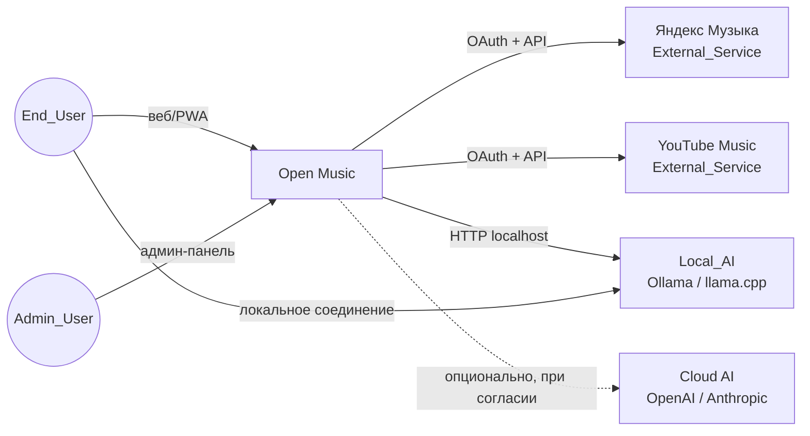

### Container Diagram (C4 Level 2)

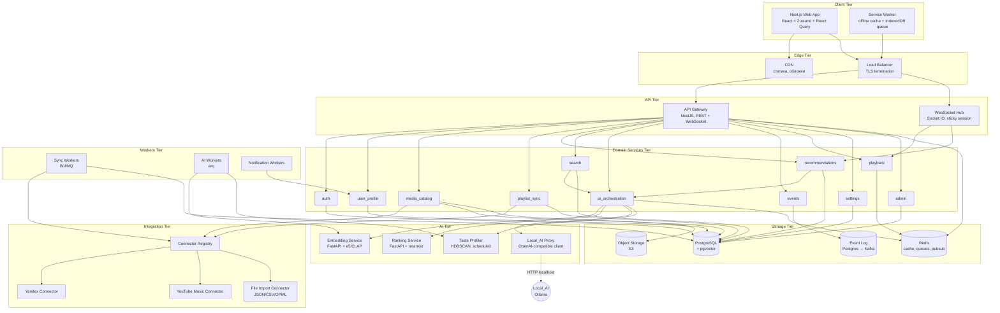

### Слои и принципы взаимодействия

- **Frontend → API Gateway** — REST поверх HTTPS; WebSocket для playback и live-recommendations.
- **API Gateway → Domain Services** — внутри одного NestJS-монорепо как DI-модули; границы строго через сервис-интерфейсы. Это даёт возможность позже вынести любой модуль в отдельный микросервис без переписывания контрактов (Req 30.1).
- **Domain Services → Integration Layer** — только через `ConnectorRegistry`; ядро не знает имён сервисов (Req 1.9, 34.1).
- **Domain Services → AI Tier** — через `ai_orchestration`, который абстрагирует выбор модели (cloud, embedding-сервис, Local_AI). Это центральная точка соблюдения Privacy_Mode (Req 9.4, 21.2).
- **Workers** не имеют публичного API; общаются через очереди и БД.
- **Event Log** — append-only поток `ListeningEvent`, входной сигнал для рекомендаций и аналитики.

---

## Components and Interfaces

### Доменные модули backend

| Модуль | Ответственность | Ключевые требования |
|---|---|---|
| `auth` | Регистрация, вход, MFA, JWT, sessions, RBAC | Req 32.3, 32.6 |
| `user_profile` | Профиль End_User, роли (Listener/Enthusiast/Power_User), AI_Profile-метаданные | Req 7, 32.4 |
| `media_catalog` | Internal_Track, Album, Artist, Playlist, MatchDecision | Req 2, 3, 19 |
| `playlist_sync` | Sync_Job-оркестрация, конфликт-резолюция | Req 25, 26 |
| `recommendations` | Сборка категорий рекомендаций, Discovery_Mode, Smart_Mix, Smart_Playlist | Req 7, 11, 12, 13, 14 |
| `search` | Семантический + полнотекстовый поиск, парсинг ограничений запроса | Req 8, 14 |
| `ai_orchestration` | Маршрутизация AI-запросов между cloud / Local_AI / embedding-сервисом | Req 7, 9, 10 |
| `events` | Запись `ListeningEvent`, `UserAction`, продуктовая аналитика | Req 27 |
| `playback` | Player state machine, очередь, sync между устройствами | Req 4 |
| `settings` | Privacy, Discovery_Mode, плеер-настройки, темы, equalizer | Req 6, 13, 21, 33 |
| `admin` | Метрики, Feature_Flag, управление коннекторами | Req 27, 28 |

### Connector-абстракция

Каждый Connector реализует один и тот же контракт. Ядро взаимодействует с Connector только через этот интерфейс.

```ts
// shared/connector.ts
export type ConnectorId = string;          // 'yandex_music' | 'youtube_music' | 'file_import'

export type ConnectionStatus =
  | 'Connected' | 'Disconnected' | 'Error'
  | 'Token_Expired' | 'Reauth_Required';

export interface ConnectorManifest {
  id: ConnectorId;
  displayName: string;
  authMethod: 'oauth2' | 'oidc' | 'file_import' | 'api_key';
  capabilities: {
    importLibrary: boolean;
    importPlaylists: boolean;
    importHistory: boolean;
    directPlayback: boolean;
    webhooks: boolean;
    isrcAvailable: boolean;
    lyrics: boolean;
  };
  rateLimits: { perMinute: number; perDay: number };
}

export interface ExternalTrack {
  externalId: string;
  isrc?: string;
  title: string;
  artists: string[];
  album?: string;
  durationMs: number;
  coverUrl?: string;
  explicit?: boolean;
  isLive?: boolean;
  genre?: string;
  audioFeatures?: Partial<AudioFeatures>;
  availability: 'playable' | 'preview_only' | 'unavailable';
}

export interface MusicConnector {
  manifest: ConnectorManifest;

  // Auth
  startAuth(userId: string): Promise<{ redirectUrl: string; state: string }>;
  handleCallback(state: string, params: Record<string, string>): Promise<TokenBundle>;
  refresh(token: TokenBundle): Promise<TokenBundle>;
  revoke(token: TokenBundle): Promise<void>;

  // Library
  listPlaylists(ctx: ConnectorCtx, cursor?: string): Promise<Page<ExternalPlaylist>>;
  listLikedTracks(ctx: ConnectorCtx, cursor?: string): Promise<Page<ExternalTrack>>;
  listRecentlyPlayed(ctx: ConnectorCtx, since?: Date): Promise<ExternalTrack[]>;
  getTrack(ctx: ConnectorCtx, externalId: string): Promise<ExternalTrack>;

  // Playback (опционально)
  resolvePlayback?(ctx: ConnectorCtx, externalId: string): Promise<PlaybackHandle>;
  getDeepLink(externalId: string): string;       // fallback для Req 4.4

  // Lyrics / extras (опционально)
  getLyrics?(ctx: ConnectorCtx, externalId: string): Promise<Lyrics | null>;
}
```

`ConnectorRegistry` — единственная точка регистрации (Req 34.5):

```ts
class ConnectorRegistry {
  register(c: MusicConnector): void;
  get(id: ConnectorId): MusicConnector;
  list(): ConnectorManifest[];
}
```

#### Yandex Music Connector

- **Авторизация:** OAuth 2.0 через Яндекс ID (publishing client_id / client_secret из конфигурации). Только официально документированные scope.
- **API:** официальный публичный API Яндекс Музыки в рамках разрешённого; в случаях, где публичный API не покрывает функцию (например, full library export) — режим `file_import` (пользователь экспортирует вручную, см. ниже).
- **Воспроизведение:** `directPlayback = false` по умолчанию (web SDK Яндекс Музыки публично недоступен для встраивания), используется deep-link (Req 4.4).
- **ISRC:** доступен через метаданные трека → используется как первичный сигнал в Track Matching.
- **Юридический риск (Risk R-1):** публичные API могут менять условия. Архитектурно мы изолируем коннектор; продуктово — fallback `file_import` всегда доступен.

#### YouTube Music Connector

- **Авторизация:** OAuth 2.0 через Google (scope `youtube.readonly` для библиотеки + `youtube` для частичных операций, если разрешено политикой). YouTube Data API v3 + (если будет применимо) YouTube Music сабсет.
- **Воспроизведение:** `directPlayback = false` (Music Premium необходим для аудио, нет официального web-embed для аудио). Используем YouTube IFrame Player API только для треков с публичным video-id и в рамках TOS.
- **ISRC:** **обычно отсутствует**, поэтому матчинг падает на title+artist+duration.
- **Юридический риск (Risk R-2):** YouTube Music TOS прямо ограничивают коммерческую агрегацию. На MVP реализован read-only доступ к Library + deep-link воспроизведение. Перед публичным запуском требуется юридическое ревью.

#### File Import Connector

Резервный путь для случаев, когда External_Service вообще не даёт API (Req 1.3). Принимает:
- JSON/CSV экспорта плейлистов (Spotify-формат, Apple Music-формат, или собственный),
- OPML/XML списки,
- ZIP-архив пользовательских данных, выданный самим External_Service по GDPR/152-ФЗ.

`file_import` коннектор **не имеет токенов**, не делает refresh, не воспроизводит — только заполняет каталог.

### AI Orchestration

`AIOrchestrator` — fasade перед всеми AI-возможностями. Все вызовы AI идут через него, чтобы централизованно соблюсти Privacy_Mode и Local_AI.

```ts
interface AIOrchestrator {
  embedText(text: string, ctx: AICtx): Promise<Vector>;
  embedTrack(track: InternalTrack, ctx: AICtx): Promise<Vector>;
  rerank(query: Vector, candidates: Candidate[], ctx: AICtx): Promise<RankedCandidate[]>;
  explain(reco: Recommendation, profile: AIProfile, ctx: AICtx): Promise<string>;
  taste(profile: ListeningHistory, ctx: AICtx): Promise<AIProfile>;
}
```

`AICtx` несёт `userId`, `privacyConsent`, `localAIEnabled`, `privateMode`. Алгоритм маршрутизации:

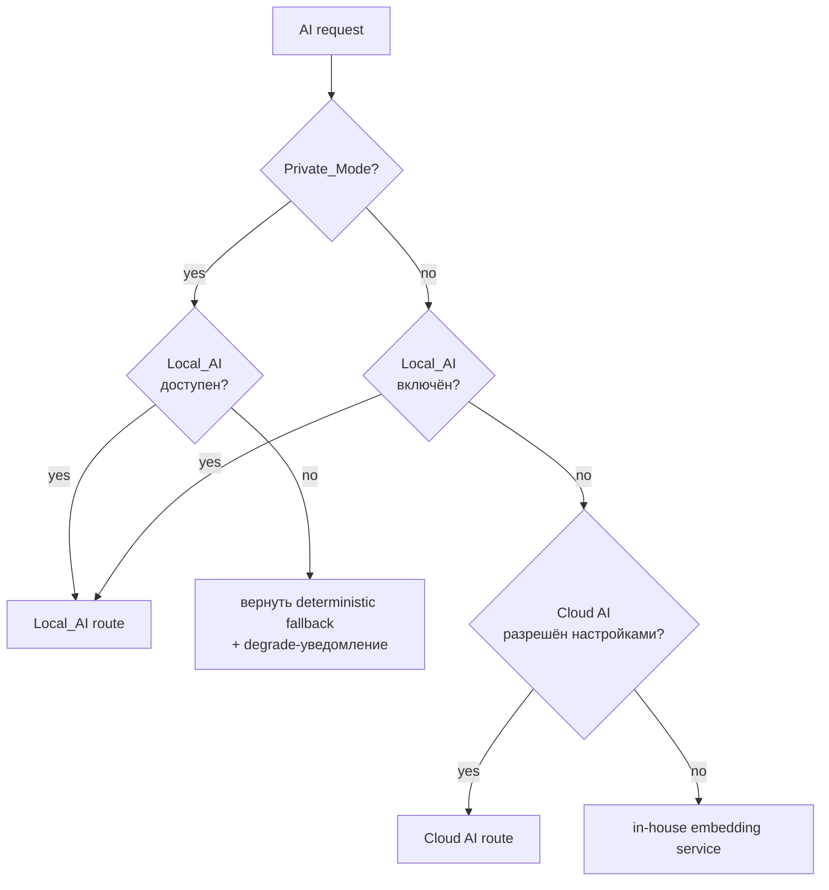

### Local_AI Connector

Local_AI описан как **plug-in поверх стандартного OpenAI-compatible HTTP-протокола**, что покрывает все три популярных runtime:

| Runtime | Эндпоинт | Поддержка |
|---|---|---|
| **Ollama** | `http://localhost:11434/v1/...` | Полная (`/chat/completions`, `/embeddings`) |
| **llama.cpp server** | `http://localhost:8080/v1/...` | Полная |
| **MLX / любой OpenAI-compatible** | `http://localhost:<port>/v1/...` | Полная |
| LM Studio, vLLM | `/v1/...` | Полная |

Конфигурация в Settings:
```json
{
  "localAI": {
    "enabled": true,
    "baseUrl": "http://127.0.0.1:11434/v1",
    "modelChat": "llama3.1:8b-instruct",
    "modelEmbed": "nomic-embed-text",
    "timeoutMs": 30000
  }
}
```

Поток вызова: frontend → backend `ai_orchestration` → если активен Local_AI и хост — desktop/PWA, backend проксирует через `LocalProxy` обратно на клиента (потому что `localhost` Local_AI живёт на устройстве пользователя, а не на сервере). Реализация: WebSocket-туннель `client → server → client`-loop, либо frontend сам делает запрос напрямую к Local_AI и шлёт результат на сервер.

**Архитектурное решение DR-005:** для приватности Local_AI вызовы идут **с frontend напрямую на localhost**, минуя сервер; сервер получает только финальный результат (или вектор), не сырые данные истории. Это соблюдает Req 9.4.

### Sync Workers

- BullMQ очереди: `sync:full:<connector>`, `sync:incremental:<connector>`, `match:reconcile`, `notify:user`.
- Воркер потребляет, выполняет с retry+backoff (Req 26.1), пишет прогресс в Redis (Req 2.7).
- Webhooks от External_Service попадают в `sync:webhook:<connector>` и триггерят incremental.

### Notification Service

Отдельный воркер, читающий `notifications` таблицу и отправляющий через email/web-push/in-app. Используется для Req 18 (умные напоминания) и Req 25.4 (уведомления о sync-инцидентах).

---

## Data Models

Ключевые сущности. Все таблицы имеют:
- `id UUID PRIMARY KEY`
- `created_at`, `updated_at` (`TIMESTAMPTZ`, server default `now()`)
- `version INT NOT NULL DEFAULT 0` (оптимистичная блокировка)
- Audit hooks → `audit_log` (Req 32.6)
- Row-level security policy `tenant_user_id = current_setting('app.user_id')::uuid` для пользовательских таблиц (Req 32.4).

### User

| Поле | Тип | Заметки |
|---|---|---|
| id | UUID | PK |
| email | CITEXT | UNIQUE, NOT NULL |
| password_hash | TEXT | argon2id; nullable если SSO |
| sso_provider | TEXT | 'google' \| 'yandex' \| 'apple' \| null |
| role | ENUM('listener','enthusiast','power_user','admin') | RBAC |
| mfa_enabled | BOOLEAN | Req 32.3 |
| privacy_settings_id | UUID | FK |
| ai_profile_id | UUID | FK |
| created_at, updated_at | TIMESTAMPTZ | |
| deleted_at | TIMESTAMPTZ | soft delete для Req 33.3 (за 30 дней) |

Индексы: `(email)`, `(deleted_at)`.

### ConnectedService

Подключение конкретного External_Service конкретным End_User.

| Поле | Тип | Заметки |
|---|---|---|
| id | UUID | PK |
| user_id | UUID | FK → User |
| connector_id | TEXT | 'yandex_music' \| 'youtube_music' \| ... |
| status | ENUM | Connected/Disconnected/Error/Token_Expired/Reauth_Required (Req 1.4) |
| last_error | JSONB | last error code+message |
| connected_at | TIMESTAMPTZ | |
| disconnected_at | TIMESTAMPTZ | nullable |
| settings | JSONB | rate-limit override, source-priority |

Индексы: `(user_id, connector_id)` UNIQUE.

### ExternalAccount (Token vault)

| Поле | Тип | Заметки |
|---|---|---|
| id | UUID | PK |
| connected_service_id | UUID | FK |
| access_token_ct | BYTEA | envelope-encrypted (Req 32.1) |
| refresh_token_ct | BYTEA | envelope-encrypted |
| dek_id | TEXT | KMS data-encryption-key id |
| expires_at | TIMESTAMPTZ | |
| scope | TEXT[] | |

Чувствительная таблица — отдельная схема `secret`, доступ только из `auth`/`playlist_sync` через хранимую процедуру `unwrap_token(connected_service_id)`.

### Track (Internal_Track)

| Поле | Тип | Заметки |
|---|---|---|
| id | UUID | PK — внутренний ID |
| canonical_title | TEXT | каноничная версия (Req 2.5) |
| canonical_artist | TEXT[] | основные артисты |
| canonical_album_id | UUID | FK → Album, nullable |
| isrc | TEXT | nullable, INDEX |
| duration_ms | INT | |
| explicit | BOOLEAN | |
| is_live | BOOLEAN | |
| genre | TEXT[] | |
| cover_url | TEXT | |
| audio_features | JSONB | bpm, energy, valence, danceability, key, loudness... (Req 7.2) |
| embedding | vector(1024) | pgvector, для Semantic_Model |
| availability | JSONB | { yandex_music: 'playable', youtube_music: 'unavailable' } |
| source | TEXT | первый источник записи (Req 2.4) |
| last_synced_at | TIMESTAMPTZ | |

Индексы:
- `isrc` (BTree)
- HNSW на `embedding` (`vector_cosine_ops`)
- GIN на `audio_features` и `genre`
- BTree на `(canonical_title, canonical_artist)` через `pg_trgm`

### Artist, Album

Стандартные сущности. Артист также получает `embedding vector(1024)` (для семантического поиска по артистам, Req 8.2).

### TrackExternalRef

Связь Internal_Track ↔ External_ID конкретного External_Service.

| Поле | Тип |
|---|---|
| id | UUID PK |
| track_id | UUID FK |
| connector_id | TEXT |
| external_id | TEXT |
| availability | ENUM('playable','preview_only','unavailable','region_locked') |
| metadata_snapshot | JSONB |
| match_decision_id | UUID nullable |
| created_at, updated_at | TIMESTAMPTZ |

UNIQUE `(connector_id, external_id)`.

### MatchDecision (Req 3)

Журнал решений матчинга — отдельная таблица для аудита и отмены (Req 3.5).

| Поле | Тип | Заметки |
|---|---|---|
| id | UUID PK | |
| left_external_ref_id | UUID | |
| right_external_ref_id | UUID | |
| confidence | NUMERIC(3,2) | 0..1 |
| signals | JSONB | { isrc_match: bool, title_sim: 0.97, ... } |
| status | ENUM | 'auto_merged','probable_pending','confirmed','rejected','reverted' |
| decided_by | ENUM | 'system','user' |
| user_id | UUID | nullable |
| decided_at | TIMESTAMPTZ | |
| reverted_at | TIMESTAMPTZ | nullable, ≤ 30 дней (Req 3.5) |

Индексы: `(status)`, `(decided_at)`, `(user_id, decided_at)`.

### Playlist & PlaylistTrack

| Playlist | |
|---|---|
| id | UUID PK |
| owner_user_id | UUID |
| name | TEXT |
| description | TEXT |
| source_connector_id | TEXT nullable |
| external_id | TEXT nullable |
| is_collaborative | BOOLEAN |
| is_smart | BOOLEAN |
| smart_config | JSONB nullable |
| pinned | BOOLEAN | Req 12.4 |
| last_synced_at | TIMESTAMPTZ |

| PlaylistTrack | |
|---|---|
| playlist_id | UUID FK |
| track_id | UUID FK |
| position | INT |
| added_by_user_id | UUID nullable |
| added_at | TIMESTAMPTZ |
| origin | JSONB | для AI-сборки в Collaborative_Playlist (Req 17.4) |
| PRIMARY KEY | (playlist_id, position) |

### ListeningEvent (Event Log)

Append-only. На MVP — таблица в Postgres, на Phase 2 — в Kafka.

| Поле | Тип | Заметки |
|---|---|---|
| id | UUID | PK |
| user_id | UUID | |
| track_id | UUID | |
| started_at | TIMESTAMPTZ | |
| duration_ms | INT | реально прослушано |
| skipped | BOOLEAN | |
| context | JSONB | { source: 'recommendation', reco_id, mood, ... } |
| connector_id | TEXT | |
| private | BOOLEAN | true → не учитывается для Reco (Req 21.1) |
| device_id | UUID | |

Индексы: `(user_id, started_at DESC)`, BRIN на `started_at`.

### Like / Favorite

Простая M:N: `user_id, track_id, liked_at`.

### Recommendation

| Поле | Тип | Заметки |
|---|---|---|
| id | UUID PK | |
| user_id | UUID | |
| category | TEXT | 'similar', 'now_will_fit', 'work_walk', 'maybe_missed', 'deep_weekly', 'new_artists' (Req 7.3) |
| track_id | UUID | |
| score | NUMERIC | финальный rank |
| reasons | JSONB | массив reason-объектов из Req 10.1 |
| sources | JSONB | веса {content, collaborative, semantic, local_ai} |
| generated_at | TIMESTAMPTZ | |
| served_at | TIMESTAMPTZ nullable | |
| expires_at | TIMESTAMPTZ | TTL |

### SearchQuery

Лог поисковых запросов End_User (для quality-метрик Req 27).

### AIProfile

| Поле | Тип |
|---|---|
| id | UUID PK |
| user_id | UUID |
| genre_distribution | JSONB |
| mood_distribution | JSONB |
| bpm_histogram | JSONB |
| energy_histogram | JSONB |
| centroid_embedding | vector(1024) |
| taste_clusters | JSONB |  // ссылки на MoodCluster |
| version | INT |
| computed_at | TIMESTAMPTZ |

### MoodCluster / TasteCluster

| Поле | Тип |
|---|---|
| id | UUID PK |
| user_id | UUID |
| label | TEXT |  // 'late-night-electronic', сгенерированно Local_AI или эвристикой
| centroid | vector(1024) |
| size | INT |
| sample_track_ids | UUID[] |

### PlaybackSession

Состояние плеера для синхронизации между устройствами (Req 4.8).

| Поле | Тип |
|---|---|
| id | UUID PK |
| user_id | UUID |
| device_id | UUID |
| current_track_id | UUID |
| position_ms | INT |
| queue | JSONB |  // массив track_id
| repeat_mode | ENUM('off','one','all') |
| shuffle | BOOLEAN |
| updated_at | TIMESTAMPTZ |
| revision | BIGINT |  // monotonic counter, для конфликт-резолюции

### SyncJob, ImportJob, ExportJob

Унифицированные `Job`-таблицы, разнятся `kind`:

| Поле | Тип |
|---|---|
| id | UUID PK |
| user_id | UUID |
| connector_id | TEXT |
| kind | ENUM('sync_full','sync_incremental','import_file','export_user_data','match_reconcile') |
| status | ENUM('queued','running','partial','succeeded','failed','cancelled') |
| progress | JSONB | { total: 1234, done: 800 }
| started_at, finished_at | TIMESTAMPTZ |
| error_summary | JSONB |
| result | JSONB |

Индекс `(user_id, started_at DESC)`. TTL — храним 30 дней (Req 25.7).

### Notification

| Поле | Тип |
|---|---|
| id | UUID PK |
| user_id | UUID |
| category | ENUM('new_release','rediscovery','continue_album','sync_error','match_pending','system') |
| payload | JSONB |
| seen_at | TIMESTAMPTZ nullable |
| dispatched_at | TIMESTAMPTZ |

### UserSetting / PrivacySetting

`PrivacySetting` отдельная таблица (Req 33.2):

| Поле | Тип |
|---|---|
| user_id | UUID PK |
| use_history_for_reco | BOOLEAN |
| use_cloud_ai | BOOLEAN |
| product_analytics_enabled | BOOLEAN |
| marketing_notifications | BOOLEAN |
| disabled_signal_sources | TEXT[] |  // например ['youtube_music']
| private_mode_default | BOOLEAN |

### DeviceSession

Активные устройства End_User для player-sync. `(user_id, device_id, last_seen_at)`.

### FeatureFlag

| Поле | Тип |
|---|---|
| key | TEXT PK |
| description | TEXT |
| enabled | BOOLEAN |
| rollout_percentage | INT |
| audience | JSONB | { roles: ['power_user'] }
| updated_by_admin_id | UUID |
| updated_at | TIMESTAMPTZ |

### Сводная ER-диаграмма

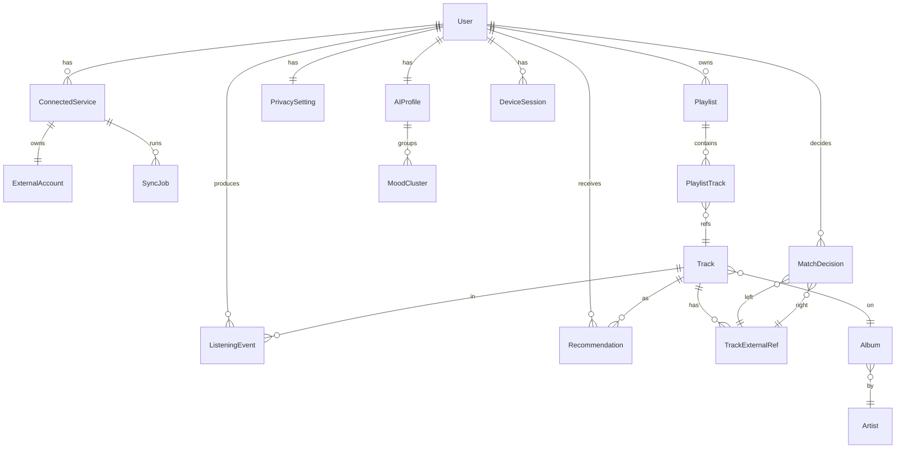


---

## API Contracts

### Стиль API: REST + WebSocket

Принято решение использовать **REST для команд и запросов** + **WebSocket для realtime** (см. DR-002). GraphQL отвергнут как избыточный для MVP и усложняющий безопасность multi-tenant.

Базовый префикс: `/api/v1`. Все ответы JSON, ошибки — RFC 7807 Problem Details.

### Auth

| Метод | Путь | Описание |
|---|---|---|
| POST | `/auth/register` | Регистрация (email + password) |
| POST | `/auth/login` | Логин, возвращает JWT + refresh |
| POST | `/auth/refresh` | Обновление JWT |
| POST | `/auth/logout` | |
| POST | `/auth/mfa/enroll` | Включение TOTP |
| POST | `/auth/mfa/verify` | Подтверждение MFA-кода |
| GET | `/auth/me` | Текущий пользователь |
| POST | `/auth/oauth/:provider/start` | Старт SSO |
| GET | `/auth/oauth/:provider/callback` | Callback SSO |

### Integrations

| Метод | Путь | Описание |
|---|---|---|
| GET | `/integrations/connectors` | Список доступных Connector + manifest |
| GET | `/integrations/connections` | Подключённые сервисы текущего End_User |
| POST | `/integrations/connect/:connectorId` | Старт OAuth-потока |
| GET | `/integrations/connect/:connectorId/callback` | OAuth callback |
| POST | `/integrations/connections/:id/reauth` | Повторное подключение (Req 1.5) |
| DELETE | `/integrations/connections/:id` | Отключение (Req 1.8) |
| POST | `/integrations/connections/:id/sync` | Запустить sync вручную |
| GET | `/integrations/connections/:id/sync-jobs` | История Sync_Job (Req 25.7) |
| POST | `/integrations/import-file` | File Import Connector — multipart upload |

**Пример:** `POST /integrations/connect/yandex_music`
```json
{ "redirectAfter": "/onboarding/library" }
```
Ответ:
```json
{
  "redirectUrl": "https://oauth.yandex.ru/authorize?...",
  "state": "0xCAFEBABE"
}
```

### Library

| Метод | Путь | Описание |
|---|---|---|
| GET | `/library/tracks` | Постраничный список Internal_Track |
| GET | `/library/tracks/:id` | Детали трека + External_Ref |
| GET | `/library/playlists` | Плейлисты End_User |
| GET | `/library/playlists/:id` | Детали + треки |
| POST | `/library/playlists` | Создать плейлист |
| PATCH | `/library/playlists/:id` | Изменить |
| POST | `/library/playlists/:id/tracks` | Добавить треки |
| DELETE | `/library/playlists/:id/tracks/:trackId` | Удалить трек |
| GET | `/library/likes` | Лайки |
| POST | `/library/likes/:trackId` | Лайк |
| DELETE | `/library/likes/:trackId` | Снять лайк |
| GET | `/library/match-pending` | Список вероятных матчей (Req 3.8) |
| POST | `/library/match-decisions` | Подтвердить/отклонить матч (batch) |
| POST | `/library/match-decisions/:id/revert` | Отмена решения (Req 3.5, ≤30 дней) |
| GET | `/library/match-report` | Отчёт по матчингу (Req 3.9) |

**Пример:** `GET /library/tracks?cursor=eyJhZnRlciI6IjE3MD...&limit=50`
Ответ:
```json
{
  "data": [{
    "id": "b7f...",
    "title": "Faded",
    "artists": ["Alan Walker"],
    "durationMs": 212000,
    "availability": {
      "yandex_music": "playable",
      "youtube_music": "playable"
    },
    "matchConfidence": 0.97,
    "explicit": false,
    "coverUrl": "https://cdn.openmusic.app/.../cover.jpg"
  }],
  "nextCursor": "eyJhZnRlciI6IjE3MA..."
}
```

### Playback

| Метод | Путь | Описание |
|---|---|---|
| GET | `/playback/state` | Текущее состояние сессии |
| POST | `/playback/play` | Body: `{ trackId, source? }` |
| POST | `/playback/pause` | |
| POST | `/playback/seek` | `{ positionMs }` |
| POST | `/playback/next` | |
| POST | `/playback/prev` | |
| PUT | `/playback/queue` | Заменить очередь |
| POST | `/playback/queue/reorder` | |
| WS | `/ws/playback` | Realtime sync между устройствами (Req 4.8) |

WebSocket-сообщения:
```jsonc
// сервер → клиент
{ "type": "state", "rev": 1024, "trackId": "...", "positionMs": 73000, "playing": true }
// клиент → сервер
{ "type": "command", "cmd": "next", "deviceId": "..." }
// сервер → клиент при изменении на другом устройстве
{ "type": "remote-change", "rev": 1025, "device": "iphone" }
```

### Recommendations

| Метод | Путь | Описание |
|---|---|---|
| GET | `/recommendations/categories` | Список текущих блоков (Req 7.3) |
| GET | `/recommendations/category/:key` | Треки + reasons |
| POST | `/recommendations/feedback` | `{ recoId, action: 'play'\|'save'\|'like'\|'skip'\|'dislike' }` (Req 7.4) |
| POST | `/recommendations/smart-mix` | Запуск Smart_Mix |
| GET | `/recommendations/smart-playlists` | Список Smart_Playlist (Req 12) |
| POST | `/recommendations/smart-playlists/:id/pin` | Закрепить (Req 12.4) |
| GET | `/recommendations/discovery` | Discovery_Mode |
| PATCH | `/recommendations/discovery` | Обновить параметры |

### Search

| Метод | Путь | Описание |
|---|---|---|
| GET | `/search?q=...&filters=...` | Семантический + filtered поиск |
| POST | `/search/save-preset` | Сохранить пресет фильтров (Req 14.3) |
| GET | `/search/presets` | |

### Settings & Privacy

| Метод | Путь | Описание |
|---|---|---|
| GET | `/settings` | Все настройки |
| PATCH | `/settings` | Частичный апдейт |
| GET | `/settings/privacy` | |
| PATCH | `/settings/privacy` | |
| POST | `/settings/private-mode/start` | Включить Private_Mode |
| POST | `/settings/private-mode/stop` | |
| POST | `/settings/data-export` | Запрос экспорта (Req 20, 33.4) |
| POST | `/settings/data-deletion` | Запрос удаления (Req 33.3) |
| GET | `/settings/local-ai/health` | Проверка доступности Local_AI |

### Admin

| Метод | Путь | Описание |
|---|---|---|
| GET | `/admin/metrics` | Сводные метрики (Req 27, 28.1) |
| GET | `/admin/connectors/health` | |
| GET | `/admin/sync-jobs?status=failed` | |
| POST | `/admin/sync-jobs/:id/retry` | |
| GET | `/admin/feature-flags` | |
| PATCH | `/admin/feature-flags/:key` | |
| GET | `/admin/incidents` | Активные инциденты (Req 28.5) |

---

## Connector-абстракция: детальный flow

### OAuth-flow (sequence)

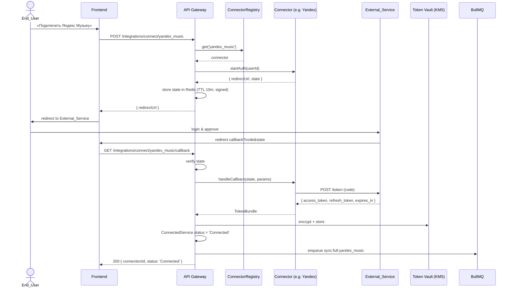

---

## AI-pipeline (Req 7–10)

### Контентная модель (Content_Model)

Источники аудио-фич Internal_Track:

1. **Из External_Service** — там, где доступно (Yandex предоставляет ограниченный набор; YouTube — фактически нет).
2. **Извлечение через preview-аудио** — где доступен 30-секундный preview, фоновый воркер качает превью и прогоняет через `librosa` (BPM, RMS energy, spectral centroid → proxy для timbre/danceability).
3. **CLAP audio embedding** — единый 512-dim вектор из preview (если есть).
4. **Метаданные жанра/настроения** — из External_Service + текстовый embedding названия+артиста.

Хранение — в `tracks.audio_features` (JSONB) и `tracks.embedding` (vector(1024)).

Скоринг Content_Model: косинусное сходство между централизованным embedding пользователя и embedding-кандидата + L2-расстояние по нормализованным `bpm/energy/valence`.

### Коллаборативная модель (Collaborative_Model)

Реализация — **implicit ALS** (через `implicit` Python-библиотеку) на матрице (user × track) с весами:
- play_completed = 1.0
- like = 1.5
- save_to_playlist = 1.5
- skip < 30% = -0.5
- repeat (повторное прослушивание) = +0.3 за повтор

Пересчёт раз в сутки в AI Worker, результат — user_factors, item_factors. Inference — top-k через approximate nearest neighbors (`pgvector` HNSW).

### Семантическая модель (Semantic_Model)

**Embedding-модель текста:** `multilingual-e5-large` (1024-dim).
**Embedding-модель трека:** конкатенация
- text-embed("title artist album genre") — 1024-dim
- (опц.) CLAP audio-embed → проецируется в то же пространство через обучаемую linear projection (Phase 2+).

На MVP — только text-embed; CLAP подключается в Phase 2.

**Индексирование:**

| Объект | Что индексируем | Индекс |
|---|---|---|
| Track | text("title artist album genre mood") | HNSW pgvector |
| Artist | text("name top_genres mood description") | HNSW pgvector |
| Playlist | aggregated centroid of its tracks + name + description | HNSW pgvector |

Для Req 8.5 ("как мой плейлист для работы") — поиск использует centroid плейлиста как query-вектор.

### Recommendation_Engine — финальная архитектура

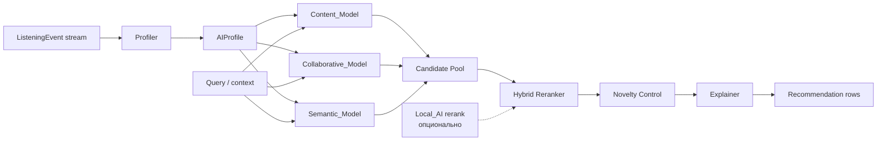

**Гибридное ранжирование:** для каждого кандидата вычисляется
```
score = w_c · score_content
      + w_cf · score_collab
      + w_s · score_semantic
      + w_l · score_local_ai
      + b_recency  ·  recency_factor
      − p_skip     ·  recent_skip_penalty
```
Веса `w_*` — per-user, обучаются raw-counterfactual способом (multi-armed bandit с e-greedy). На старте — preset `(0.30, 0.30, 0.30, 0.10, 0.05, 0.20)`. При cold-start (Req 7.5) `w_cf = 0`, остальные нормализуются.

**Novelty Control (Req 13.4):** после ранжирования применяется фильтр:
1. Удаляет треки из `Excluded_Genres`.
2. Контролирует долю незнакомых артистов: `Δfresh ≤ 0.10` от предыдущего batch.
3. Балансирует Familiarity/Riskiness/Novelty слайдерами через soft-tempering: `score' = score · (familiarity_weight if known else novelty_weight)`.

**Explainer (Req 10):**

- Если Local_AI активен → текстовое объяснение генерирует Local_AI на базе `reasons[]` (структурированный ввод).
- Если Local_AI отсутствует → шаблонный генератор (template + структурированные `reasons`).
- Если `reasons` пустой → категория `experiment` без объяснения (Req 10.5).

### Cold-start стратегия (Req 7.5)

Триггеры:
- < 20 уникальных треков прослушано → активен cold-start.

Поведение:
1. Спрашиваем у End_User в Onboarding: жанр(ы), любимый артист(ы), настроение.
2. Стартовый AIProfile = mean(embeddings выбранных артистов/жанров).
3. Веса `w_cf = 0`, `w_s = 0.5`, `w_c = 0.4`, `w_l = 0.1`.
4. После ≥20 треков переход на стандартное ранжирование.

---

## Семантический поиск (Req 8)

### Алгоритм

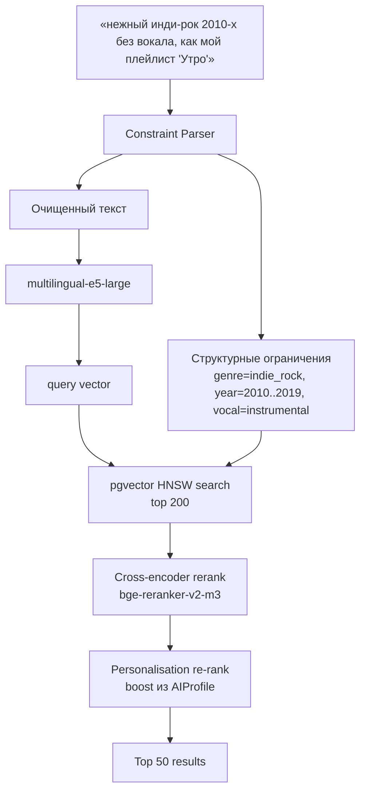

### Constraint Parser

Гибрид:
1. **Rule-based** на регулярках для понятных слотов: годы (`\b(19|20)\d{2}-?х?\b`), отрицания ("без рэпа", "без вокала"), ссылки на свои плейлисты (`как мой плейлист "..."`).
2. **LLM-fallback** (cloud или Local_AI) для разбора сложных запросов в JSON-ограничения.
3. Fallback: если ничего не разобрано → чистый vector search + пользователю показывается дружественное сообщение (Req 8.6).

### Multilang

`e5` поддерживает 100+ языков; запросы RU и EN мапятся в общее пространство, возможен mix-language matching ("ambient русские исполнители").

### Latency budget (Req 8.7 — 2 секунды)

| Шаг | Бюджет |
|---|---|
| Constraint parsing (rule + кэш) | 50 ms |
| Embedding запроса | 150 ms |
| pgvector search (HNSW, top-200) | 100 ms |
| Rerank top-200 → top-50 | 700 ms (cross-encoder, batch=32) |
| Personalisation | 50 ms |
| Сериализация + сеть | 200 ms |
| **Итого** | **≤ 1250 ms (P95)** |

---

## Track Matching pipeline (Req 3)

### Алгоритм

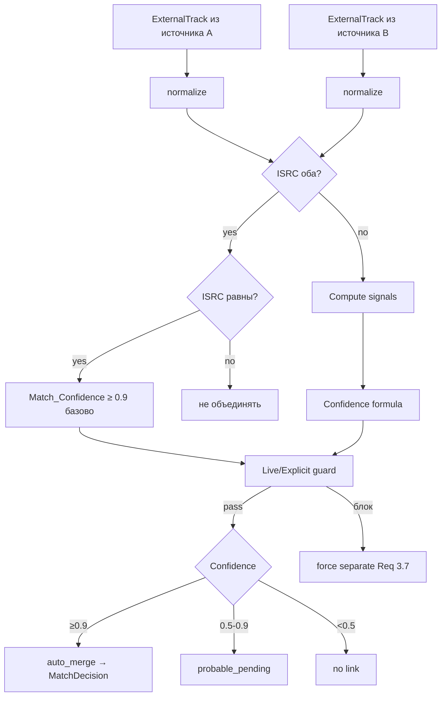

### Нормализация

```
normalize(s):
  s = NFD(s) → убрать диакритические знаки
  s = lower(s)
  s = удалить (...) и [...]
  s = заменить {feat., ft., featuring} → 'feat'
  s = удалить пунктуацию [^\p{L}\p{N} ]
  s = collapse whitespace
```

### Confidence formula

Без ISRC:
```
title_sim    = jaro_winkler(norm_title_a,  norm_title_b)
artist_sim   = jaccard(set(artists_a),    set(artists_b))
album_sim    = jaro_winkler(norm_album_a, norm_album_b)   // 0 если у одного нет
duration_sim = max(0, 1 - |dur_a - dur_b| / 3000)         // 3 сек допуск Req 3.1.b

confidence  = 0.45 · title_sim
            + 0.30 · artist_sim
            + 0.15 · duration_sim
            + 0.10 · album_sim
```

С ISRC: confidence = `0.95` базово, плюс бонус +0.05 если совпали title и artist → ≥ 0.9 как требует Req 3.1.a.

**Live/Explicit guard (Req 3.7):** перед auto_merge проверяем `is_live_a == is_live_b` и `explicit_a == explicit_b` (флаг is_live извлекается также из удалённых скобочных аннотаций "(Live)" и т. д.). Если различаются — связь не создаётся независимо от confidence.

### Хранение

Каждое решение → запись в `MatchDecision` с `signals` JSONB и `status`. Это даёт:
- аудит (Req 3.9 — отчёт),
- отмену в течение 30 дней (Req 3.5).

### Batch reconciliation

Воркер `match:reconcile` запускается после каждого Sync_Job:
- Для каждой пары новых TrackExternalRef в одном "соседстве" (по нормализованному ключу `lower(artist_first) + lower(title_short)`) считается confidence.
- Соседство ограничивается O(N log N) bucketing'ом (избегает N²).
- Результат — пакет MatchDecision со статусами.

---

## Sync engine (Req 25)

### Режимы

| Режим | Триггер | Что делает |
|---|---|---|
| `full` | Первое подключение, ручной запрос | Импортирует все плейлисты/лайки/история |
| `incremental` | Расписание (каждые 15 мин — лайки, каждые 6 ч — full library), webhooks | Только дельта по `since` |

### Конфликт-резолюция (Req 25.6)

Если объект изменён и в Open Music, и в External_Service:

1. Smart-merge для аддитивных изменений (новые треки в плейлист → объединение).
2. Для деструктивных (удаление, переименование) → создаётся `Conflict` уведомление, End_User выбирает `local`/`external`/`merge`.

### Rate limits

`Connector.manifest.rateLimits` декларирует лимиты. `RateLimiter` middleware (Redis token bucket) применяется на стороне коннектора. При 429:
- backoff: `min(60s · 2^attempt, 30 min)` + jitter,
- max 3 retry (Req 26.1),
- если `Retry-After` указан сервером — используем его (Req 26.2).

### Retry с backoff

Bull-job options: `attempts: 3`, `backoff: { type: 'exponential', delay: 1000 }`.

### Event-driven обновления

Где External_Service поддерживает webhooks (для YouTube — частичная поддержка через PubSubHubbub feeds артистов; Yandex — нет вебхуков → polling), используется webhook → enqueue incremental.

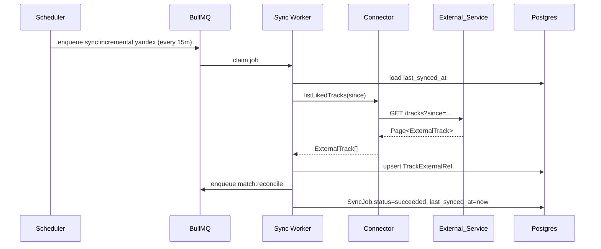

---

## Player architecture (Req 4)

### State machine

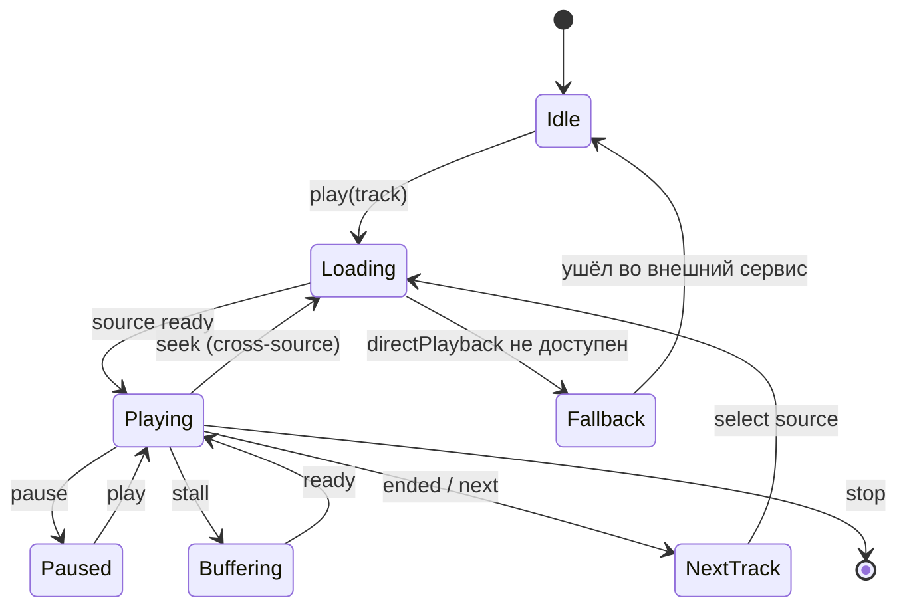

### Источник аудио

| Источник | Когда | Технология |
|---|---|---|
| **Прямое HTTP audio** (если External_Service отдаёт URL preview/full) | `directPlayback=true` | `HTMLAudioElement` + `Web Audio API` для AnalyserNode |
| **YouTube IFrame Player** | `directPlayback=true` для youtube_music | YouTube IFrame API; AnalyserNode не доступен → equalizer переходит в декоративный режим (Req 5.8) |
| **Deep-link во внешнее приложение** | `directPlayback=false` | window.open(`getDeepLink`); состояние очереди сохраняется (Req 4.4, 4.7) |

### Cross-device sync (Req 4.8)

- При входе устройство регистрируется как `DeviceSession`.
- Player публикует через WebSocket изменения позиции каждые 5 сек и при каждой команде.
- Сервер хранит `PlaybackSession` с monotonic `revision`. Любое устройство с устаревшим revision получает `remote-change` и перетягивает state.
- Latency budget — 5 секунд (Req 4.8): WebSocket round-trip ~200ms, остальное — буфер на загрузку трека.

### Media Session API

Native media keys, lock-screen controls — через стандартный `navigator.mediaSession`. Заполняем `metadata` из текущего Internal_Track.

### Persistence (Req 4.7)

Состояние плеера (текущий трек, позиция, очередь, режимы) сохраняется:
- В `PlaybackSession` (Postgres) — каноничное.
- В IndexedDB — оффлайн-кэш для быстрого восстановления при перезапуске без сети.

### Auto-skip (Req 4.11)

Если HTTP-загрузка трека вернула 403/404 или fallback deep-link недоступен → state machine переходит в `NextTrack`, в очереди трек помечается `skip_reason='unavailable'`, End_User получает toast.

---

## Equalizer Visualizer (Req 5)

### Общая архитектура

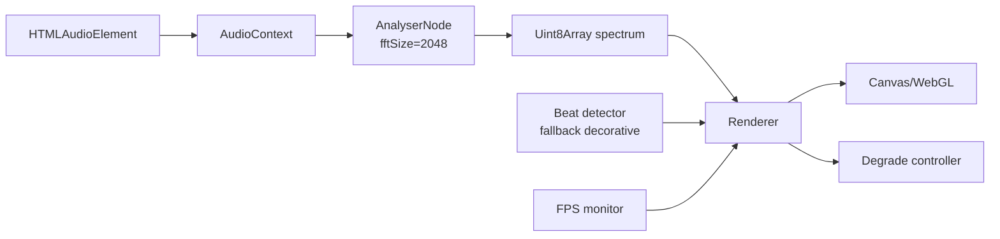

### Bar_Mode

- **Технология:** Canvas 2D (производительность достаточна).
- **Алгоритм:** 32–64 частотных бина (логарифмическая агрегация по частотам), сглаживание во времени `s[i] = α·new + (1-α)·prev`, α = 0.6.
- **Отрисовка:** `requestAnimationFrame`, бар = прямоугольник с высотой ∝ амплитуда.

### Circular_Mode

- **Технология:** WebGL 2 через `regl`. На WebGL 1 — fallback PixiJS.
- **Алгоритм:** концентрические окружности вокруг обложки трека; радиус каждой возмущается по соответствующему частотному бину; рендерим в шейдере с морфингом по beat.
- **Обложка** — текстура в центре, не двигается.

### Liquid_Mode

- **Технология:** WebGL/WGSL шейдер.
- **Алгоритм:** noise-based displacement (simplex/curl noise) с амплитудой, модулируемой суммарной энергией спектра + цветами Dynamic_Palette. Псевдо-fluid через двухslot ping-pong textures (advection-by-noise, не настоящее SPH).
- **Стиль:** "blob"-формы, мягкие переходы, blur через двухпроходный gaussian.

### Декоративный fallback (Req 5.8)

Когда нет AnalyserNode (deep-link воспроизведение или YouTube IFrame):
- Используем BPM из `tracks.audio_features.bpm` — генерируем синтетический сигнал sin(2π·bpm/60·t).
- Анимация — та же визуально, но без реального FFT.
- Если BPM неизвестен → 110 BPM по умолчанию.

### Адаптивная деградация (Req 5.9, 5.6)

- FPS-monitor (rolling avg за 2 сек). Целевые FPS: desktop 30+, mobile 24+.
- Если FPS < target в течение 3 сек:
  - Шаг 1: уменьшить fftSize (2048 → 1024 → 512).
  - Шаг 2: уменьшить разрешение canvas (`devicePixelRatio` → 1 → 0.75).
  - Шаг 3: Liquid → Circular → Bar (downgrade).
  - Шаг 4: переход в декоративный режим.
- Однократный toast End_User (Req 5.9).

### Без блокирования UI-потока (Req 5.7)

- Анализ + рендер — на main thread, но все тяжёлые матричные операции вынесены в `OffscreenCanvas` + Web Worker (где поддерживается).
- WebGL/WebGPU освобождает CPU.

---

## Dynamic Palette (Req 6)

### Алгоритм

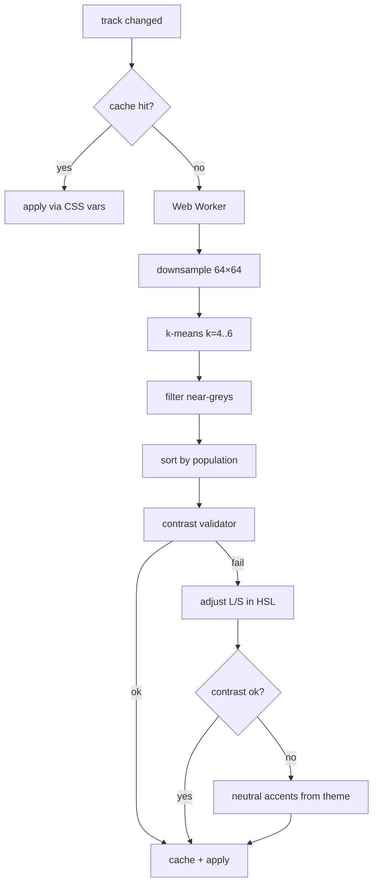

### Ключевые детали

- **Запуск:** в `OffscreenCanvas` Web Worker; время бюджет — 200 мс (Req 6.1).
- **k-means:** k=4..6, до 30 итераций или ε<1e-3.
- **Контраст:** WCAG-формула относительной светимости. Минимум 4.5:1 (AA, Req 6.3) или 7:1 (AAA, Req 6.8).
- **Светлая тема (Req 6.9):** извлечённые цвета насильно сдвигаются в HSL так, что фон имеет L≥85%; H берётся как доминирующий из обложки.
- **Plateau при недостатке вариативности (Req 6.4):** если σ(H) < 5° или mean(L) < 10% или > 90% — корректируем S и L, сохраняя H.
- **Сменa во время transition (Req 6.7):** хранится текущее промежуточное значение CSS-переменной; новый transition стартует от него — `transition-property` + `--palette-bg-from` обновляется в момент смены.
- **prefers-reduced-motion (Req 6.2):** transition-duration = 0; снимок мгновенный.

### CSS-схема

```css
:root {
  --palette-bg: oklch(0.18 0.04 280);
  --palette-bg-secondary: oklch(0.25 0.06 280);
  --palette-accent: oklch(0.7 0.15 280);
  --palette-text: oklch(0.95 0.02 280);
  --palette-transition: 600ms cubic-bezier(0.4, 0, 0.2, 1);
}
@media (prefers-reduced-motion: reduce) { :root { --palette-transition: 0ms; } }
```

### Кэш

Ключ: `track.id || cover_url_hash`. TTL = 7 дней. Хранилище — IndexedDB на клиенте (быстро) + опциональная backend-таблица `palette_cache` для cross-device. AAA-вариант кэшируется отдельно.

---

## UI architecture (Req 23, 24)

### Список экранов

`Login_Screen`, `Onboarding`, `Dashboard`, `Library`, `Playlists`, `Track_Page`, `Artist_Page`, `Search`, `Recommendations`, `AI_Insights` (Music_Mirror + History_Graph), `Connected_Services`, `Settings`, `Privacy`, `Admin_Panel` (только Admin).

### Навигация

- **Desktop (≥1024px):** левый sidebar (Library / Recommendations / Search / AI_Insights / Settings) + персистентный Mini_Player снизу + кнопка Fullscreen_Player.
- **Mobile (<1024px):** bottom navigation bar 5 пунктов + sheet-плеер.

### Design Tokens

Tailwind config + CSS-переменные:

```ts
// tokens.ts
export const tokens = {
  spacing: { xs: 4, sm: 8, md: 16, lg: 24, xl: 32 },
  radius:  { sm: 4, md: 8, lg: 16, full: 9999 },
  motion:  { fast: 150, base: 250, slow: 400, palette: 600 },
  density: { compact: { rowHeight: 40 }, expanded: { rowHeight: 56 } },
  glass:   { blur: 16, alpha: 0.55 }
}
```

### Темизация

| Тема | Поведение Dynamic_Palette |
|---|---|
| Dark (default, Req 23.2) | Dynamic_Palette меняет фон и акценты целиком |
| Light | Dynamic_Palette только акценты, фон светлый (Req 6.9) |
| Static | Dynamic_Palette отключён (Req 6.5) |

### Glassmorphism (Req 23.3)

`backdrop-filter: blur(16px) saturate(150%); background: color-mix(in oklch, var(--palette-bg-secondary), transparent 45%);`

С учётом Req 24.5 — текстовые слои поверх стекла всегда имеют достаточный контраст, проверяется во время выбора палитры.

### Skeleton-loading (Req 23.4)

Подготовлены skeleton-варианты для всех data-driven компонентов (TrackList, PlaylistCard, RecoBlock, Search). React Query `isLoading` → skeleton.

### Микроанимации (Req 23.5)

Framer Motion с derived-длительностями из `tokens.motion`. Уважение `prefers-reduced-motion` глобально.

### Accessibility (Req 24)

- **Keyboard:** все экраны проходимы Tab/Shift+Tab, плеер управляется Space (play/pause), стрелками (next/prev/seek), L (like).
- **Focus indicator:** Radix дефолт + кастомный outline `2px solid var(--palette-accent)` с `outline-offset`.
- **ARIA:** `aria-live="polite"` для уведомлений, `role="application"` для плеера, `aria-pressed` для toggle-кнопок.
- **Контраст:** автоматический WCAG-чек в Dynamic_Palette + e2e тесты Lighthouse в CI.
- **Text scaling:** все размеры в `rem`; адаптивный layout до 200% (Req 24.6).
- **Equalizer + read (Req 24.5):** под текстом — обязательный полупрозрачный «контраст-щит» (semi-opaque scrim) с автозатемнением, чтобы текст оставался читаемым поверх анимации.

### Onboarding (Req 23.8)

Шаги:
1. Подключение хотя бы одного External_Service (skippable, но баннер до подключения).
2. Выбор темы (dark/light/system).
3. Выбор режима Equalizer_Visualizer (Bar/Circular/Liquid/off).
4. Стартовые предпочтения для cold-start (жанры, артисты).

Любой шаг можно пропустить (Req 23.9), вернуться через Settings.

---

## Безопасность (Req 32)

### Шифрование токенов External_Service

**Envelope encryption:**
1. Глобальный KEK (Key Encryption Key) хранится в **KMS** (AWS KMS / HashiCorp Vault Transit).
2. Для каждой `ExternalAccount` — свой DEK (Data Encryption Key), сгенерированный AES-256-GCM.
3. DEK шифруется KEK; зашифрованный DEK + nonce хранится в Postgres рядом с токеном.
4. Расшифровка — только через хранимую процедуру `unwrap_token`, которая логирует доступ.

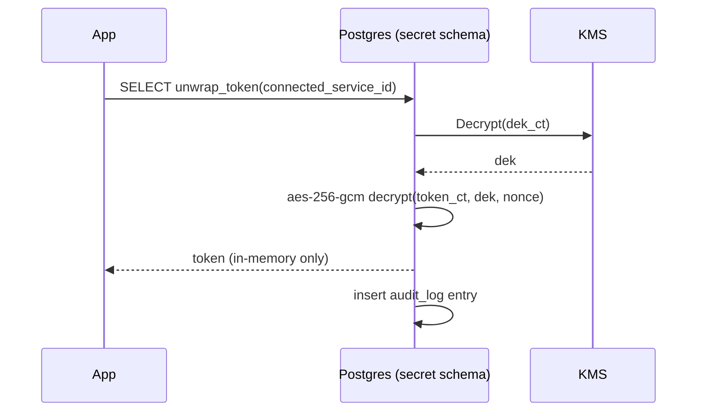

### TLS

- TLS 1.3 (минимум 1.2) повсюду (Req 32.2).
- HSTS, secure cookies, SameSite=Lax/Strict.

### Аутентификация

- Registration: argon2id (memory=64MB, ops=3).
- Login: rate-limited по IP+account (Redis token bucket).
- JWT access (15 min) + opaque refresh (30 дней, rotated).
- Опциональная **MFA TOTP** (Req 32.3).
- SSO: Google, Yandex (для End_User, удобство).

### Изоляция данных (Req 32.4)

- **Postgres Row Level Security:** каждая user-owned таблица имеет RLS-policy `tenant_user_id = current_setting('app.user_id')::uuid`.
- API-сервис устанавливает `app.user_id` в session-контексте при каждом запросе через middleware.
- Любая утечка `tenant` через bypass требует SUPERUSER — невозможна для прикладных юзеров БД.
- Тест: e2e suite `tenant-isolation.spec` проверяет, что user A не видит данные user B даже при подмене ID в пути.

### Аудит-логи (Req 32.6)

Таблица `audit_log` (append-only):
- security: login success/fail, MFA, token issue/revoke, data export, data deletion.
- admin: feature flag toggle, sync retry, config changes.

Хранится 12 месяцев (Req 27.4).

### Защита от leak (Req 32.7)

При попытке доступа к чужому ресурсу — 404 (а не 403), чтобы не раскрывать существование. Инцидент логируется.

---

## Приватность и Local_AI (Req 9, 21, 33)

### Поток данных при стандартном режиме

`History → Profiler (server) → AIProfile → Cloud LLM/embedding → Recommendations` — но **с маскированием PII** (e-mail/реальные имена не передаются в cloud).

### При Local_AI = on

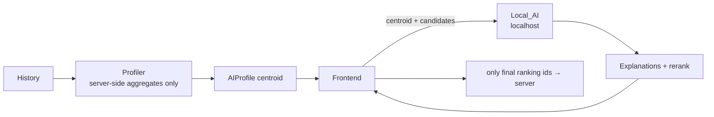

- Сырая история в Local_AI не попадает; только агрегаты.
- Explanations LLM-овские генерируются локально → текст объяснения не уходит в cloud.

### Private_Mode (Req 21)

Переключатель в Settings + быстрая кнопка в плеере (Req 21.1).

При активации:
1. Все `ListeningEvent` помечаются `private=true` → исключаются из агрегатов и ML.
2. Cloud-AI вызовы блокируются (Req 21.2): `AIOrchestrator` принудительно роутит на Local_AI или возвращает deterministic fallback.
3. Webhook-уведомления и telemetry помечаются `private=true` и не агрегируются (Req 21).

### Управление согласиями (Req 33.2)

Раздельные toggles:
- Использование истории для рекомендаций.
- Использование cloud-AI.
- Продуктовая аналитика.
- Маркетинговые уведомления.
- Per-source: «не использовать историю YouTube Music для рекомендаций» (Req 21.4).

### Удаление данных (Req 33.3)

- API: `POST /settings/data-deletion`.
- Воркер `data-deletion-job` каскадно удаляет: `ListeningEvent`, `AIProfile`, `MoodCluster`, `Recommendation`, `PlaybackSession`, `MatchDecision`, `Notification`, токены, плейлисты, `User` (`deleted_at`).
- Срок: до 30 дней (gov-grace period для требований 152-ФЗ/GDPR Right-to-Erasure).
- По завершении — email-уведомление End_User.
- Аудит-лог события сохраняется 12 месяцев (compliance).

---

## Расширяемость (Req 34)

### Registry-паттерн для каждой расширяемой точки

| Тип | Реестр | Манифест |
|---|---|---|
| Connector | `ConnectorRegistry` | `ConnectorManifest` |
| AI module | `AIModuleRegistry` | `AIModuleManifest` |
| Recommendation source | `RecoSourceRegistry` | `RecoSourceManifest` |
| Analytics module | `AnalyticsRegistry` | `AnalyticsManifest` |

Все регистры — singletons с lazy-initialisation. Регистрация происходит в `bootstrap.ts` каждого workspace-пакета. Для plugin-пакетов поддерживается auto-discovery через `package.json#openMusicPlugin`:

```json
{
  "openMusicPlugin": {
    "type": "connector",
    "entry": "./dist/index.js",
    "manifest": "./manifest.json"
  }
}
```

### Lifecycle модуля

```
register → init(config) → ready → enable/disable (feature flag) → upgrade → unregister
```

Каждый модуль обязан реализовать health-check (`getHealth(): Promise<{ status, lastCheckedAt, details }>`). Health-check вызывается каждые 30 сек и попадает в Admin_Panel.

### AIModuleManifest (Req 34.2)

```ts
interface AIModuleManifest {
  id: string;             // 'embedding-e5-large', 'ranker-bge-m3', 'local-ollama'
  type: 'embedding' | 'rerank' | 'explain' | 'profile' | 'cluster';
  capabilities: { batch: boolean; streaming: boolean; multilingual: boolean };
  io: { input: 'text'|'audio'|'features'; output: 'vector'|'rank'|'text' };
  cost: { latencyMs: number; tokensPerCall?: number };
  privacyClass: 'cloud' | 'local' | 'in-process';
}
```

Recommendation_Engine спрашивает у `AIModuleRegistry` подходящие модули по `type` + `privacyClass`, выбирая по политике пользователя.

---

## Производительность и масштабируемость (Req 29, 30)

### Кэширование

| Кэш | Где | Инвалидация |
|---|---|---|
| Library list | Redis (per user) + React Query | На любое изменение Library через Sync_Job emit `cache:invalidate:library:userId` |
| Recommendations | Redis (1 час TTL) | По расписанию + on-feedback |
| AIProfile | Redis (24 ч) | По воркер-перерасчёту |
| Track metadata | CDN (immutable on cover_url, по hash) | Cover_url содержит content hash |
| Palette | IndexedDB (client) + Postgres `palette_cache` | Версионируется |

### CDN

Обложки и preview-MP3 проксируются через CDN с cache-key `=hash(content)` для immutable-семантики. Метаданные треков — через `Cache-Control: max-age=300, stale-while-revalidate=86400`.

### Горизонтальное масштабирование

- API Gateway — stateless, scale by replicas.
- Domain services — упакованы в один NestJS процесс на MVP, но spec'ом разбиты на модули с ясными интерфейсами; распилить в отдельные процессы — без изменения API (Req 30.1).
- WebSocket Hub — отдельный deployment с sticky session (Redis-adapter для Socket.IO для cross-node broadcast).
- Sync Workers — масштабируются количеством pod'ов; параллелизм per-connector контролируется через BullMQ rate-limiter.
- AI Workers — отдельный pool, GPU-ноды для embedding/rerank (Phase 2+).

### Очереди приоритетов AI (Req 30.3)

Три очереди:
- `ai:interactive` (search query, recos pre-render): высший приоритет, latency budget < 1s.
- `ai:user-driven` (Smart_Mix continuation, on-demand explanation): средний.
- `ai:background` (Profiler nightly, embedding backfill): низший.

BullMQ `priority` field + worker concurrency-cap для interactive.

### Архивация (Req 30.4)

- `ListeningEvent` старше 24 месяцев — архив в S3 Parquet, удаление из горячей БД.
- `SyncJob`, `Notification` — TTL 30 дней.

---

## Error Handling

### Категории и обработка

| Категория | Стратегия | Пример |
|---|---|---|
| Network / timeout | Exponential backoff, ≤3 retry (Req 26.1) | Connector vs External_Service |
| Rate limit | Pause+resume по `Retry-After` (Req 26.2) | 429 от Yandex |
| Auth (401/403) | Mark Token_Expired, prompt reauth (Req 26.3) | Истёк refresh |
| Bad data | Mark track requires reload, не блокировать (Req 26.4) | Битый JSON |
| Partial sync | `SyncJob.status='partial'` + UI badge (Req 26.5) | Часть playlist'ов упала |
| Recommendation fail | Fallback на кэш, badge "неполные результаты" (Req 26.6) | embedding-сервис down |

### User-facing сообщения

Каждая ошибка имеет:
- `code` (machine-readable),
- `messageRu` и `messageEn` — естественно-языковое сообщение для End_User,
- `actions[]` — варианты действий (retry, disconnect, contact_support).

### Структурированный лог (Req 26.7)

JSON-line:
```json
{
  "ts": "2025-01-12T10:00:00Z",
  "level": "error",
  "category": "connector.sync",
  "userId": "uuid-...",
  "connectorId": "yandex_music",
  "operationId": "sync_job:uuid-...",
  "code": "ext.rate_limit",
  "retryAfterSec": 60,
  "msg": "rate limit hit"
}
```

### Graceful degradation (Req 31)

- Если один Connector упал → остальные продолжают работать; UI показывает badge `Disconnected` для упавшего (Req 31.1).
- Если Recommendation_Engine недоступен → recoBlock заменяется placeholder'ом, остальной UI работает (Req 31.2).
- Если AI embedding-сервис недоступен → search degradates до полнотекстового FTS Postgres.
- Если Local_AI недоступен (был включён, упал) → переключение на cloud (если согласие есть) или fallback (Req 9.6).

---

## Testing Strategy

### Подход

Open Music — продукт со смешанным профилем тестов:

- **Pure-logic слои** (matching, normalization, palette extraction, ranking, novelty control, formula scoring) — отлично подходят для **property-based testing (PBT)**.
- **UI слои** (компоненты, layout, glassmorphism) — снапшот-тесты + a11y проверки + Lighthouse в CI.
- **External integrations** (Yandex/YouTube API) — интеграционные тесты с **WireMock/MSW**, плюс smoke-тесты с реальными sandbox-аккаунтами на отдельной среде.
- **AI inference** — детерминированные unit-тесты с фиксированными embeddings (моки), плюс контрактные тесты на форму ответа Local_AI.
- **End-to-end** — Playwright для критичных user flows.

### PBT-инструменты

| Технология | Библиотека |
|---|---|
| TypeScript (frontend + backend) | **fast-check** |
| Python (AI services) | **Hypothesis** |

Все property-tests: ≥ 100 итераций (`numRuns: 100`/`max_examples=100`), теги в комментариях с маппингом на свойства этого документа: `// Feature: open-music, Property N: <текст>`.

### Где PBT неприменимо

- IaC (Terraform/Helm) → snapshot тесты.
- React-компоненты с фокусом на верстку → snapshot + a11y.
- Yandex/YouTube API адаптеры → contract tests на mocks.
- Простые CRUD без логики → example-based.

### Roadmap тестов

- MVP: PBT для matching, normalization, palette, ranking-формулы; unit для Connector маппинга; e2e для логина+импорта+воспроизведения.
- Phase 2: PBT для семантического парсера ограничений, novelty control; perf-tests (k6) для search/reco.
- Phase 3: контрактные тесты для Local_AI (Ollama/llama.cpp); chaos-tests для отказа Connector.
- Phase 4: PBT для CRDT-логики Collaborative_Playlist; load-test 10k concurrent users.

---


## Correctness Properties

*A property is a characteristic or behavior that should hold true across all valid executions of a system — essentially, a formal statement about what the system should do. Properties serve as the bridge between human-readable specifications and machine-verifiable correctness guarantees.*

Open Music — продукт со смешанным профилем: ядро (matching, ranking, palette extraction, sync, privacy) хорошо ложится на property-based testing, тогда как UI/Visual слои покрываются snapshot-тестами и не входят в этот раздел. Ниже приведены свойства, охватывающие testable acceptance criteria после консолидации (см. Testing Prework выше).

### Property 1: Connector manifest и registry

*For all* зарегистрированных Connector в `ConnectorRegistry`, `manifest.authMethod ∈ {oauth2, oidc, file_import, api_key}`, и для всех типов pluggable-модулей (Connector, AIModule, RecoSource, AnalyticsModule) регистрация нового модуля сохраняет инварианты существующих регистраций (никакой регистр не возвращает другую информацию для уже зарегистрированных id).

**Validates: Requirements 1.1, 34.1, 34.2, 34.3, 34.4, 34.5**

### Property 2: Token vault round-trip + at-rest шифрование

*For all* токенов `t` и любых `ConnectedService`, после `store(connectedServiceId, t)` и последующего `unwrap_token(connectedServiceId)` возвращается `t`, при этом сырая колонка хранения (`access_token_ct`) никогда не равна `t` (cipher ≠ plaintext). После `revoke()` или `disconnect()` `unwrap_token` для этого `ConnectedService` возвращает ошибку «not found».

**Validates: Requirements 1.2, 1.8, 32.1**

### Property 3: ConnectedService state machine и блокировка при не-Connected

*For all* последовательностей валидных событий жизненного цикла подключения, `ConnectedService.status` всегда принимает значение из множества `{Connected, Disconnected, Error, Token_Expired, Reauth_Required}`. *For all* запросов к `MusicConnector`, выполняемых через ядро: если `status ∈ {Token_Expired, Disconnected, Error}`, то запрос не достигает External_Service (отклонён слоем интеграции).

**Validates: Requirements 1.4, 1.7, 26.3**

### Property 4: Сохранение Library через переподключения и toggles

*For all* существующих Library `L` и любых сценариев `reauth(connectedService)`, `enable/disable(localAI)`, `switchModel(localAI, m)`, выполненных без явного `data-deletion`, итоговое состояние Library `L'` содержит все треки и плейлисты из `L` (`L ⊆ L'`).

**Validates: Requirements 1.5, 9.5**

### Property 5: Каноничный выбор метаданных

*For all* множеств метаданных-вариантов одного и того же объекта Library из разных источников, выбранная каноничная версия удовлетворяет приоритету «наличие обложки → точность длительности → длина названия»; если функцию приоритета применять повторно к тому же входу — результат идентичен (детерминизм), а оригинальные варианты сохранены и доступны.

**Validates: Requirements 2.5, 25.5**

### Property 6: Resilience импорта и обработки данных

*For all* batch'ей `B = {item_1, ..., item_n}` импортируемых объектов, при инжекции произвольного подмножества ошибок `F ⊆ B`, итоговое количество успешно обработанных объектов равно `|B| − |F|`, и каждая ошибка зафиксирована в журнале без блокирования обработки остальных. Любой объект с битыми обязательными метаданными помечается как требующий перезагрузки и не блокирует остальные операции.

**Validates: Requirements 2.6, 26.4**

### Property 7: Match decision rule и guards

*For all* пар нормализованных треков `(a, b)` в Track Matching:
1. `confidence(a, b) ∈ [0, 1]`,
2. при совпадении ISRC обоих треков `confidence(a, b) ≥ 0.9`,
3. функция `confidence` монотонна по числу совпавших нормализованных сигналов (увеличение совпадений не уменьшает confidence),
4. если `is_live(a) ≠ is_live(b)` или `explicit(a) ≠ explicit(b)`, то решение никогда не равно `auto_merged` независимо от значения confidence,
5. при отсутствии guard-блокировки решение строго определяется порогами: `≥ 0.9 → auto_merged`, `[0.5, 0.9) → probable_pending`, `< 0.5 → no_link`.

**Validates: Requirements 3.1, 3.2, 3.3, 3.4, 3.7**

### Property 8: Revert window 30 дней

*For all* решений `MatchDecision` и `LibraryCleanupDecision` (Req 19.4), выполненных в момент `t`, при выполнении `revert(decisionId)` в моменте `t' ∈ [t, t + 30 days]` система восстанавливает состояние, существовавшее непосредственно перед `t`. При `t' > t + 30 days` revert недоступен.

**Validates: Requirements 3.5, 19.4**

### Property 9: Track-level consistency после деактивации внешних ссылок

*For all* `Internal_Track` `T` и любых последовательностей пометок `TrackExternalRef.availability = unavailable`: если хотя бы одна `ref ∈ T.refs` имеет `availability ≠ unavailable`, то `T` присутствует в Library и виден End_User; если все `ref` стали `unavailable`, `T` помечается недоступным целиком, но не удаляется автоматически.

**Validates: Requirements 3.6**

### Property 10: Player state machine, очередь и persistence

*For all* последовательностей корректных команд плеера `c_1, …, c_n ∈ {play, pause, next, prev, seek, repeat, shuffle, addQueue, removeQueue, reorderQueue}` начиная из любого валидного начального состояния:
1. итоговое состояние принадлежит множеству валидных состояний state-machine,
2. `0 ≤ position_ms ≤ track.duration_ms`,
3. в очереди не появляются дубликаты идентификаторов треков, не задавайные явно,
4. после произвольной точки в последовательности при имитации перезапуска (`save → load`) восстановленное состояние идентично сохранённому,
5. при добавлении и затем удалении одного и того же трека в очередь её содержимое возвращается к исходному (round-trip add/remove).

**Validates: Requirements 4.1, 4.2, 4.7, 31.4**

### Property 11: Выбор источника воспроизведения по приоритету пользователя

*For all* `Internal_Track` `T`, доступных одновременно в нескольких подключённых External_Service, при списке приоритетов End_User `P = [p_1, …, p_k]` выбранный источник равен первому `p_i ∈ P`, для которого `T` доступен и Connector поддерживает прямое воспроизведение; иначе используется fallback deep-link, и при этом текущая позиция и очередь сохраняются неизменными.

**Validates: Requirements 4.3, 4.4, 4.6**

### Property 12: Cross-device convergence

*For all* множеств устройств `D = {d_1, …, d_n}`, синхронизирующих один `PlaybackSession`, при любом порядке событий `revision`-обновлений система сходится в одно и то же финальное состояние (определяемое максимальным `revision`) на всех устройствах в пределах окна синхронизации (бюджет — 5 секунд).

**Validates: Requirements 4.8**

### Property 13: Auto-skip при пропадании доступности

*For all* воспроизводимых треков, если в момент воспроизведения `availability` текущего трека становится `unavailable` для всех источников, плеер переходит к следующему доступному треку очереди и логирует `skip_reason='unavailable'`; ни один трек не воспроизводится после того, как его availability стал `unavailable` для всех источников.

**Validates: Requirements 4.11**

### Property 14: Equalizer — взаимоисключающие режимы и монотонность интенсивности

*For all* пользовательских переключений режима Equalizer_Visualizer одновременно активным может быть не более одного из `{Bar_Mode, Circular_Mode, Liquid_Mode, off}`. *For all* значений интенсивности `v ∈ [0, 100]`, амплитуда визуализации монотонно неубывает по `v`. При имитированном падении FPS ниже целевого порога сложность визуализации монотонно неубывающе деградирует (количество элементов / fftSize / целевой downgrade), и пользовательское уведомление выдаётся не более одного раза за сессию деградации.

**Validates: Requirements 5.1, 5.5, 5.9**

### Property 15: Equalizer — fallback при отсутствии аудио

*For all* воспроизводимых треков с отсутствующим/недоступным аудиопотоком (deep-link, IFrame без AnalyserNode), Equalizer_Visualizer не переходит в idle, а использует BPM (или дефолтное значение, если BPM неизвестен) для генерации синтетического сигнала и продолжает рендеринг в выбранном пользователем режиме.

**Validates: Requirements 5.8**

### Property 16: FPS бюджеты на референсных конфигурациях

*For all* референсных нагрузок и сэмплов в течение `T`-секундного окна, доля кадров, отрендеренных за `≤ 1000/30 ms` (desktop) или `≤ 1000/24 ms` (mobile), не ниже 95%.

**Validates: Requirements 5.6**

### Property 17: Dynamic_Palette — извлечение и непрерывность

*For all* обложек треков (включая монохромные, очень тёмные, очень светлые), результирующая палитра содержит от 4 до 6 цветов; время извлечения (без учёта кэш-хитов) не превышает 200 мс на референсной конфигурации, а извлечение выполняется вне главного потока. *For all* пар последовательных смен обложки `cover_a → cover_b → cover_c` с прерыванием перехода `cover_b → cover_c` в момент `t`, новый transition стартует от текущего промежуточного значения, и применяемые CSS-переменные не имеют разрывов (визуальных скачков) во времени.

**Validates: Requirements 6.1, 6.6, 6.7**

### Property 18: Контраст палитры (AA / AAA / equalizer overlay)

*For all* обложек, для активной темы и режима accessibility, итоговая применённая палитра гарантирует контраст между основным текстом и фоном:
- ≥ 4.5:1 в стандартном AA-режиме,
- ≥ 7:1 в AAA-режиме,
а также при активном Equalizer_Visualizer контраст текста относительно усреднённого фонового слоя (с учётом scrim) сохраняется не ниже соответствующего порога. В светлой теме при наличии обложки фоновая светлота не ниже 0.85.

**Validates: Requirements 6.3, 6.4, 6.8, 6.9, 24.4, 24.5**

### Property 19: Privacy boundary (Local_AI и Private_Mode)

*For all* AI-вызовов, выполняемых через `AIOrchestrator`:
1. если `Private_Mode = on`, история текущей сессии не покидает устройство End_User (никакой исходящий запрос к cloud-AI не содержит данных текущих `ListeningEvent`),
2. если `Local_AI = on`, то полная история End_User в облачные AI-сервисы не отправляется (передаются только агрегаты и/или векторы AIProfile, но не сырые `ListeningEvent`),
3. при `disabled_signal_sources` соответствующие источники полностью исключены из агрегата, передаваемого AI,
4. при завершении `Private_Mode` события, накопленные за приватный период, не переносятся в общую историю, влияющую на рекомендации,
5. AI-payload содержит только подмножество полей End_User, минимально необходимых для конкретной задачи (`payload.fields ⊆ minimal_required_set`).

**Validates: Requirements 9.4, 21.1, 21.2, 21.4, 21.5, 32.5**

### Property 20: Tenant isolation

*For all* пар различных End_User `(A, B)` и любых валидных операций End_User `A`: ответ системы не содержит данных, принадлежащих `B`. Любая попытка доступа End_User `A` к ресурсу, принадлежащему `B`, возвращает ответ, неотличимый от ответа на несуществующий ресурс (без указания на существование чужих данных), и записывает событие в `audit_log`. Это распространяется на endpoints API, Music_Mirror и Admin-only ресурсы (для не-Admin пользователей).

**Validates: Requirements 15.4, 28.6, 32.4, 32.7**

### Property 21: Consent-gating и анонимизация аналитики

*For all* пользователей с `product_analytics_enabled = false` или `use_history_for_reco = false`: их события не попадают в продуктовую аналитику или поток рекомендательного обучения соответственно. *For all* агрегатов в продуктовой аналитике: они не содержат полей PII. Использование данных End_User для целей, на которые не дано согласия, отсутствует.

**Validates: Requirements 27.2, 27.3, 33.5**

### Property 22: Retry / backoff / rate-limit

*For all* временных сбоев External_Service: число повторных попыток ≤ 3 (Req 26.1), интервалы между попытками экспоненциально неубывают, при ответе 429 с `Retry-After` следующий запрос выполняется не ранее, чем через указанный интервал; ни один запрос к External_Service не выполняется во время активного «pause» окна для этого сервиса.

**Validates: Requirements 26.1, 26.2, 31.3**

### Property 23: Sync_Job partial-status и canonical update

*For all* Sync_Job, при которых произошёл хотя бы один сбой обработки одного объекта при успешной обработке других, `SyncJob.status = 'partial'` (никогда не `succeeded`). *For all* объектов, обновлённых во внешнем сервисе, после incremental sync канонические метаданные в Library соответствуют правилу качества данных (Property 5).

**Validates: Requirements 25.3, 25.4, 26.5**

### Property 24: Конфликт-резолюция (sync и offline)

*For all* пар одновременных изменений одного и того же объекта в Open Music и External_Service, и *for all* offline-очередей действий, конфликтующих с серверным состоянием при восстановлении сети: система помечает конфликт, не теряет ни одну из версий до выбора End_User, и применяет именно ту версию, которую выбрал End_User (`local | external | merge`); порядок других, не-конфликтных действий из offline-очереди сохраняется.

**Validates: Requirements 22.5, 25.6**

### Property 25: Offline action queue ordering

*For all* offline-сессий и последовательностей пользовательских действий `a_1, …, a_n`, накопленных во время отсутствия сети, после восстановления соединения система применяет действия к серверу в исходном порядке `a_1, …, a_n` (с учётом конфликт-резолюции — Property 24).

**Validates: Requirements 22.3, 22.4**

### Property 26: Recommendation feedback и cold-start

*For all* пользовательских feedback-событий (`play`, `save`, `like`, `skip`, `dislike`) к рекомендациям: следующее обновление рекомендаций (или Smart_Playlist для затронутого playlist'а) учитывает это событие. *For all* пользователей с историей менее 20 уникальных треков, конфигурация весов Recommendation_Engine соответствует cold-start preset (`w_cf = 0`), а при пересечении порога — переключается на стандартное ранжирование.

**Validates: Requirements 7.4, 7.5, 12.3**

### Property 27: Discovery_Mode — exclusion и novelty bound

*For all* активных пользовательских настроек Discovery_Mode и для всех итоговых блоков рекомендаций: треков из `Excluded_Genres` ровно ноль; *for all* двух последовательных обновлений рекомендаций для одного End_User, прирост доли незнакомых артистов между ними не превышает 10 процентных пунктов.

**Validates: Requirements 13.3, 13.4**

### Property 28: Применение фильтров и сохранение пресетов

*For all* непустых наборов фильтров `F`, применяемых к рекомендациям/поиску/Smart_Mix, итоговый список содержит только треки, удовлетворяющие конъюнкции всех фильтров (`∀ track ∈ result, ∀ f ∈ F: f(track) = true`). *For all* сохранённых пресетов фильтров: `loadPreset(savePreset(F)) = F` (round-trip).

**Validates: Requirements 14.2, 14.3**

### Property 29: Smart_Mix invariants

*For all* активных Smart_Mix сессий: после любой команды `next` (включая авто-skip) число треков впереди очереди ≥ 10. *For all* подряд идущих skip'ов количеством ≥ 3, происходит пересчёт характеристик Smart_Mix и обновление очереди в текущем цикле.

**Validates: Requirements 11.2, 11.3, 11.4**

### Property 30: Объяснимость рекомендаций

*For all* `Recommendation`: значения `reasons[]` принадлежат фиксированному набору причин из Req 10.1; для каждой причины ссылающиеся объекты (треки/артисты) — это объекты из истории End_User; если для рекомендации не удалось сформировать осмысленное `reasons[]`, её категория = `experiment` и поле `explanation` отсутствует (никогда не подделывается).

**Validates: Requirements 10.1, 10.3, 10.5**

### Property 31: Совместные плейлисты и происхождение треков

*For all* `Collaborative_Playlist` и любой последовательности действий участников: участник может удалить только свой собственный трек, голосовать может за любой; вклад в счётчиках корректно соответствует фактической истории действий; *for all* AI-сборок плейлиста — каждый трек имеет метаданные `origin`, идентифицирующие пересечение AI_Profile участников, в которое трек попал. *For all* выходов участника из плейлиста (без явного запроса удаления его треков) добавленные им треки сохраняются в плейлисте.

**Validates: Requirements 17.2, 17.4, 17.5**

### Property 32: Music_Mirror и Library auto-grouping

*For all* истории прослушиваний End_User, Music_Mirror содержит только данные этого End_User. *For all* контентов Library: автогруппировка покрывает всю Library (`union(groups) = library`), и каждый трек принадлежит ровно одной группе по жанру и одной по периоду добавления; алгоритм обнаружения дубликатов находит все искусственно введённые дубликаты (полнота); раздел «Треки для возвращения» возвращает только треки, удовлетворяющие критерию (часто слушались + ≥ 90 дней без открытия).

**Validates: Requirements 15.4, 19.1, 19.2, 19.3**

### Property 33: Export round-trip

*For all* состояний End_User Library `L` (включая плейлисты, лайки, AI_Profile, MatchDecision'ы): `import(export(L, format)) ≅ L` для `format ∈ {JSON, CSV}` и для полного бэкапа, причём ни один экспорт не содержит чувствительных полей (`access_token`, `refresh_token`, `dek_id`, password-hashes).

**Validates: Requirements 20.1, 20.2, 20.3, 20.4, 33.4**

### Property 34: Удаление данных (right to erasure)

*For all* запросов End_User на удаление данных: в течение 30 календарных дней с момента запроса все каскадно-связанные таблицы (`ListeningEvent`, `AIProfile`, `MoodCluster`, `Recommendation`, `PlaybackSession`, `MatchDecision`, `Notification`, `ExternalAccount`, `Playlist` пользовательские, `User`) не содержат записей, связанных с этим `userId`; запись об удалении в `audit_log` присутствует и сохраняется по политике хранения 12 месяцев.

**Validates: Requirements 33.3**

### Property 35: Feature_Flag rollout детерминизм

*For all* пар (`flagKey`, `userId`) и заданного `rollout_percentage = p`: функция `isEnabled(flagKey, userId, p)` возвращает одинаковое значение при повторных вычислениях; среди всех `userId` в большом случайном множестве доля `true` сходится к `p / 100` с допустимым отклонением.

**Validates: Requirements 28.2**

### Property 36: AI queue priority

*For all* смешанных потоков задач AI трёх приоритетов (`interactive`, `user-driven`, `background`) с ограниченной concurrency: средняя latency задач `interactive` не превышает latency задач более низких приоритетов при равных условиях, и ни одна задача `interactive` не ждёт за выполняющейся `background`-задачей дольше, чем длительность одного `background`-чанка.

**Validates: Requirements 30.3**

### Property 37: Аудит security-событий

*For all* security-критичных операций (`login`, `mfa_verify`, `token_issue`, `token_revoke`, `data_export`, `data_deletion`, попытки cross-tenant доступа): в `audit_log` появляется запись с полями `(actor, action, resource, ts)` в течение того же транзакционного контекста, что и сама операция; отказ записи аудита откатывает операцию.

**Validates: Requirements 32.6**

### Property 38: Cache invalidation

*For all* изменений данных, влияющих на закэшированные представления (Library, Recommendations, AIProfile): запись инвалидации публикуется до того, как любой клиент может прочитать устаревшее значение из кэша по истечении окна согласованности; `staleness ≤ TTL`.

**Validates: Requirements 29.6**

### Property 39: Graceful degradation подсистем

*For all* подмножеств `S` подсистем, помеченных как недоступные (`Connector`, `Recommendation_Engine`, `embedding service`, `Local_AI`): остальные подсистемы остаются функциональными в соответствии с Requirement 31.1, 31.2, 9.6, 8.x — Library/Player/Search функционируют (с допустимой деградацией качества). Никакой отказ одного External_Service не приводит к недоступности данных от других подключённых сервисов.

**Validates: Requirements 9.6, 31.1, 31.2**


---

## Decision Records

Каждое архитектурное решение фиксируется в формате Context / Decision / Consequences.

### DR-001: Frontend stack — Next.js + React + TypeScript + Tailwind

**Context.** Greenfield-проект, web-first. Требуются SSR (LCP ≤ 2.5s), хороший экосистемный supply (a11y, PWA, audio), быстрая итерация UI и работа со сложными UI-эффектами (Dynamic_Palette, Equalizer_Visualizer).

**Decision.** Next.js 14+ (App Router), React 18, TypeScript strict, Tailwind CSS + Radix primitives для headless-UI, Framer Motion для микроанимаций, Zustand + TanStack Query для state. Альтернативы (SvelteKit, SolidStart) отвергнуты из-за меньшей экосистемы под audio/MIDI/WebGL и опыта команды.

**Consequences.** Получаем промышленный SSR/streaming, готовые a11y-примитивы, типобезопасные контракты для Connector. Минус — bundle size и runtime cost React; митигируется RSC и продуманным code-splitting.

### DR-002: API стиль — REST + WebSocket, не GraphQL

**Context.** На MVP домены чёткие, ответ-форма стабильна, нет over-fetch проблем. GraphQL-сервер усложнил бы security (auth, rate-limiting на per-field level) и кэширование.

**Decision.** REST для command/query + Socket.IO для realtime (player sync, live-recommendations). OpenAPI как источник истины для контрактов; авто-генерация клиента.

**Consequences.** Простая безопасность, простой rate-limiting через middleware, простой кэш на CDN-уровне. Минус — переход на GraphQL в будущем потребует обёртки; решаем в Phase 4 при необходимости.

### DR-003: Vector DB — pgvector сейчас, Qdrant как drop-in позже

**Context.** Нужен vector search для Semantic_Model и AIProfile centroid'ов. На MVP размер данных — десятки миллионов треков. Qdrant даёт лучшую производительность при сотнях миллионов, но добавляет операционную сложность (отдельный кластер, бэкапы).

**Decision.** Стартуем на pgvector с HNSW-индексом — meаньше движущихся частей, бэкапы и транзакции через Postgres. Дизайн `EmbeddingStore` интерфейсного слоя позволяет drop-in замену на Qdrant без изменений в API.

**Consequences.** Меньшая операционная нагрузка на MVP. Лимит ~50–100M векторов на одно дерево HNSW; при достижении — миграция в Qdrant прозрачна для приложения.

### DR-004: Player — Web Audio API + AnalyserNode + Media Session API

**Context.** Equalizer_Visualizer требует FFT-данных в реальном времени; cross-device sync требует консистентного state-машинного представления; нативные media-keys должны работать.

**Decision.** Использовать `HTMLAudioElement` подключённый к `AudioContext.createMediaElementSource()` → `AnalyserNode` для получения спектра. Для YouTube IFrame, где AnalyserNode недоступен — переход в декоративный режим. Native media controls — через Media Session API. State-machine плеера — общая модель на frontend и backend, синхронизация — через WebSocket с monotonic revision.

**Consequences.** Работает в любых браузерах поддерживающих Web Audio API. CORS для аудио-источников требует правильных заголовков (или прокси). Не получится получить FFT для DRM-защищённых потоков и YouTube IFrame — fallback решает.

### DR-005: Local_AI — OpenAI-compatible протокол + frontend-direct routing

**Context.** Local_AI должен работать с разными runtime (Ollama, llama.cpp, MLX, LM Studio). Сырые данные истории не должны отправляться на наш backend, если пользователь хочет полную приватность.

**Decision.** Абстракция Local_AI = HTTP-клиент к OpenAI-совместимому endpoint (`/v1/chat/completions`, `/v1/embeddings`). Конфигурация в Settings. **Routing:** запросы к Local_AI идут с frontend напрямую на `localhost`, минуя backend; backend получает только результат (вектор или текст). Это даёт максимальную приватность и нулевой network overhead.

**Consequences.** Один интерфейс — поддерживает все популярные local runtime. Frontend становится участником AI-pipeline (нагружает CPU/GPU клиента). Минус — для browser-only сценариев (без PWA installation), localhost-доступ к Local_AI требует явной настройки CORS на стороне Ollama/llama.cpp; документируем установочные шаги.

### DR-006: Backend — NestJS modulith, не микросервисы на старте

**Context.** Команда small/medium, нужна скорость итерации; в то же время нужно сохранить возможность горизонтального масштабирования и распила на сервисы (Req 30.1).

**Decision.** Один NestJS-проект, разбитый на модули с чёткими границами (per-domain). Использовать DI-контейнер NestJS для inversion-of-control между модулями; запретить cross-module прямые импорты, только через интерфейсы (enforced via dependency-cruiser в CI).

**Consequences.** Проще dev-loop, меньше сетевой коммуникации. Когда модуль перерастёт — выносим в отдельный процесс без переписывания контрактов. Workers (BullMQ) уже отдельные процессы.

### DR-007: AI sevices — отдельный Python процесс (FastAPI)

**Context.** Embedding/rerank — Python-экосистема (sentence-transformers, transformers). Не хочется тащить Python в основной API (проще деплой/CI/runtime), но нужны быстрые и пакетные вызовы.

**Decision.** Отдельные FastAPI-сервисы (Embedding Service, Ranking Service, Profiler). Внутренний контракт — REST с protobuf-style schemas (Pydantic). Кэш embeddings в Redis.

**Consequences.** Чёткое разделение зон ответственности. Cross-language коммуникация требует осторожности с типами (типы дублируются в Zod и Pydantic; решается code-gen из единого OpenAPI).

### DR-008: Postgres + Row-Level Security как primary multi-tenant механизм

**Context.** Multi-tenant изоляция (Req 32.4) — критически важный security invariant. Application-level фильтрация хрупка к багам.

**Decision.** Postgres RLS с policy `tenant_user_id = current_setting('app.user_id')::uuid`. Middleware при каждом запросе устанавливает `app.user_id`. Дополнительно — Application-level guard в DI-слое.

**Consequences.** Защита уровня БД — даже при логической ошибке в коде пользователь не получит чужие данные. Минусы: PgPool/PgBouncer transaction-mode требует осторожности (session vars per-transaction); решается через `SET LOCAL`.

### DR-009: Event Log — Postgres сейчас, Kafka в Phase 2

**Context.** `ListeningEvent` — большая таблица с append-heavy workload. На MVP пользователей мало → Postgres справится. При росте Kafka даст лучший throughput и стриминг для analytics.

**Decision.** На MVP — таблица `listening_events` с BRIN-индексом по `started_at`. В Phase 2 — выделить Kafka topic, продолжать писать в Postgres только последние 30 дней (hot tier), холодные — в Kafka + Parquet/S3.

**Consequences.** Дешёвый старт. Архитектура event-driven уже на старте, чтобы переход в Kafka не требовал переписывания продьюсеров.

### DR-010: Connector legality — официальные API + file_import fallback

**Context.** Yandex Music и YouTube Music имеют разные правила доступа; некоторые функции не покрыты публичными API, и обход TOS неприемлем.

**Decision.** Каждый Connector использует только официально разрешённые механизмы. Где функция недоступна — реализуем `file_import` (пользователь вручную экспортирует данные через GDPR/152-ФЗ механизмы) и встраиваем как первоклассный путь, не как костыль (Req 1.3).

**Consequences.** Юридически чисто, но user-experience страдает (надо вручную экспорт). Митигация — подробные инструкции в UI и автоматический watcher загрузок.

---

## Risks and Assumptions

| ID | Категория | Описание | Вероятность | Митигация |
|---|---|---|---|---|
| R-1 | Legal/API | Изменения публичного API Яндекс Музыки или ужесточение TOS | Высокая | `file_import` fallback всегда доступен; изоляция Connector минимизирует blast radius |
| R-2 | Legal/API | YouTube Music TOS ограничивают коммерческую агрегацию | Высокая | На MVP read-only library + deep-link play; **обязательное юридическое ревью перед публичным запуском**; в случае запрета — file_import only |
| R-3 | Tech | Embedding-модели версионируются; разные версии дают несовместимые векторы | Средняя | Хранить `embedding_version` в БД; запускать reindex при обновлении модели; HNSW переcтройка должна быть batch-фоновым процессом |
| R-4 | Tech | Local_AI на слабых устройствах не справляется с inference (latency > 5s) | Средняя | Time-budget; при превышении — fallback на cloud (если разрешено) или deterministic explainer |
| R-5 | Cost | Vector DB растёт с каталогом; pgvector HNSW лимит ~100M векторов | Средняя | Заранее заложить переход на Qdrant; cold-storage для старых артистов/playlists |
| R-6 | Tech | DRM-защищённые потоки нельзя пропустить через AnalyserNode для FFT | Высокая | Декоративный режим эквалайзера через BPM (Req 5.8) — уже спроектирован |
| R-7 | Tech | YouTube IFrame не отдаёт audio buffer | Высокая | Декоративный режим по BPM |
| R-8 | Privacy | Утечка истории через cloud-AI при ошибке маршрутизации | Низкая | Privacy boundary property тестируется PBT (Property 19); централизованный AIOrchestrator — единственная точка вызова cloud-AI |
| R-9 | Operational | KMS unavailable → доступ к токенам External_Service невозможен | Низкая | Локальный hot-cache расшифрованных токенов с коротким TTL; KMS HA |
| R-10 | UX | Низкий FPS на mid-range мобилах при Liquid_Mode | Средняя | Адаптивная деградация (Req 5.9) до Bar_Mode |
| R-11 | Security | OAuth-callback CSRF при не-cryptographically-signed state | Низкая | State signed JWT с TTL; verify в callback |
| R-12 | Compliance | Право-на-удаление: каскадные удаления в распределённых БД | Средняя | Audit + cascade-job в течение 30 дней; тест Property 34 |

### Допущения

- Пользователи имеют активный аккаунт Yandex и/или Google для OAuth.
- Стандарт WebGL 2 доступен на 95%+ desktop / 90%+ mobile (Caniuse 2024+).
- Web Audio API доступен в Safari 14+ и Chromium 89+.
- IndexedDB ≥ 50 MB на устройстве для offline-кэша.
- Локально установленный Ollama/llama.cpp слушает на `localhost` и имеет CORS, разрешающий браузерный origin (документируется при включении Local_AI).
- Размер библиотеки End_User — до 100 000 треков (95-й перцентиль), до 1000 плейлистов.

---

## Roadmap по фазам

### MVP (Requirements 1, 2, 3, 4, 5, 6, 23, 24, 25, 26, 29, 31, 32)

**Архитектурные компоненты:**
- Frontend: Next.js + базовые экраны (Login, Onboarding, Dashboard, Library, Search, Settings, Track_Page).
- Backend: NestJS с модулями `auth`, `user_profile`, `media_catalog`, `playlist_sync`, `playback`, `events` (минимально), `settings`.
- Connector Tier: Yandex Music Connector, YouTube Music Connector, File Import Connector, ConnectorRegistry.
- Workers: Sync Workers (BullMQ).
- AI Tier: пока нет — поиск использует Postgres FTS; рекомендации не в MVP.
- Storage: Postgres (с pgvector — для будущего), Redis, S3 для обложек.
- Player: Web Audio API + Media Session API + cross-device sync (Socket.IO).
- Visualization: все три режима Equalizer + Dynamic_Palette.
- Безопасность: KMS+envelope для токенов, RLS, MFA optional.

### Phase 2 (Requirements 7, 8, 10, 11, 13, 14, 27, 30)

**Добавляются:**
- AI Tier: Embedding Service (FastAPI + e5-large), Ranking Service (bge-reranker), Profiler (HDBSCAN), AIOrchestrator.
- Domain modules: `recommendations`, `search`, `ai_orchestration`.
- Smart_Mix, Discovery_Mode, объяснимые рекомендации (template-based, без Local_AI).
- Семантический поиск с rerank.
- ClickHouse / event log на Kafka для product analytics.
- Метрики (Prometheus + Grafana), CTR/conversion дашборды.
- Cold-start onboarding flow.
- Recommendation feedback loop (`POST /recommendations/feedback`).

### Phase 3 (Requirements 9, 21, 33)

**Добавляются:**
- Local_AI Connector (frontend-direct routing).
- Privacy boundary enforcement, Private_Mode.
- Privacy-кабинет (consent toggles), data deletion job, data export job.
- Поддержка CLAP audio embeddings (если есть preview).
- Расширение Explainer на Local_AI.

### Phase 4 (Requirements 12, 15, 16, 17, 18, 19, 20, 22, 28, 34)

**Добавляются:**
- Smart_Playlist (12), Music_Mirror (15), History_Graph (16).
- Collaborative_Playlist (17) — требует CRDT-логики, отдельная подсистема.
- Smart Reminders (18), Library auto-sort (19).
- Полный экспорт/импорт (20).
- Offline / Limited mode (22) — отдельная major-итерация.
- Admin_Panel (28) с feature flags, sync re-run, incident dashboard.
- Plugin SDK и manifest auto-discovery (34) для third-party-разработчиков.
- Kafka в качестве primary event log.
- Возможный переезд vector store на Qdrant.

---

## Review and Approval

Документ ссылается на `requirements.md` (34 требования по 10 группам). Адресует:
- все MVP-требования через выбранный технологический стек, архитектуру, Connector-абстракцию, Player и Equalizer/Palette,
- Phase 2 — через AI-pipeline и семантический поиск,
- Phase 3 — через Local_AI и Privacy boundary,
- Phase 4 — через расширяемость и Admin_Panel.

Корректностные свойства (39 шт.) покрывают testable acceptance criteria и сгруппированы для PBT в фазе implementation.

Если в процессе ревью будут выявлены пробелы в требованиях — следует вернуться к фазе requirements; аналогично, при изменении набора Connector / AI-моделей — обновить соответствующие разделы и Decision Records.
