# Implementation Plan: Open Music

## Overview

Этот план реализации Open Music разбит на четыре фазы (плюс Phase 0 — Bootstrap), отражающие Roadmap из `design.md`. Каждая задача — атомарный коммит / один PR на 0.5–3 дня работы — ссылается на acceptance criteria из `requirements.md` и (где применимо) на корректностные свойства из `design.md`.

**Технологический стек (фиксирован в design.md):** TypeScript для frontend (Next.js 14, React 18, Zustand, TanStack Query, Tailwind, Radix, Framer Motion, Web Audio API, WebGL/PixiJS, regl), TypeScript для backend (NestJS modulith, Prisma, BullMQ, Socket.IO), Python 3.11 для AI-сервисов (FastAPI, sentence-transformers, scikit-learn, librosa, HDBSCAN, Hypothesis), Postgres 16 + pgvector, Redis 7, S3-совместимое хранилище.

**Структура монорепо:**
- `apps/web` — Next.js фронтенд
- `apps/api` — NestJS backend
- `services/ai/{embedding,ranking,profiler}` — Python FastAPI AI-сервисы
- `packages/shared` — TypeScript-контракты (`MusicConnector`, DTO, Zod-схемы)
- `packages/connectors/{yandex-music,youtube-music,file-import,local-ai}` — реализации MusicConnector
- `packages/ui` — общие UI-примитивы
- `infra/{docker,helm,terraform}` — IaC

**Маркеры задач:**
- 🔒 Security / Privacy
- 🎨 UI / UX
- 🤖 AI
- 🔌 Connector
- ⚡ Performance / Scalability
- 🧪 Property-Based Test (PBT)
- 📋 DevOps / Infrastructure

**Тестирование:** unit-тесты для чистой логики, integration-тесты с MSW/WireMock-моками для коннекторов, e2e Playwright для критичных флоу, PBT через `fast-check` (TypeScript) и `Hypothesis` (Python). PBT-задачи помечены `*` (опционально, но рекомендуется к моменту checkpoint фазы).

**Out of scope этого плана:** деплой в production (отдельный runbook), маркетинговые активности, юридическое ревью TOS/GDPR (вынесено в Pre-launch checklist в конце документа), бизнес-процессы.

---

## Tasks

### Phase 0 — Bootstrap (общая инфраструктура и фундамент аутентификации)

- [ ] 1. 📋 Инициализировать монорепо и базовый tooling
  - [ ] 1.1 📋 Создать структуру pnpm-workspace и общий tsconfig
    - Создать `apps/web`, `apps/api`, `services/ai`, `packages/shared`, `packages/connectors/{yandex-music,youtube-music,file-import,local-ai}`, `packages/ui`, `infra/docker`
    - Настроить `pnpm-workspace.yaml`, корневой `tsconfig.base.json` (strict, `noUncheckedIndexedAccess`)
    - Корневой `package.json` со скриптами `lint`, `typecheck`, `test`, `build`, `dev`
    - _Requirements: 30.1, 34.5_

  - [ ] 1.2 📋 Настроить ESLint, Prettier, Husky, lint-staged, commitlint
    - Общая конфигурация ESLint c TypeScript, import/order, security plugins
    - Pre-commit hooks: lint-staged + typecheck для затронутых пакетов
    - Conventional Commits через commitlint
    - _Requirements: 30.1_

  - [ ] 1.3 📋 Настроить GitHub Actions CI pipeline
    - Workflow: lint → typecheck → unit tests → integration tests → build для всех пакетов
    - Кэш pnpm и Turbo (если используется), shadow-DB для миграций Prisma в CI
    - Status checks обязательны для merge в main
    - _Requirements: 30.1_

  - [ ] 1.4 📋 Настроить pre-commit security gates
    - Secret scanning (gitleaks или trufflehog) и dependency vulnerability scan (npm audit / pip-audit)
    - SBOM generation в CI (CycloneDX)
    - _Requirements: 32.1, 32.6_

- [ ] 2. 📋 Поднять dev-инфраструктуру через docker compose
  - [ ] 2.1 📋 Описать `infra/docker/docker-compose.dev.yml`
    - Сервисы: Postgres 16 (с pre-installed `pgvector`, `pgcrypto`, `citext`, `pg_trgm`), Redis 7, MinIO (S3-совместимое), Mailhog (SMTP-stub)
    - Volumes для persistance, health-checks, исходные креды через `.env.dev`
    - _Requirements: 29.6, 30.1_

  - [ ] 2.2 📋 Поднять локальный mock-KMS для envelope-шифрования
    - Контейнер `localstack` (kms emulation) или собственный mock-KMS сервис, экспозинг минимальный API `Encrypt`/`Decrypt`/`GenerateDataKey`
    - Переключение через env: `KMS_BACKEND=localstack|aws|vault`
    - _Requirements: 32.1_

  - [ ] 2.3 📋 Создать seed-скрипт начальных данных
    - Скрипт `pnpm db:seed:dev` создаёт двух dev-пользователей (admin + listener), feature-flags, fixture для каждого Connector mock'а
    - Документация в `infra/docker/README.md`
    - _Requirements: 28.6, 32.4_

- [ ] 3. 📋 Определить shared-контракты в `packages/shared`
  - [ ] 3.1 📋 Объявить TypeScript-интерфейсы Connector
    - `ConnectorId`, `ConnectionStatus`, `ConnectorManifest`, `ExternalTrack`, `ExternalPlaylist`, `TokenBundle`, `Page<T>`, `ConnectorCtx`, `PlaybackHandle`, `Lyrics`
    - Интерфейсы `MusicConnector` (полная сигнатура: auth, library, playback, lyrics) и `ConnectorRegistry`
    - _Requirements: 1.1, 1.4, 1.9, 34.1, 34.5_

  - [ ] 3.2 📋 Объявить DTO доменных моделей
    - `InternalTrack`, `Album`, `Artist`, `Playlist`, `MatchDecision`, `ListeningEvent`, `PlaybackSession`, `User`, `PrivacySetting`, `Recommendation`, `AIProfile`, `MoodCluster`, `SyncJob`, `Notification`, `FeatureFlag`
    - Envelope: `ProblemDetails` (RFC 7807), `PageResponse<T>`, `ApiError`
    - Все поля типизированы, экспортируются Zod-схемы для рантайм-валидации (`zod` совместим с NestJS)
    - _Requirements: 2.2, 3.1, 4.7, 26.7_

  - [ ] 3.3 📋 Объявить интерфейсы AIModule, RecoSource, AnalyticsModule
    - `AIModuleManifest` (id, type, capabilities, io, cost, privacyClass), `RecoSourceManifest`, `AnalyticsManifest`
    - Реестры: `AIModuleRegistry`, `RecoSourceRegistry`, `AnalyticsRegistry` (singletons с lazy-init)
    - _Requirements: 34.1, 34.2, 34.3, 34.4, 34.5_

- [ ] 4. 📋 Создать NestJS app skeleton `apps/api`
  - [ ] 4.1 📋 Инициализировать NestJS приложение и базовую конфигурацию
    - `main.ts` с graceful shutdown, configuration через `@nestjs/config` + Zod-валидация env
    - Глобальный `ZodValidationPipe`, глобальный `ProblemDetailsExceptionFilter` (RFC 7807)
    - Healthcheck endpoints: `/healthz` (liveness), `/readyz` (readiness — Postgres + Redis + KMS ping)
    - Структурированный JSON-логгер `pino` с полями `ts`, `level`, `category`, `userId`, `operationId`, `code`
    - _Requirements: 26.7, 31.3_

  - [ ] 4.2 📋 Настроить middleware установки `app.user_id` для RLS
    - Глобальный middleware читает `userId` из validated JWT и выполняет `SET LOCAL app.user_id = ...` в текущей транзакции
    - Совместимость с PgBouncer transaction-mode
    - _Requirements: 32.4_

  - [ ] 4.3 📋 Настроить Prisma и описать базовую схему `User`
    - `apps/api/prisma/schema.prisma` с `User`, `PrivacySetting`, `AuditLog`
    - Миграция включает расширения: `pgcrypto`, `citext`, `pg_trgm`, `vector`
    - Soft-delete через `deletedAt`, RBAC через `role` enum (`listener`, `enthusiast`, `power_user`, `admin`)
    - _Requirements: 32.3, 32.4, 32.6, 33.3_

- [ ] 5. 📋 Создать Next.js app skeleton `apps/web`
  - [ ] 5.1 📋 Инициализировать Next.js 14 (App Router) с TypeScript strict
    - Tailwind CSS, дизайн-токены через CSS-переменные
    - Базовая раскладка, dark theme by default
    - Глобальный provider'ы: TanStack Query, Zustand, NextAuth
    - _Requirements: 23.2_

  - [ ] 5.2 📋 Настроить типобезопасный API-клиент
    - OpenAPI-генератор клиента (или `ts-rest` / собственная обёртка) поверх REST-эндпоинтов API
    - Глобальный error handler React Query, автоматическая инвалидация по WebSocket-событиям
    - _Requirements: 26.7, 29.6_

- [ ] 6. 🔒 Базовая аутентификация (register, login, JWT, refresh)
  - [ ] 6.1 🔒 Реализовать модуль `auth` в NestJS (register / login / refresh / logout / me)
    - Эндпоинты: `POST /auth/register`, `POST /auth/login`, `POST /auth/refresh`, `POST /auth/logout`, `GET /auth/me`
    - argon2id (memory=64MB, ops=3) для паролей; opaque refresh (30 дней, rotated, в Redis)
    - JWT access (15 мин) с claims `userId`, `role`, `mfaCompleted`
    - Rate-limit middleware (Redis token bucket) на `/auth/login` per IP+account
    - JWT guard, добавляющий `userId` в request context
    - _Requirements: 32.2, 32.3_

  - [ ] 6.2 🔒 Реализовать NextAuth (Auth.js) на frontend
    - Credentials provider поверх `/auth/login`, session storage в HttpOnly cookie
    - SSR-aware redirect logic для защищённых роутов
    - _Requirements: 32.3_

  - [ ] 6.3 🎨 Реализовать экраны Login и Register
    - Формы с Zod-валидацией на клиенте, дисплей ошибок API через ProblemDetails
    - Редирект на onboarding после первой регистрации
    - _Requirements: 23.1, 32.3_

  - [ ] 6.4* 🧪 Unit-тесты для auth (хеширование, JWT, refresh rotation)
    - argon2id round-trip, JWT verify, refresh rotation, rate-limit срабатывает после N попыток
    - _Requirements: 32.3_

- [ ] 7. Checkpoint Phase 0
  - Прогнать lint/typecheck/unit-тесты, dev-стек поднимается одной командой `pnpm dev`, регистрация → логин → `/auth/me` работает локально
  - Ensure all tests pass, ask the user if questions arise.

---

### Phase 1 — MVP (Requirements 1, 2, 3, 4, 5, 6, 23, 24, 25, 26, 29, 31, 32)

#### MVP — A. Backend foundation (security, RLS, audit)


- [ ] 8. 🔒 Полная схема БД и RLS-изоляция (MVP-уровень)
  - [ ] 8.1 🔒 Описать сущности интеграций и токены в Prisma
    - Модели: `ConnectedService`, `ExternalAccount` (отдельная schema `secret`), `SyncJob`
    - UNIQUE `(userId, connectorId)`; `accessTokenCt`, `refreshTokenCt` BYTEA, `dekId TEXT`
    - Хранимая процедура `unwrap_token(connectedServiceId)` с записью в `audit_log`
    - _Requirements: 1.4, 25.7, 32.1, 32.6_

  - [ ] 8.2 Описать сущности media catalog
    - Модели: `Track` (с `embedding vector(1024)`, `audioFeatures JSONB`, `availability JSONB`), `Album`, `Artist`, `TrackExternalRef`, `MatchDecision`, `Playlist`, `PlaylistTrack`, `Like`
    - Индексы: HNSW на `Track.embedding`, GIN на `audioFeatures` и `genre`, trigram на `(canonicalTitle, canonicalArtist)`, BTree на `isrc`
    - UNIQUE `(connectorId, externalId)` на `TrackExternalRef`
    - _Requirements: 2.2, 2.3, 3.1, 3.9_

  - [ ] 8.3 Описать сущности playback и event log
    - `PlaybackSession` (revision BIGINT, queue JSONB), `DeviceSession`, `ListeningEvent` (с BRIN на `startedAt`, флагом `private`)
    - `Notification`, `FeatureFlag`
    - _Requirements: 4.7, 4.8, 21.1, 28.2_

  - [ ] 8.4 🔒 Включить Row Level Security для всех user-owned таблиц
    - Миграция `ALTER TABLE ... ENABLE ROW LEVEL SECURITY` + policy `tenant_user_id = current_setting('app.user_id')::uuid`
    - Роль `app_user` без `BYPASSRLS`
    - _Requirements: 32.4, 32.7_

  - [ ] 8.5* 🧪 🔒 Integration-тест tenant-isolation (Property 20)
    - **Property 20: Tenant isolation**
    - **Validates: Requirements 15.4, 28.6, 32.4, 32.7**
    - Создать пары пользователей, выполнить cross-user запросы по всем endpoints; ожидаемый ответ — пусто/404, не 403
    - Использовать `fast-check` для генерации различных user-payload пар
    - _Requirements: 32.4, 32.7_

- [ ] 9. 🔒 Token vault и envelope-шифрование
  - [ ] 9.1 🔒 Реализовать `TokenVaultService` с pluggable KMS-backend
    - Интерфейс `KmsClient` с реализациями для AWS KMS, HashiCorp Vault Transit, mock-KMS (dev)
    - AES-256-GCM для DEK; зашифрованный DEK + nonce в БД, KEK в KMS
    - Методы `wrap(plain): ciphertext` и `unwrap(connectedServiceId): plain`
    - Каждый `unwrap` пишется в `audit_log`
    - _Requirements: 32.1, 32.6_

  - [ ] 9.2 🔒 Реализовать `audit_log`-сервис
    - Append-only таблица, партиционирование по месяцу, retention 12 месяцев
    - Запись событий: login success/fail, MFA, token issue/revoke, data export, data deletion, cross-tenant attempts
    - _Requirements: 32.6_

  - [ ] 9.3* 🧪 🔒 PBT для Token vault (Property 2)
    - **Property 2: Token vault round-trip + at-rest шифрование**
    - **Validates: Requirements 1.2, 1.8, 32.1**
    - `fast-check`: для случайной строки `t` после `wrap` → `unwrap` возвращается `t`; ciphertext ≠ plaintext; после `revoke` `unwrap` падает
    - _Requirements: 1.2, 1.8, 32.1_

  - [ ] 9.4* 🧪 🔒 PBT для audit security events (Property 37)
    - **Property 37: Аудит security-событий**
    - **Validates: Requirements 32.6**
    - `fast-check`: для последовательностей операций каждая security-критичная попадает в `audit_log` атомарно с операцией; отказ записи откатывает основную транзакцию
    - _Requirements: 32.6_

- [ ] 10. 🔒 MFA TOTP и SSO
  - [ ] 10.1 🔒 Реализовать опциональную MFA TOTP
    - `POST /auth/mfa/enroll` (выдаёт QR + recovery codes), `POST /auth/mfa/verify`
    - При входе: если `mfa_enabled` — second-factor шаг; флаг `mfaCompleted` в JWT
    - _Requirements: 32.3_

  - [ ] 10.2 🔒 Реализовать SSO провайдеров (Google, Yandex)
    - `POST /auth/oauth/:provider/start`, `GET /auth/oauth/:provider/callback`
    - Привязка SSO-аккаунта к существующему `User` по email
    - State signed JWT с TTL (для защиты от CSRF, R-11)
    - _Requirements: 32.3_

#### MVP — B. Connector tier

- [ ] 11. 🔌 Connector registry и базовая инфраструктура коннекторов
  - [ ] 11.1 🔌 Реализовать `ConnectorRegistry` и интеграцию с DI NestJS
    - Класс с методами `register()`, `get(id)`, `list()`
    - Bootstrap-функция, регистрирующая все встроенные коннекторы при старте
    - Эндпоинт `GET /integrations/connectors` (список manifest'ов)
    - _Requirements: 1.9, 34.1, 34.5_

  - [ ] 11.2 🔌 Реализовать модуль `integrations` и OAuth-flow для подключений
    - Эндпоинты: `GET /integrations/connections`, `POST /integrations/connect/:connectorId`, `GET /integrations/connect/:connectorId/callback`, `POST /integrations/connections/:id/reauth`, `DELETE /integrations/connections/:id`, `POST /integrations/connections/:id/sync`, `GET /integrations/connections/:id/sync-jobs`
    - OAuth-state хранится в Redis (TTL 10 мин), подписан HMAC, проверяется на callback
    - State machine `ConnectedService.status` ∈ {Connected, Disconnected, Error, Token_Expired, Reauth_Required}
    - При Token_Expired/Disconnected/Error — слой интеграции не пропускает запросы к External_Service
    - _Requirements: 1.1, 1.2, 1.4, 1.5, 1.6, 1.7, 1.8_

  - [ ] 11.3* 🧪 🔌 PBT для Connector manifest и registry (Property 1)
    - **Property 1: Connector manifest и registry**
    - **Validates: Requirements 1.1, 34.1, 34.2, 34.3, 34.4, 34.5**
    - `fast-check`: для случайных манифестов проверить, что регистрация нового модуля не ломает уже зарегистрированные; `manifest.authMethod` ∈ valid set
    - _Requirements: 1.1, 34.1, 34.5_

  - [ ] 11.4* 🧪 🔌 PBT для ConnectedService state machine (Property 3)
    - **Property 3: ConnectedService state machine и блокировка при не-Connected**
    - **Validates: Requirements 1.4, 1.7, 26.3**
    - `fast-check`: для последовательностей событий (`connect`, `tokenExpire`, `error`, `disconnect`, `reauth`) состояние всегда валидно; при не-Connected запросы блокируются
    - _Requirements: 1.4, 1.7, 26.3_

- [ ] 12. 🔌 Yandex Music Connector (`packages/connectors/yandex-music`)
  - [ ] 12.1 🔌 Реализовать Yandex Music Connector
    - Implements `MusicConnector` (`id: 'yandex_music'`, `directPlayback: false`, `isrcAvailable: true`)
    - OAuth 2.0 через Яндекс ID: `startAuth`, `handleCallback`, `refresh`, `revoke`
    - Library: `listPlaylists`, `listLikedTracks`, `listRecentlyPlayed`, `getTrack` (cursor-based)
    - `getDeepLink(externalId)` → `https://music.yandex.ru/track/...`
    - Маппинг `ExternalTrack` с заполнением `isrc`, `availability`, `explicit`, `isLive`
    - HTTP-клиент с rate-limit middleware (token bucket из manifest), retry+backoff
    - _Requirements: 1.1, 1.2, 1.6, 1.7, 4.4, 26.1, 26.2, 26.3_

  - [ ] 12.2* 🧪 🔌 Integration-тесты Yandex Connector с MSW
    - Зафиксировать API-фикстуры; прогнать `listLikedTracks`, `getTrack`
    - Проверить retry на 5xx, паузу на 429 c `Retry-After`, обработку 401 → `Token_Expired`
    - _Requirements: 1.7, 26.1, 26.2, 26.3_

- [ ] 13. 🔌 YouTube Music Connector (`packages/connectors/youtube-music`)
  - [ ] 13.1 🔌 Реализовать YouTube Music Connector
    - Implements `MusicConnector` (`id: 'youtube_music'`, `directPlayback: false`, `isrcAvailable: false`)
    - OAuth 2.0 через Google (scope `youtube.readonly`)
    - Library через YouTube Data API v3 (плейлисты, лайки, история)
    - `getDeepLink(externalId)` → `https://music.youtube.com/watch?v=...`
    - Rate-limit + backoff + 401-обработка
    - _Requirements: 1.1, 1.2, 1.6, 1.7, 4.4, 26.1, 26.2, 26.3_

  - [ ] 13.2* 🧪 🔌 Integration-тесты YouTube Connector с MSW
    - Аналогично 12.2 для YouTube Data API
    - _Requirements: 1.7, 26.1, 26.2, 26.3_

- [ ] 14. 🔌 File Import Connector (`packages/connectors/file-import`)
  - [ ] 14.1 🔌 Реализовать File Import Connector
    - Implements `MusicConnector` (`authMethod: 'file_import'`, без токенов)
    - Парсеры: Spotify JSON, Apple Music CSV, общий OPML, GDPR-ZIP
    - Эндпоинт `POST /integrations/import-file` (multipart, валидация формата, лимиты размера)
    - Маппинг в `ExternalTrack[]` с `availability: 'unavailable'` (только метаданные)
    - _Requirements: 1.3_

  - [ ] 14.2* 🧪 🔌 Unit-тесты парсеров File Import
    - `fast-check`: для случайных JSON/CSV входов парсер не падает; валидные snapshot'ы из реальных экспортов парсятся; повреждённые файлы возвращают понятные ошибки
    - _Requirements: 1.3_

#### MVP — C. Domain modules: matching, sync, library, playback

- [ ] 15. Track Matching pipeline
  - [ ] 15.1 Реализовать функцию нормализации (`apps/api/src/matching/normalize.ts`)
    - NFD → удаление диакритики, lowercase, удаление `(...)` и `[...]`, унификация `feat./ft./featuring → feat`
    - Удаление Unicode-пунктуации, схлопывание whitespace
    - Извлечение `isLive`/`explicit`/`acoustic` из удалённых скобочных аннотаций
    - _Requirements: 3.1_

  - [ ] 15.2 Реализовать вычисление `Match_Confidence` (`apps/api/src/matching/confidence.ts`)
    - Jaro-Winkler для title/album, Jaccard для artists, duration_sim с порогом 3 сек
    - ISRC-путь: 0.95 базово + 0.05 при совпадении title+artist (≥0.9 как требует Req 3.1.a)
    - Без ISRC: `0.45·title + 0.30·artist + 0.15·duration + 0.10·album`
    - Возвращает `{ confidence, signals }`
    - _Requirements: 3.1_

  - [ ] 15.3 Реализовать Live/Explicit guard и `MatchingService`
    - Перед auto-merge: если `isLive_a !== isLive_b` или `explicit_a !== explicit_b` → блок (forced separate)
    - `decide(refA, refB) → MatchDecision` со статусами `auto_merged` (≥0.9), `probable_pending` ([0.5, 0.9)), no-link (<0.5)
    - Слияние Internal_Track при auto_merge с сохранением всех `External_ID`
    - Запись в `MatchDecision` с `signals`, `decidedBy`, `decidedAt`
    - Метод `revert(decisionId)` восстанавливает state, доступен ≤30 дней
    - _Requirements: 3.2, 3.3, 3.4, 3.5, 3.7_

  - [ ] 15.4 Реализовать batch-reconciler `match:reconcile`
    - BullMQ-job, запускается после Sync_Job
    - Bucketing по `lower(artist_first) + lower(title_short)` (избегает N²)
    - Пакетная нагрузка через worker pool
    - _Requirements: 3.1, 3.8_

  - [ ] 15.5 Реализовать API для управления матчами
    - `GET /library/match-pending` (пагинация), `POST /library/match-decisions` (batch confirm/reject), `POST /library/match-decisions/:id/revert` (≤30 дней), `GET /library/match-report`
    - Обновление флага `availability` для External_Ref, который стал недоступен
    - _Requirements: 3.3, 3.5, 3.6, 3.8, 3.9_

  - [ ] 15.6* 🧪 PBT для нормализации (Property 7 — частичная)
    - **Property 7: Match decision rule и guards (нормализация-часть)**
    - **Validates: Requirements 3.1**
    - `fast-check`: идемпотентность `normalize(normalize(s)) === normalize(s)`, инвариантность к Unicode-эквивалентным формам, корректное извлечение `isLive`/`explicit`
    - _Requirements: 3.1_

  - [ ] 15.7* 🧪 PBT для confidence и match decision rule (Property 7)
    - **Property 7: Match decision rule и guards**
    - **Validates: Requirements 3.1, 3.2, 3.3, 3.4, 3.7**
    - `fast-check`: `confidence ∈ [0,1]`; ISRC-совпадение → ≥0.9; монотонность по числу совпавших сигналов; live/explicit guard блокирует auto_merge независимо от confidence; пороговая логика (≥0.9, [0.5,0.9), <0.5)
    - _Requirements: 3.1, 3.2, 3.3, 3.4, 3.7_

  - [ ] 15.8* 🧪 PBT для revert window 30 дней (Property 8)
    - **Property 8: Revert window 30 дней**
    - **Validates: Requirements 3.5, 19.4**
    - `fast-check` + fake-clock: revert внутри 30 дней восстанавливает state; revert после — отклоняется
    - _Requirements: 3.5_

  - [ ] 15.9* 🧪 PBT для track-level consistency (Property 9)
    - **Property 9: Track-level consistency после деактивации внешних ссылок**
    - **Validates: Requirements 3.6**
    - `fast-check`: для случайных последовательностей пометок `availability=unavailable` Internal_Track видим End_User пока хотя бы одна ref доступна
    - _Requirements: 3.6_

- [ ] 16. Sync engine и worker'ы
  - [ ] 16.1 📋 Сконфигурировать BullMQ и определить очереди
    - Очереди: `sync:full:<connector>`, `sync:incremental:<connector>`, `match:reconcile`, `notify:user`
    - Глобальные опции: `attempts: 3`, `backoff: { type: 'exponential', delay: 1000 }`
    - Worker pool настраивается через env, отдельный `apps/api-worker` процесс
    - _Requirements: 26.1_

  - [ ] 16.2 Реализовать `SyncOrchestrator` сервис
    - Создание Job-записи с `kind`, `status`, `progress`
    - Прогресс через Redis pub-sub (для UI), эндпоинт `GET /integrations/connections/:id/sync-jobs`
    - История с TTL 30 дней
    - _Requirements: 25.1, 25.2, 25.7, 25.8_

  - [ ] 16.3 Реализовать full sync worker
    - Импорт плейлистов, лайков, недавних прослушиваний, метаданных
    - Per-object error isolation (ошибка одного объекта не валит весь job)
    - Прогресс в `Job.progress` (total, done)
    - После успеха → enqueue `match:reconcile`
    - _Requirements: 2.1, 2.6, 2.7, 25.2, 25.3_

  - [ ] 16.4 Реализовать incremental sync worker и расписание
    - Cron: лайки каждые 15 мин, full library каждые 6 ч
    - Webhook-эндпоинт где поддерживается; дельта по `lastSyncedAt`
    - 401 → `Token_Expired`, остановка дальнейших запросов до reauth
    - _Requirements: 1.7, 25.1, 25.2_

  - [ ] 16.5 Реализовать выбор каноничной метаданных и конфликт-резолюцию
    - Правило приоритета: обложка → точность длительности → длина названия (Req 2.5)
    - Сохранение всех версий в `metadataSnapshot` каждого `TrackExternalRef`
    - Smart-merge для аддитивных изменений; `Conflict` уведомление для деструктивных с выбором `local`/`external`/`merge`
    - Mark deleted-from-source без удаления из Library
    - _Requirements: 2.4, 2.5, 25.4, 25.5, 25.6_

  - [ ] 16.6 Реализовать rate-limit handling и retry-стратегию (Req 26.1, 26.2)
    - Token bucket per-connector через Redis
    - 429 + `Retry-After` → пауза с уважением сервера
    - Exponential backoff с jitter для 5xx, max 3 попытки
    - _Requirements: 26.1, 26.2_

  - [ ] 16.7* 🧪 PBT для retry/backoff/rate-limit (Property 22)
    - **Property 22: Retry / backoff / rate-limit**
    - **Validates: Requirements 26.1, 26.2, 31.3**
    - `fast-check`: для последовательностей сбоев число попыток ≤3; интервалы экспоненциально неубывают; запросы не идут в pause-окне
    - _Requirements: 26.1, 26.2_

  - [ ] 16.8* 🧪 PBT для resilience импорта (Property 6)
    - **Property 6: Resilience импорта и обработки данных**
    - **Validates: Requirements 2.6, 26.4**
    - `fast-check`: для batch'а с инжекцией случайных ошибок успешных = `|B| − |F|`; каждая ошибка в журнале
    - _Requirements: 2.6, 26.4_

  - [ ] 16.9* 🧪 PBT для каноничных метаданных (Property 5)
    - **Property 5: Каноничный выбор метаданных**
    - **Validates: Requirements 2.5, 25.5**
    - `fast-check`: для случайных мульти-версий выбранная версия удовлетворяет приоритету; идемпотентность; оригиналы сохранены
    - _Requirements: 2.5, 25.5_

  - [ ] 16.10* 🧪 PBT для sync partial-status и канонического апдейта (Property 23)
    - **Property 23: Sync_Job partial-status и canonical update**
    - **Validates: Requirements 25.3, 25.4, 26.5**
    - `fast-check`: при ≥1 сбое и ≥1 успехе статус = `partial`; канон-обновление соответствует Property 5
    - _Requirements: 25.3, 25.4, 26.5_

- [ ] 17. Media Catalog API
  - [ ] 17.1 Реализовать модуль `media_catalog` с REST-эндпоинтами
    - `GET /library/tracks` (cursor-based pagination), `GET /library/tracks/:id`
    - `GET /library/playlists`, `GET /library/playlists/:id`
    - `POST /library/playlists`, `PATCH /library/playlists/:id`
    - `POST /library/playlists/:id/tracks`, `DELETE /library/playlists/:id/tracks/:trackId`
    - `GET /library/likes`, `POST /library/likes/:trackId`, `DELETE /library/likes/:trackId`
    - _Requirements: 2.1, 2.2, 2.3, 2.4, 4.5_

  - [ ] 17.2 ⚡ Реализовать кэширование Library в Redis с инвалидацией
    - Cache-key per user, TTL 5 минут, Pub/sub `cache:invalidate:library:userId`
    - `Cache-Control: max-age=300, stale-while-revalidate=86400` для метаданных треков
    - _Requirements: 29.6_

  - [ ] 17.3* 🧪 ⚡ PBT для cache invalidation (Property 38)
    - **Property 38: Cache invalidation**
    - **Validates: Requirements 29.6**
    - `fast-check`: после изменения данных staleness ≤ TTL; инвалидация публикуется до того, как клиент может прочитать устаревшее значение
    - _Requirements: 29.6_

- [ ] 18. Playback service
  - [ ] 18.1 Реализовать модуль `playback` с REST + state machine
    - Эндпоинты: `GET /playback/state`, `POST /playback/{play,pause,seek,next,prev}`, `PUT /playback/queue`, `POST /playback/queue/reorder`
    - State machine: Idle → Loading → Playing/Paused/Buffering → NextTrack → Fallback
    - Сохранение в `PlaybackSession` с monotonic `revision`
    - _Requirements: 4.1, 4.2, 4.7_

  - [ ] 18.2 Реализовать выбор источника и auto-skip
    - Auto-выбор по приоритету End_User (Req 4.6)
    - Возврат `directPlayback`-flag и `getDeepLink` для fallback (Req 4.4)
    - Индикатор `availability` per External_Service (Req 4.5)
    - Auto-skip при недоступности с записью `skipReason` (Req 4.11)
    - _Requirements: 4.3, 4.4, 4.5, 4.6, 4.11_

  - [ ] 18.3 Реализовать WebSocket-хаб для cross-device sync
    - Socket.IO namespace `/ws/playback`, sticky session через Redis-adapter
    - События `state` (S→C), `command` (C→S), `remote-change` (S→C)
    - Latency budget — 5 секунд (Req 4.8)
    - DeviceSession регистрация с `lastSeenAt`
    - _Requirements: 4.8_

  - [ ] 18.4* 🧪 PBT для state machine и persistence плеера (Property 10)
    - **Property 10: Player state machine, очередь и persistence**
    - **Validates: Requirements 4.1, 4.2, 4.7, 31.4**
    - `fast-check`: для случайных последовательностей команд итоговое состояние валидно; round-trip save/load; round-trip add/remove очереди; `0 ≤ position ≤ duration`
    - _Requirements: 4.1, 4.2, 4.7, 31.4_

  - [ ] 18.5* 🧪 PBT для выбора источника (Property 11)
    - **Property 11: Выбор источника воспроизведения по приоритету пользователя**
    - **Validates: Requirements 4.3, 4.4, 4.6**
    - `fast-check`: для случайных доступностей и priority-listов выбран первый доступный + directPlayback; иначе fallback с сохранением очереди
    - _Requirements: 4.3, 4.4, 4.6_

  - [ ] 18.6* 🧪 PBT для cross-device convergence (Property 12)
    - **Property 12: Cross-device convergence**
    - **Validates: Requirements 4.8**
    - `fast-check`: для random-permutation revision-обновлений все устройства сходятся к финальному состоянию (max revision)
    - _Requirements: 4.8_

  - [ ] 18.7* 🧪 PBT для auto-skip (Property 13)
    - **Property 13: Auto-skip при пропадании доступности**
    - **Validates: Requirements 4.11**
    - `fast-check`: при unavailable во время воспроизведения переход к следующему доступному, лог `skip_reason='unavailable'`
    - _Requirements: 4.11_

- [ ] 19. Settings и privacy (MVP-уровень)
  - [ ] 19.1 Реализовать модуль `settings`
    - `GET /settings`, `PATCH /settings`, `GET /settings/privacy`, `PATCH /settings/privacy`
    - Поля: source-priority для playback, theme, density, equalizer mode/intensity, dynamic palette on/off, AAA contrast
    - _Requirements: 4.6, 5.3, 5.4, 5.5, 6.5, 6.8, 23.7, 24.4_

  - [ ] 19.2 🔒 Глобальный обработчик ошибок и user-facing сообщения
    - Error codes с `messageRu`/`messageEn`, structured `actions[]`
    - Глобальный exception filter возвращает `ProblemDetails` (RFC 7807)
    - Структурированные логи (Req 26.7)
    - _Requirements: 1.6, 26.7_

#### MVP — D. Frontend foundation и UI screens

- [ ] 20. 🎨 Application shell, навигация, design-tokens
  - [ ] 20.1 🎨 Реализовать application shell с навигацией
    - Desktop (≥1024px): левый sidebar (Library / Playlists / Search / Settings) + persistent Mini_Player снизу
    - Mobile (<1024px): bottom navigation bar 5 пунктов + sheet-плеер
    - Density toggle Compact/Expanded
    - _Requirements: 23.6, 23.7_

  - [ ] 20.2 🎨 Реализовать систему тем и design-токенов
    - Tailwind config + CSS-переменные `--palette-*`, `--motion-*`, `--density-*`
    - Темы: Dark (default), Light, Static
    - Glassmorphism utilities: `backdrop-filter: blur(16px) saturate(150%)`
    - _Requirements: 23.2, 23.3_

  - [ ] 20.3 🎨 Реализовать Skeleton-компоненты для всех data-driven экранов
    - Skeletons для TrackList, PlaylistCard, ConnectionsList, RecoBlock
    - Триггер по React Query `isLoading`
    - _Requirements: 23.4_

  - [ ] 20.4 🎨 Реализовать микроанимации с уважением `prefers-reduced-motion`
    - Framer Motion с длительностями из `tokens.motion` (100–400 ms)
    - Глобальный hook `useReducedMotion` отключает анимации при системном предпочтении
    - _Requirements: 23.5, 6.2_

  - [ ] 20.5* 🎨 a11y-тесты для shell и базовой навигации
    - Keyboard navigation Tab/Shift+Tab по всему приложению
    - axe-core в CI на ключевых экранах; контраст ≥ 4.5:1
    - Тестирование с screenreader (NVDA/VoiceOver) — manual checklist в CI artifact
    - _Requirements: 24.1, 24.2, 24.3, 24.4, 24.6_

- [ ] 21. 🎨 Onboarding flow
  - [ ] 21.1 🎨 Реализовать flow Onboarding
    - Шаг 1: подключение хотя бы одного External_Service (skippable, баннер до подключения)
    - Шаг 2: выбор темы (dark/light/system)
    - Шаг 3: выбор Equalizer_Visualizer mode (Bar/Circular/Liquid/off)
    - Шаг 4: стартовые предпочтения (заглушка под cold-start Phase 2)
    - Возврат к шагам через Settings
    - _Requirements: 23.8, 23.9_

  - [ ] 21.2* 🎨 e2e Playwright для onboarding flow
    - Регистрация → онбординг → подключение mock-Yandex → дашборд
    - _Requirements: 23.8_

- [ ] 22. 🎨 Library UI
  - [ ] 22.1 🎨 ⚡ Реализовать экран Library с виртуализированным списком
    - `@tanstack/react-virtual` для производительности на больших библиотеках
    - Колонки: cover, title, artist, album, duration, source-badges, availability-icons (Req 2.4, 4.5)
    - Сортировка и фильтрация (по источнику, наличию, дате добавления)
    - _Requirements: 2.4, 4.5, 23.1, 29.1, 29.2_

  - [ ] 22.2 🎨 Реализовать экран Track_Page
    - Метаданные, External_Refs, availability per service, deep-links
    - Match_Confidence badge при < 0.9 (Req 3.3)
    - История прослушиваний этого трека
    - _Requirements: 2.2, 3.3, 23.1_

  - [ ] 22.3 🎨 Реализовать экран Playlists и Playlist details
    - Список плейлистов с источником, владельцем, количеством треков
    - Создание/редактирование/удаление; drag-and-drop перестановка
    - _Requirements: 23.1_

  - [ ] 22.4 🎨 Реализовать экран Match Review
    - Список вероятных матчей, batch confirm/reject
    - История решений с возможностью revert (≤30 дней)
    - Match-report (`/library/match-report`)
    - _Requirements: 3.3, 3.5, 3.8, 3.9_

  - [ ] 22.5 🎨 🔌 Реализовать экран Connected Services
    - Список подключений со статусом (Connected/Disconnected/Error/Token_Expired/Reauth_Required)
    - Кнопки: подключить, переподключить (reauth без потери Library), отключить
    - История Sync_Job с прогрессом импорта
    - _Requirements: 1.4, 1.5, 1.6, 1.7, 1.8, 2.7, 25.7, 25.8_

  - [ ] 22.6* 🧪 PBT для сохранения Library через переподключения (Property 4)
    - **Property 4: Сохранение Library через переподключения и toggles**
    - **Validates: Requirements 1.5, 9.5**
    - `fast-check`: для случайных reauth/toggle-сценариев `L ⊆ L'` (треки и плейлисты не пропадают)
    - _Requirements: 1.5_

  - [ ] 22.7* 🎨 Component-тесты Library и Match Review
    - Виртуализация рендерит только видимые строки
    - Match-decision flow: confirm/reject обновляют UI оптимистично
    - _Requirements: 3.3, 3.8_

#### MVP — E. Player и visualization

- [ ] 23. 🎨 Player UI (Mini и Fullscreen)
  - [ ] 23.1 🎨 Реализовать `playerStore` (Zustand) и аудио-движок
    - State: currentTrack, queue, position, isPlaying, repeat, shuffle, source
    - Web Audio API: `AudioContext` + `MediaElementSource` → `AnalyserNode`
    - YouTube IFrame Player API для youtube_music треков (без AnalyserNode)
    - Команды play/pause/next/prev/seek/repeat/shuffle с синхронизацией к backend
    - Восстановление состояния после перезапуска через IndexedDB + `/playback/state`
    - _Requirements: 4.1, 4.2, 4.7_

  - [ ] 23.2 🎨 Реализовать Mini_Player
    - Compact: cover, title, artist, play/pause, next, position-slider
    - Кнопка раскрытия → Fullscreen_Player
    - Media Session API: `navigator.mediaSession` для media keys и lock-screen
    - _Requirements: 4.9, 23.5_

  - [ ] 23.3 🎨 Реализовать Fullscreen_Player
    - Большая обложка, lyrics-панель (если коннектор поддерживает)
    - Очередь, controls, toggle Equalizer mode и intensity
    - Source-switcher для трека, доступного в нескольких сервисах
    - _Requirements: 4.6, 4.9, 4.10_

  - [ ] 23.4 🎨 🔌 Реализовать fallback на deep-link
    - При `directPlayback=false`: модал с предложением открыть во внешнем приложении
    - Сохранение позиции очереди при уходе во внешнее приложение
    - Toast-уведомление при auto-skip недоступного трека (Req 4.11)
    - _Requirements: 4.4, 4.11_

  - [ ] 23.5 🎨 Реализовать WebSocket-клиент cross-device sync
    - Подключение к `/ws/playback`, отправка команд, приём `remote-change`
    - Resolve через monotonic revision: устаревшие изменения отбрасываются
    - _Requirements: 4.8_

  - [ ] 23.6* 🎨 Component-тесты плеера
    - State machine переходы, восстановление после перезагрузки, deep-link fallback flow
    - _Requirements: 4.1, 4.4, 4.7_

- [ ] 24. 🎨 ⚡ Equalizer Visualizer (3 режима)
  - [ ] 24.1 🎨 ⚡ Реализовать общую инфраструктуру визуализатора
    - Хук `useAudioAnalyser` возвращает `Uint8Array` спектра из `AnalyserNode`
    - FPS-monitor (rolling avg за 2 сек): desktop ≥30 fps, mobile ≥24 fps
    - Adaptive-degrade: fftSize 2048→1024→512, devicePixelRatio→0.75, режим Liquid→Circular→Bar→декоративный
    - Однократный toast при срабатывании деградации
    - _Requirements: 5.6, 5.7, 5.9_

  - [ ] 24.2 🎨 Реализовать Bar_Mode (Canvas 2D)
    - 32–64 логарифмических частотных бина, временное сглаживание α=0.6
    - `requestAnimationFrame`, бары с высотой ∝ амплитуда
    - Цвета из CSS-переменных `--palette-accent`
    - _Requirements: 5.1, 5.2, 5.6_

  - [ ] 24.3 🎨 ⚡ Реализовать Circular_Mode (WebGL via regl)
    - Концентрические окружности вокруг обложки, радиус возмущается частотными бинами
    - Шейдер с beat-морфингом, текстура обложки в центре
    - Fallback на PixiJS для WebGL 1
    - _Requirements: 5.1, 5.2, 5.6_

  - [ ] 24.4 🎨 ⚡ Реализовать Liquid_Mode (WebGL ping-pong noise)
    - Simplex/curl noise displacement, ping-pong textures
    - Цвета из Dynamic_Palette, blob-формы с двухпроходным gaussian blur
    - _Requirements: 5.1, 5.2, 5.6_

  - [ ] 24.5 🎨 Реализовать декоративный fallback
    - Когда AnalyserNode недоступен (deep-link или YouTube IFrame): синтетический сигнал sin(2π·bpm/60·t)
    - BPM из `track.audioFeatures.bpm`, дефолт 110
    - Сохраняется визуальный стиль выбранного режима
    - _Requirements: 5.8_

  - [ ] 24.6 🎨 Реализовать settings для Equalizer
    - Toggle on/off, выбор режима (Bar/Circular/Liquid), slider intensity 0..100
    - Сохранение в `/settings`
    - _Requirements: 5.3, 5.4, 5.5_

  - [ ] 24.7 🎨 Реализовать «контраст-щит» поверх анимации (a11y)
    - Semi-opaque scrim под текстом с автозатемнением — гарантирует читаемость поверх визуализации
    - _Requirements: 24.5_

  - [ ] 24.8* 🧪 PBT для Equalizer-режимов (Property 14)
    - **Property 14: Equalizer — взаимоисключающие режимы и монотонность интенсивности**
    - **Validates: Requirements 5.1, 5.5, 5.9**
    - `fast-check`: одновременно активен ≤1 режим; амплитуда монотонна по intensity; деградация монотонно неубывает; toast не более одного раза за сессию
    - _Requirements: 5.1, 5.5, 5.9_

  - [ ] 24.9* 🧪 PBT для fallback Equalizer (Property 15)
    - **Property 15: Equalizer — fallback при отсутствии аудио**
    - **Validates: Requirements 5.8**
    - `fast-check`: для треков без AnalyserNode визуализатор не уходит в idle, использует BPM (или дефолт)
    - _Requirements: 5.8_

  - [ ] 24.10* 🧪 ⚡ PBT для FPS budget (Property 16)
    - **Property 16: FPS бюджеты на референсных конфигурациях**
    - **Validates: Requirements 5.6**
    - Симулировать рендер в headless браузере (Playwright + performance API), проверить долю кадров в budget ≥95%
    - _Requirements: 5.6_

- [ ] 25. 🎨 Dynamic Palette
  - [ ] 25.1 🎨 ⚡ Реализовать k-means извлечение палитры в Web Worker
    - `OffscreenCanvas` + downsample 64×64
    - K-means k=4..6, до 30 итераций или ε<1e-3
    - Time budget 200 мс на cold-cache (Req 6.1)
    - Filter near-greys, sort by population
    - _Requirements: 6.1_

  - [ ] 25.2 🎨 Реализовать contrast validator и HSL-коррекцию
    - WCAG-формула относительной светимости
    - Минимум 4.5:1 (AA), 7:1 (AAA)
    - При недостатке: коррекция L и S в HSL с сохранением H; fallback — нейтральные акценты темы
    - _Requirements: 6.3, 6.4, 6.8_

  - [ ] 25.3 🎨 Реализовать обработку особых обложек
    - Монохромные (σ(H) < 5°), очень тёмные (mean(L) < 10%), очень светлые (mean(L) > 90%): force HSL adjustment
    - Светлая тема (Req 6.9): фон L≥85%, H берётся из доминирующего цвета обложки
    - Недоступная обложка: палитра по умолчанию активной темы
    - _Requirements: 6.4, 6.6, 6.9_

  - [ ] 25.4 🎨 Реализовать применение палитры через CSS-переменные
    - `:root` cssVars: `--palette-bg`, `--palette-bg-secondary`, `--palette-accent`, `--palette-text`
    - Smooth transition 300–800 мс
    - При `prefers-reduced-motion`: transition ≤16 мс
    - _Requirements: 6.1, 6.2_

  - [ ] 25.5 🎨 Реализовать handling смены трека во время transition
    - Хранить текущее промежуточное значение CSS-переменной
    - Новый transition стартует от текущего значения, без визуальных скачков
    - _Requirements: 6.7_

  - [ ] 25.6 🎨 ⚡ Реализовать кэширование палитр
    - IndexedDB на клиенте, ключ `track.id || hash(coverUrl)`, TTL 7 дней
    - AAA-вариант кэшируется отдельно
    - Опциональная backend-таблица `palette_cache` для cross-device
    - _Requirements: 6.1_

  - [ ] 25.7 🎨 Реализовать toggle Dynamic_Palette в Settings
    - Enable/disable, выбор static theme при disabled
    - _Requirements: 6.5_

  - [ ] 25.8* 🧪 PBT для извлечения и непрерывности палитры (Property 17)
    - **Property 17: Dynamic_Palette — извлечение и непрерывность**
    - **Validates: Requirements 6.1, 6.6, 6.7**
    - `fast-check`: для случайных image-buffer'ов палитра 4–6 цветов; время <200 мс; при прерывании transition — старт от текущего, без скачков
    - _Requirements: 6.1, 6.6, 6.7_

  - [ ] 25.9* 🧪 🎨 PBT для контраста палитры (Property 18)
    - **Property 18: Контраст палитры (AA / AAA / equalizer overlay)**
    - **Validates: Requirements 6.3, 6.4, 6.8, 6.9, 24.4, 24.5**
    - `fast-check`: для случайных обложек итоговая палитра ≥4.5:1 (AA) или ≥7:1 (AAA); светлая тема L≥0.85; контраст с overlay сохраняется
    - _Requirements: 6.3, 6.4, 6.8, 6.9, 24.4, 24.5_

#### MVP — F. Settings, Privacy (минимальный), error handling

- [ ] 26. 🎨 🔒 Settings и Privacy экраны (MVP)
  - [ ] 26.1 🎨 Реализовать экран Settings
    - Theme (dark/light/system), density (compact/expanded), AAA contrast toggle
    - Equalizer mode + intensity, Dynamic Palette toggle
    - Source-priority drag-and-drop reorder подключённых сервисов
    - _Requirements: 4.6, 5.3, 5.4, 5.5, 6.5, 6.8, 23.7, 24.4_

  - [ ] 26.2 🎨 🔒 Реализовать экран Privacy (минимальный для MVP)
    - Раздел «какие данные собираются и зачем» (статичный текст)
    - Toggles: использование истории для рекомендаций, маркетинговые уведомления
    - Кнопка «удалить аккаунт» — заглушка под Phase 3
    - _Requirements: 33.1, 33.2_

- [ ] 27. 🎨 Graceful degradation и обработка ошибок UI
  - [ ] 27.1 🎨 🔌 Badge статуса коннектора в UI
    - При External_Service статусе Disconnected/Error: badge на Library и Connected Services
    - Остальной UI продолжает работать (Req 31.1)
    - _Requirements: 31.1_

  - [ ] 27.2 🎨 Error-toaster для пользовательских сообщений
    - Глобальный обработчик ошибок API с RU/EN messages
    - Action-buttons (retry, reconnect, contact support)
    - _Requirements: 1.6, 26.7_

  - [ ] 27.3 🎨 🔒 Обработка Token_Expired в UI
    - Detect 401 → редирект на Connected Services с подсказкой reauth
    - _Requirements: 1.7, 26.3_

  - [ ] 27.4 🎨 Восстановление сессии плеера после кратковременного сбоя сети
    - Online/offline event listeners
    - Re-connect WebSocket, восстановить очередь и позицию из IndexedDB
    - _Requirements: 31.4_

  - [ ] 27.5* 🎨 e2e-тесты для critical user flows
    - Login → Connect Yandex (mock OAuth) → Sync → Library показывает треки → Play deep-link fallback → Auto-skip недоступного
    - _Requirements: 1.1, 2.1, 4.4, 4.11, 25.1_

  - [ ] 27.6* 🧪 PBT для graceful degradation подсистем (Property 39 — MVP-часть)
    - **Property 39: Graceful degradation подсистем (MVP-часть)**
    - **Validates: Requirements 31.1, 31.2**
    - `fast-check`: для случайных подмножеств `S` помеченных как недоступные подсистем (Connector только) Library/Player/Search функционируют; UI badge показывается
    - _Requirements: 31.1, 31.2_

#### MVP — G. Observability и hardening

- [ ] 28. 📋 ⚡ Observability и production-ready hardening MVP
  - [ ] 28.1 📋 Подключить OpenTelemetry в backend и frontend
    - Tracing API requests, BullMQ jobs, AI calls (заглушки)
    - Метрики: request latency, error rate, sync-job duration, queue depth
    - Логи в JSON с correlation-id
    - _Requirements: 26.7_

  - [ ] 28.2 📋 Подключить Sentry для error tracking
    - Backend (NestJS) и frontend (Next.js)
    - Source maps, release tagging, sensitive data scrubbing
    - _Requirements: 26.7_

  - [ ] 28.3 📋 Healthcheck-эндпоинты для всех сервисов
    - `/healthz` (liveness), `/readyz` (readiness c проверкой Postgres/Redis/KMS)
    - Probe-конфигурация для k8s
    - _Requirements: 31.3_

  - [ ] 28.4 ⚡ Performance budget tests (Lighthouse CI)
    - LCP ≤ 2.5s, TTI ≤ 3.5s для основных экранов
    - First search result ≤ 500ms (mock-нагрузка)
    - Falling on regression > threshold
    - _Requirements: 29.1, 29.2, 29.3_

- [ ] 29. Checkpoint Phase 1 — MVP готов к dogfooding
  - Прогнать unit, integration и e2e тесты; критичный user flow работает end-to-end локально
  - Проверить a11y через axe-core и Lighthouse, контраст в Equalizer-overlay
  - Все Req-маркеры из MVP-фазы покрыты тасками
  - PBT-задачи MVP (Properties 1, 2, 3, 4, 5, 6, 7, 8, 9, 10, 11, 12, 13, 14, 15, 16, 17, 18, 20, 22, 23, 37, 38) запущены ≥100 итераций; падающие — расследованы
  - Ensure all tests pass, ask the user if questions arise.

---

### Phase 2 — AI Tier (Requirements 7, 8, 10, 11, 13, 14, 27, 30)

#### Phase 2 — A. AI infrastructure


- [ ] 30. 🤖 📋 Поднять AI-сервисы в Python (FastAPI)
  - [ ] 30.1 🤖 📋 Инициализировать `services/ai/embedding` (FastAPI)
    - Pydantic v2 модели запроса/ответа: `EmbedTextRequest`, `EmbedTrackRequest`, `EmbedResponse`
    - Загрузка `intfloat/multilingual-e5-large` (1024-dim) при старте
    - Эндпоинты: `POST /embed/text`, `POST /embed/track`, `POST /embed/batch`
    - Healthcheck `/healthz`, метрики Prometheus
    - _Requirements: 8.2, 8.7, 30.1_

  - [ ] 30.2 🤖 📋 Инициализировать `services/ai/ranking` (FastAPI)
    - Cross-encoder `BAAI/bge-reranker-v2-m3`
    - `POST /rerank` с входом `query_vector + candidates`, output `ranked candidates`
    - Batch=32, GPU-aware (опционально)
    - _Requirements: 8.3_

  - [ ] 30.3 🤖 📋 Инициализировать `services/ai/profiler` (Python worker)
    - HDBSCAN для Taste_Cluster
    - implicit ALS (Python lib `implicit`) для Collaborative_Model
    - Запускается через очередь (arq на Redis), nightly + on-demand
    - _Requirements: 7.1, 7.2_

  - [ ] 30.4 🤖 ⚡ Кэш embeddings в Redis
    - Ключ: `embed:text:hash(text)` / `embed:track:trackId:embedVersion`
    - TTL 30 дней; rebuild на смену `embeddingVersion`
    - _Requirements: 29.6, 30.3_

  - [ ] 30.5 📋 Описать инфраструктурные миграции для AI-tier
    - Расширить Prisma: `Recommendation`, `AIProfile`, `MoodCluster`, `TasteCluster`, `SearchQuery`
    - HNSW-индексы pgvector на новых embedding-полях
    - _Requirements: 7.1, 8.2, 27.1_

  - [ ] 30.6 🤖 Реализовать `EmbeddingStore` интерфейсный слой в backend
    - DR-003: pgvector сейчас, drop-in замена на Qdrant позже
    - Методы `upsert(id, vector, metadata)`, `searchKNN(vector, k, filter)`
    - _Requirements: 8.2, 30.1_

  - [ ] 30.7 🤖 Реализовать backfill audio embeddings worker
    - Для каждого Internal_Track: `embedding = embedText("title artist album genre mood")`
    - Async, partial-batch с прогрессом, идемпотентный
    - _Requirements: 8.2_

#### Phase 2 — B. AI Orchestrator и domain modules

- [ ] 31. 🤖 🔒 AI Orchestrator и privacy boundary
  - [ ] 31.1 🤖 Реализовать модуль `ai_orchestration` в NestJS
    - Интерфейс `AIOrchestrator` с методами `embedText`, `embedTrack`, `rerank`, `explain`, `taste`
    - `AICtx`: `userId`, `privacyConsent`, `localAIEnabled`, `privateMode`
    - Routing: `Private_Mode → Local_AI или fallback`; `Cloud_AI разрешён → cloud`; иначе in-house embedding
    - _Requirements: 7.1, 9.4, 21.2, 32.5_

  - [ ] 31.2 🤖 Реализовать `LLMProvider` абстракцию
    - Реализации: OpenAI, Anthropic, Local_AI proxy (заглушка под Phase 3)
    - Минимальный набор данных в payload (Req 32.5)
    - PII-маскирование (e-mail, реальные имена) перед отправкой в cloud
    - _Requirements: 32.5, 33.5_

  - [ ] 31.3 🤖 Реализовать `AIModuleRegistry` для расширяемости
    - Lifecycle: register → init → ready → enable/disable → upgrade → unregister
    - Health-check каждые 30 сек → Admin_Panel
    - Manifest auto-discovery через `package.json#openMusicPlugin` (база под Phase 4 Plugin SDK)
    - _Requirements: 34.2, 34.5_

#### Phase 2 — C. Recommendations module

- [ ] 32. 🤖 Recommendation Engine
  - [ ] 32.1 🤖 Реализовать модуль `recommendations` (NestJS)
    - Эндпоинты: `GET /recommendations/categories`, `GET /recommendations/category/:key`, `POST /recommendations/feedback`
    - Категории: "similar", "now_will_fit", "work_walk", "maybe_missed", "deep_weekly", "new_artists"
    - Хранение в `Recommendation` с TTL
    - _Requirements: 7.3_

  - [ ] 32.2 🤖 Реализовать ансамбль ранжирования
    - Гибридный score: `w_c·content + w_cf·collab + w_s·semantic + w_l·local + b_recency·recency − p_skip·skip_penalty`
    - Initial preset `(0.30, 0.30, 0.30, 0.10, 0.05, 0.20)`
    - Multi-armed bandit (e-greedy) для per-user обновления весов
    - _Requirements: 7.1, 7.2_

  - [ ] 32.3 🤖 Реализовать cold-start режим
    - Триггер: < 20 уникальных треков в истории
    - `w_cf = 0`, `w_s = 0.5`, `w_c = 0.4`, `w_l = 0.1`
    - Стартовый AIProfile = mean(embeddings выбранных артистов/жанров из onboarding)
    - Переключение при пересечении порога
    - _Requirements: 7.5_

  - [ ] 32.4 🤖 Реализовать feedback loop
    - `POST /recommendations/feedback` принимает `play|save|like|skip|dislike`
    - Учёт в следующем цикле обновления (≤1 час для "Сейчас зайдёт")
    - _Requirements: 7.4, 7.6_

  - [ ] 32.5 🤖 Реализовать Smart_Mix
    - `POST /recommendations/smart-mix` с параметрами (mood, time-of-day, activity, genre, artist)
    - Бесконечное радио на основе AI_Profile
    - В очереди ≥10 предстоящих треков
    - При 3+ skip подряд — пересчёт характеристик и обновление очереди
    - _Requirements: 11.1, 11.2, 11.3, 11.4_

  - [ ] 32.6 🤖 Реализовать Discovery_Mode
    - `GET /recommendations/discovery`, `PATCH /recommendations/discovery`
    - Параметры: Familiarity (0..100), Riskiness (0..100), Novelty (0..100), Excluded_Genres
    - `Excluded_Genres` доля = 0; `Δfresh ≤ 0.10` между обновлениями
    - _Requirements: 13.1, 13.2, 13.3, 13.4_

  - [ ] 32.7 🤖 Реализовать настраиваемые фильтры выдачи
    - Фильтры: BPM, длительность, настроение, язык, жанр, страна, популярность, новизна, энергия, вокальность, explicit, тип трека
    - Применяются одновременно к рекомендациям, поиску и Smart_Mix
    - Пресеты: `POST /search/save-preset`, `GET /search/presets`
    - При пустой выдаче — предложение ослабить наименее ограничивающий фильтр
    - _Requirements: 14.1, 14.2, 14.3, 14.4_

  - [ ] 32.8 🤖 Реализовать Explainer (template-based, без Local_AI)
    - Reasons из набора: "похожий темп", "похожее настроение", "похожая структура", "часто слушается в это время суток", "близко к сохранённым трекам", "новый артист из твоего Taste_Cluster"
    - Если `reasons` пустой → категория `experiment`, без объяснения (Req 10.5)
    - _Requirements: 10.1, 10.2, 10.3, 10.5_

#### Phase 2 — D. Semantic search

- [ ] 33. 🤖 Семантический поиск
  - [ ] 33.1 🤖 Реализовать модуль `search` с rule-based constraint parser
    - Распознаваемые слоты: жанр, настроение, темп/энергия, референсы (артист/трек), отрицания, годы (regex), язык вокала, интенсивность
    - Reference-on-own-playlist ("как мой плейлист X") → centroid плейлиста
    - LLM-fallback для сложных запросов (через AIOrchestrator)
    - _Requirements: 8.1, 8.4, 8.5_

  - [ ] 33.2 🤖 Реализовать pipeline семантического поиска
    - Embed запроса (multilingual-e5) → pgvector HNSW top-200 → cross-encoder rerank top-50 → personalisation re-rank
    - Latency budget ≤ 2 секунды (Req 8.7), бюджеты по этапам
    - При нераспознанном запросе — дружественное сообщение с примерами (Req 8.6)
    - _Requirements: 8.1, 8.2, 8.3, 8.6, 8.7_

  - [ ] 33.3 🎨 Реализовать UI экран Search и Recommendations
    - Search-bar с примерами и подсказками
    - Чипы для активных фильтров и пресетов
    - Recommendations-блоки по категориям с reason-бейджами
    - _Requirements: 8.1, 23.1, 14.2_

#### Phase 2 — E. Product analytics

- [ ] 34. 📋 ⚡ Продуктовая аналитика и event log на Kafka
  - [ ] 34.1 📋 Развернуть Kafka (или Redpanda) и мигрировать ListeningEvent
    - Topic `listening-events`, partitioned by `userId`
    - Двойная запись (Postgres hot tier 30 дней + Kafka), затем переключение читающих consumers
    - DR-009: гладкая миграция без переписывания продьюсеров
    - _Requirements: 27.1, 30.1_

  - [ ] 34.2 📋 ⚡ Поднять ClickHouse и материализовать агрегаты
    - Таблицы: daily/weekly user activity, recommendation CTR, search-to-play conversion, sync-job durations
    - ETL из Kafka через ClickHouse Kafka Engine
    - _Requirements: 27.1, 30.4_

  - [ ] 34.3 📋 Реализовать сбор продуктовых метрик
    - MAU, DAU, connected services count, imported tracks, recommendation CTR/conversion, retention cohorts, session length, search-to-play conversion, recommendation quality, matching accuracy, sync time (avg + p95), integration error counts
    - Анонимизация per Req 27.2; consent-gating per Req 27.3
    - Retention 12 месяцев (агрегат)
    - _Requirements: 27.1, 27.2, 27.3, 27.4_

  - [ ] 34.4 📋 Метрики Prometheus + Grafana дашборды
    - Дашборды: recommendation quality, search latency, sync health, AI inference latency
    - _Requirements: 27.1_

#### Phase 2 — F. Scalability

- [ ] 35. ⚡ 📋 Очереди приоритетов AI и horizontal scaling
  - [ ] 35.1 ⚡ Реализовать три AI-очереди по приоритетам
    - `ai:interactive` (search, recos pre-render): latency budget < 1s
    - `ai:user-driven` (Smart_Mix continuation, on-demand explanation): средний
    - `ai:background` (Profiler nightly, embedding backfill): низший
    - BullMQ `priority` field + worker concurrency-cap для interactive
    - _Requirements: 30.3_

  - [ ] 35.2 📋 Архивация старых данных
    - `ListeningEvent` старше 24 месяцев → S3 Parquet, удаление из горячей БД
    - `SyncJob`, `Notification` — TTL 30 дней
    - _Requirements: 30.4_

  - [ ] 35.3 📋 Подготовить инфраструктуру k8s + Helm
    - Helm-чарты для api, ai-services, workers, web
    - HPA по CPU/memory/queue depth
    - _Requirements: 30.1, 30.2_

#### Phase 2 — G. PBT для AI tier

- [ ] 36. 🧪 🤖 Property-Based Tests для Phase 2
  - [ ] 36.1* 🧪 🤖 PBT для feedback loop и cold-start (Property 26)
    - **Property 26: Recommendation feedback и cold-start**
    - **Validates: Requirements 7.4, 7.5, 12.3**
    - `fast-check`/`Hypothesis`: для случайных feedback-последовательностей следующий цикл учитывает событие; cold-start preset `w_cf=0` при <20 треков
    - _Requirements: 7.4, 7.5_

  - [ ] 36.2* 🧪 🤖 PBT для Discovery_Mode (Property 27)
    - **Property 27: Discovery_Mode — exclusion и novelty bound**
    - **Validates: Requirements 13.3, 13.4**
    - `fast-check`: треков из Excluded_Genres нет; прирост незнакомых артистов ≤10 п.п. между обновлениями
    - _Requirements: 13.3, 13.4_

  - [ ] 36.3* 🧪 🤖 PBT для применения фильтров и пресетов (Property 28)
    - **Property 28: Применение фильтров и сохранение пресетов**
    - **Validates: Requirements 14.2, 14.3**
    - `fast-check`: для непустого набора фильтров результат удовлетворяет конъюнкции; round-trip `loadPreset(savePreset(F)) = F`
    - _Requirements: 14.2, 14.3_

  - [ ] 36.4* 🧪 🤖 PBT для Smart_Mix invariants (Property 29)
    - **Property 29: Smart_Mix invariants**
    - **Validates: Requirements 11.2, 11.3, 11.4**
    - `fast-check`: после `next` ≥10 треков впереди; 3+ skip → пересчёт в текущем цикле
    - _Requirements: 11.2, 11.3, 11.4_

  - [ ] 36.5* 🧪 🤖 PBT для объяснимости рекомендаций (Property 30)
    - **Property 30: Объяснимость рекомендаций**
    - **Validates: Requirements 10.1, 10.3, 10.5**
    - `fast-check`: reasons ⊆ valid set; ссылки только на объекты из истории; пустой reasons → category=experiment без explanation
    - _Requirements: 10.1, 10.3, 10.5_

  - [ ] 36.6* 🧪 📋 PBT для consent-gating и анонимизации (Property 21)
    - **Property 21: Consent-gating и анонимизация аналитики**
    - **Validates: Requirements 27.2, 27.3, 33.5**
    - `fast-check`: пользователи с opt-out не попадают в аналитику/обучение; агрегаты не содержат PII
    - _Requirements: 27.2, 27.3, 33.5_

  - [ ] 36.7* 🧪 ⚡ PBT для AI queue priority (Property 36)
    - **Property 36: AI queue priority**
    - **Validates: Requirements 30.3**
    - `fast-check`: для смешанных потоков средняя latency interactive ≤ user-driven ≤ background; interactive не ждёт за background дольше длительности background-чанка
    - _Requirements: 30.3_

- [ ] 37. Checkpoint Phase 2
  - Семантический поиск работает на референсной нагрузке ≤2 сек p95
  - Recommendation engine выдаёт все 6 категорий + Smart_Mix + Discovery_Mode
  - Product analytics дашборды показывают ключевые метрики
  - PBT-задачи Phase 2 (Properties 21, 26, 27, 28, 29, 30, 36) запущены ≥100 итераций
  - Ensure all tests pass, ask the user if questions arise.

---

### Phase 3 — Local_AI и Privacy (Requirements 9, 21, 33)

- [ ] 38. 🔒 🤖 Local_AI Connector
  - [ ] 38.1 🔌 🤖 Реализовать `packages/connectors/local-ai`
    - HTTP-клиент к OpenAI-совместимому endpoint (`/v1/chat/completions`, `/v1/embeddings`)
    - Поддержка Ollama, llama.cpp server, MLX, LM Studio, vLLM
    - Конфигурация: `baseUrl`, `modelChat`, `modelEmbed`, `timeoutMs`
    - Health-check `/v1/models` и timing-телеметрия
    - _Requirements: 9.1, 9.2, 9.3_

  - [ ] 38.2 🔒 🤖 Реализовать frontend-direct routing для Local_AI (DR-005)
    - При активном Local_AI запросы идут с frontend напрямую на `localhost`, минуя backend
    - Backend получает только финальный результат (вектор или текст), не сырые данные истории
    - WebSocket-туннель `client → server → client` для серверной маршрутизации (alternative)
    - Документация по настройке CORS на стороне Ollama/llama.cpp
    - _Requirements: 9.4_

  - [ ] 38.3 🤖 Расширить Explainer на Local_AI
    - При активном Local_AI: текстовое объяснение генерируется локально
    - Структурированный input `reasons[]` → natural language через локальный LLM
    - _Requirements: 9.3, 10.4_

  - [ ] 38.4 🤖 Поддержка CLAP audio embeddings
    - Подключить `laion/CLAP` в `services/ai/embedding`
    - Pipeline: download preview → CLAP audio embed → projection в общее пространство (linear projection)
    - Backfill для треков с доступным preview
    - _Requirements: 7.1, 8.2_

  - [ ] 38.5 🎨 🤖 Реализовать UI настройки Local_AI
    - Toggle в Settings (`enabled`, `baseUrl`, `modelChat`, `modelEmbed`, `timeoutMs`)
    - Кнопка «Проверить соединение» → `GET /settings/local-ai/health`
    - При недоступности: уведомление, fallback на cloud (если согласие) или deterministic (Req 9.6)
    - _Requirements: 9.1, 9.2, 9.5, 9.6_

- [ ] 39. 🔒 Privacy boundary и Private_Mode
  - [ ] 39.1 🔒 Реализовать Private_Mode
    - Toggle в Settings + быстрая кнопка в плеере
    - При активации: `ListeningEvent.private = true`, исключение из агрегатов и ML
    - Cloud-AI вызовы блокируются, AIOrchestrator принудительно роутит на Local_AI или fallback
    - При завершении: события приватного периода не переносятся в общую историю
    - _Requirements: 21.1, 21.2, 21.5_

  - [ ] 39.2 🔒 Реализовать выборочную очистку истории
    - `DELETE /settings/history` (full / by period / by track)
    - Per-source disable: `disabled_signal_sources` (например, исключить YouTube Music из обучения)
    - _Requirements: 21.3, 21.4_

  - [ ] 39.3 🔒 🎨 Реализовать полный экран Privacy
    - Перечень категорий собираемых данных с целями использования
    - Раздельные toggles: история для рекомендаций, cloud-AI, продуктовая аналитика, маркетинг, per-source
    - Журнал согласий с timestamps
    - _Requirements: 33.1, 33.2_

  - [ ] 39.4* 🧪 🔒 PBT для Privacy boundary (Property 19)
    - **Property 19: Privacy boundary (Local_AI и Private_Mode)**
    - **Validates: Requirements 9.4, 21.1, 21.2, 21.4, 21.5, 32.5**
    - `fast-check`: для всех AI-вызовов через AIOrchestrator при Private_Mode=on исходящий cloud-payload не содержит ListeningEvent текущей сессии; при Local_AI=on в cloud не уходит сырая история; payload ⊆ minimal_required_set
    - _Requirements: 9.4, 21.1, 21.2, 21.4, 21.5, 32.5_

- [ ] 40. 🔒 Удаление данных (Right to erasure)
  - [ ] 40.1 🔒 Реализовать `data-deletion-job`
    - `POST /settings/data-deletion` создаёт job, выполнение в течение 30 дней
    - Каскадное удаление: ListeningEvent, AIProfile, MoodCluster, Recommendation, PlaybackSession, MatchDecision, Notification, ExternalAccount, Playlist, User (`deleted_at`)
    - Audit-лог события (хранится 12 мес для compliance)
    - Email-уведомление End_User по завершении
    - _Requirements: 33.3_

  - [ ] 40.2 🔒 Реализовать обработку `use_history_for_reco=false` и `use_cloud_ai=false`
    - События не попадают в обучение
    - Cloud-AI вызовы блокируются
    - _Requirements: 33.5_

  - [ ] 40.3* 🧪 🔒 PBT для удаления данных (Property 34)
    - **Property 34: Удаление данных (right to erasure)**
    - **Validates: Requirements 33.3**
    - `fast-check` + fake-clock: после запроса в течение 30 дней все каскадные таблицы не содержат записей `userId`; audit-запись присутствует и хранится 12 мес
    - _Requirements: 33.3_

- [ ] 41. 🤖 ⚡ Graceful degradation Local_AI и AI-сервисов
  - [ ] 41.1 🤖 Реализовать fallback при недоступности Local_AI
    - Если Local_AI был включён и упал: переключение на cloud (если согласие) или deterministic explainer
    - Уведомление End_User об ухудшении персонализации
    - _Requirements: 9.6_

  - [ ] 41.2 🤖 ⚡ Реализовать degradation для embedding/rerank сервисов
    - Search degradates до полнотекстового FTS Postgres при недоступности embedding-сервиса
    - Recommendation_Engine при недоступности возвращает кэш с badge "неполные результаты"
    - _Requirements: 26.6, 31.2_

  - [ ] 41.3* 🧪 PBT для graceful degradation (Property 39 — расширение)
    - **Property 39: Graceful degradation подсистем (расширение)**
    - **Validates: Requirements 9.6, 31.1, 31.2**
    - `fast-check`: для случайных подмножеств S недоступных подсистем (Connector, Reco, embedding, Local_AI) остальные функционируют; отказ одного External_Service не блокирует остальные
    - _Requirements: 9.6, 31.1, 31.2_

  - [ ] 41.4* 🧪 🔒 PBT для конфликт-резолюции и offline (Property 24 — частично)
    - **Property 24: Конфликт-резолюция (sync-часть, offline в Phase 4)**
    - **Validates: Requirements 25.6**
    - `fast-check`: для пар одновременных изменений система помечает конфликт без потери версий, применяет выбор End_User
    - _Requirements: 25.6_

- [ ] 42. Checkpoint Phase 3
  - Local_AI работает с Ollama локально (включая explanations)
  - Private_Mode и data deletion проходят compliance-чеклист
  - Privacy boundary тесты не нарушены ни в одном пути
  - PBT-задачи Phase 3 (Properties 19, 24, 34, 39 расширение) запущены ≥100 итераций
  - Ensure all tests pass, ask the user if questions arise.

---

### Phase 4 — Smart Playlists, Music Mirror, Collaborative, Reminders, Auto-sort, Offline, Admin, Plugin SDK (Requirements 12, 15, 16, 17, 18, 19, 20, 22, 28, 34)

#### Phase 4 — A. Smart Playlists и Music Mirror

- [ ] 43. 🤖 Smart Playlists
  - [ ] 43.1 🤖 Реализовать генератор Smart_Playlist
    - Стандартный набор: ежедневный, "Работа", "Для дороги", "Фокус", "Отдых", "Спорт", "Сон", "Новинки", "Меньше знакомого, больше открытий"
    - Обновление не реже раза в сутки
    - Pin (`POST /recommendations/smart-playlists/:id/pin`) — фиксирует содержимое
    - Учёт пользовательских изменений в следующей генерации
    - _Requirements: 12.1, 12.2, 12.3, 12.4_

  - [ ] 43.2 🎨 🤖 UI для Smart Playlists
    - Карточки с reasoning, кнопка pin, индикация даты обновления
    - _Requirements: 23.1_

- [ ] 44. 🤖 Music Mirror
  - [ ] 44.1 🤖 Реализовать `AI_Insights` API
    - Топ-жанры, топ-артисты, динамика, наиболее частое настроение, любимое время суток, "музыкальная подпись", новинки в истории, треки/артисты что слушаются реже
    - Период анализа: 7д, 30д, 90д, 1г, всё время
    - Обновление не реже раза в сутки
    - Только данные End_User (Req 15.4)
    - _Requirements: 15.1, 15.2, 15.3, 15.4_

  - [ ] 44.2 🎨 🤖 UI Music Mirror
    - Графики (recharts/visx), таймлайн, тёплая палитра под dynamic_palette
    - _Requirements: 23.1, 6.1_

- [ ] 45. 🤖 History Graph
  - [ ] 45.1 🤖 Реализовать построение графа истории
    - Узлы: Internal_Track, артисты, жанры; рёбра: переходы и принадлежность
    - Эволюция вкуса (распределение жанров по времени)
    - Сезонные/недельные паттерны
    - При выборе узла — связанные треки/артисты/Taste_Cluster
    - _Requirements: 16.1, 16.2, 16.3, 16.4, 16.5_

  - [ ] 45.2 🎨 🤖 UI History Graph
    - Force-directed visualization (d3 / sigma.js / cytoscape) с зумом и фильтрами по периоду
    - _Requirements: 23.1_

  - [ ] 45.3* 🧪 🤖 PBT для Music Mirror и Library auto-grouping (Property 32)
    - **Property 32: Music_Mirror и Library auto-grouping**
    - **Validates: Requirements 15.4, 19.1, 19.2, 19.3**
    - `Hypothesis`: Music_Mirror содержит только данные End_User; автогруппировка покрывает Library; алгоритм дубликатов находит все искусственные дубликаты; "Треки для возвращения" удовлетворяют критерию
    - _Requirements: 15.4, 19.1, 19.2, 19.3_

#### Phase 4 — B. Collaborative Playlists, Reminders, Auto-sort

- [ ] 46. 🤖 Collaborative Playlists
  - [ ] 46.1 Реализовать модель `Collaborative_Playlist` и API
    - Создание, приглашение участников по ссылке/email
    - Per-member CRUD и голосование (за/против)
    - Vote, contribution-counters
    - Сохранение треков ушедшего участника
    - _Requirements: 17.1, 17.2, 17.3, 17.5_

  - [ ] 46.2 🤖 Реализовать AI-сборку общего вкуса для Collaborative_Playlist
    - Пересечение AI_Profile всех участников
    - Origin-метаданные ("общий вкус", "вкус N участников")
    - _Requirements: 17.4_

  - [ ] 46.3 ⚡ Реализовать CRDT-логику для одновременного редактирования
    - LWW-Element-Set / OR-Set для треков
    - Realtime через WebSocket
    - _Requirements: 17.2_

  - [ ] 46.4 🎨 UI Collaborative Playlists
    - Live-присутствие участников, голосование, индикация origin
    - _Requirements: 23.1_

  - [ ] 46.5* 🧪 PBT для Collaborative Playlists (Property 31)
    - **Property 31: Совместные плейлисты и происхождение треков**
    - **Validates: Requirements 17.2, 17.4, 17.5**
    - `fast-check`: участник удаляет только свои; counters корректны; AI-сборка содержит origin; выход без явного запроса не удаляет добавленные треки
    - _Requirements: 17.2, 17.4, 17.5_

- [ ] 47. 🤖 Smart Reminders
  - [ ] 47.1 🤖 Реализовать генератор напоминаний
    - Новые релизы топ-артистов в течение 24 ч (Req 18.1)
    - Треки не слушаемые >90 дней но ранее регулярные
    - "Продолжи слушать" последний незавершённый альбом/подкаст
    - Учёт текущего контекста (время суток, активность)
    - Per-category disable
    - _Requirements: 18.1, 18.2, 18.3, 18.4, 18.5_

  - [ ] 47.2 🎨 UI inbox для напоминаний и push/email диспетчер
    - Web-push, email через Notification Service
    - _Requirements: 18.4_

- [ ] 48. Library Auto-sort
  - [ ] 48.1 Реализовать автогруппировку Library
    - По настроению, жанру, периоду добавления (покрывает всю Library, ровно одна группа на трек по жанру и одна по периоду)
    - _Requirements: 19.1_

  - [ ] 48.2 Реализовать обнаружение и очистку дубликатов
    - Список выявленных дубликатов с одобрением/отклонением
    - Применение решения с журналом и revert ≤30 дней
    - _Requirements: 19.2, 19.4_

  - [ ] 48.3 Реализовать раздел «Треки для возвращения»
    - Треки часто слушались + ≥90 дней без открытия
    - _Requirements: 19.3_

#### Phase 4 — C. Export/Import и Offline

- [ ] 49. Export / Import пользовательских данных
  - [ ] 49.1 🔒 Реализовать экспорт в JSON и CSV
    - `POST /settings/data-export` создаёт ExportJob
    - Форматы JSON и CSV; полный бэкап (Library + плейлисты + AIProfile + настройки)
    - Без чувствительных данных (токены, password-hashes, dek_id)
    - _Requirements: 20.1, 20.3, 20.4, 33.4_

  - [ ] 49.2 Реализовать импорт ранее экспортированных JSON/CSV
    - Сохранение External_ID, Match_Confidence при наличии
    - _Requirements: 20.2_

  - [ ] 49.3* 🧪 🔒 PBT для export round-trip (Property 33)
    - **Property 33: Export round-trip**
    - **Validates: Requirements 20.1, 20.2, 20.3, 20.4, 33.4**
    - `fast-check`: `import(export(L, format)) ≅ L` для JSON/CSV; экспорт не содержит sensitive-полей
    - _Requirements: 20.1, 20.2, 20.3, 20.4, 33.4_

- [ ] 50. ⚡ Offline / Limited mode
  - [ ] 50.1 ⚡ Настроить PWA (next-pwa) и Service Worker
    - Кэширование статики и API-ответов
    - Manifest для установки на mobile
    - _Requirements: 22.1_

  - [ ] 50.2 ⚡ Реализовать оффлайн-кэш Library в IndexedDB
    - Закэшированные плейлисты и метаданные
    - Последние сохранённые рекомендации с timestamp
    - _Requirements: 22.1, 22.2_

  - [ ] 50.3 ⚡ Реализовать offline action queue
    - Локальная очередь действий (лайки, добавления в плейлисты, изменения очереди) в IndexedDB
    - При восстановлении сети — применение в исходном порядке
    - Конфликт-резолюция по правилам Req 25
    - _Requirements: 22.3, 22.4, 22.5_

  - [ ] 50.4* 🧪 ⚡ PBT для offline action queue ordering (Property 25)
    - **Property 25: Offline action queue ordering**
    - **Validates: Requirements 22.3, 22.4**
    - `fast-check`: для случайных offline-сессий действия применяются в исходном порядке (с учётом конфликт-резолюции)
    - _Requirements: 22.3, 22.4_

  - [ ] 50.5* 🧪 ⚡ PBT для offline-конфликтов (Property 24 — расширение)
    - **Property 24: Конфликт-резолюция (offline-часть)**
    - **Validates: Requirements 22.5**
    - `fast-check`: offline-конфликты помечаются, ни одна версия не теряется до выбора End_User; non-conflicting порядок сохраняется
    - _Requirements: 22.5_

#### Phase 4 — D. Admin Panel

- [ ] 51. 📋 🔒 Admin Panel
  - [ ] 51.1 📋 Реализовать модуль `admin` в backend
    - `GET /admin/metrics`, `GET /admin/connectors/health`, `GET /admin/sync-jobs?status=failed`, `POST /admin/sync-jobs/:id/retry`, `GET /admin/feature-flags`, `PATCH /admin/feature-flags/:key`, `GET /admin/incidents`
    - RBAC: только для `role=admin`
    - _Requirements: 28.1, 28.2, 28.3, 28.4, 28.6_

  - [ ] 51.2 📋 Подключить Unleash для feature flags
    - Управление через Admin_Panel UI и Unleash dashboard
    - Audience: roles, percentage rollout
    - _Requirements: 28.2_

  - [ ] 51.3 📋 Реализовать инцидент-tracking
    - Когда External_Service в статусе Error дольше 5 минут — инцидент в `/admin/incidents`
    - Алерты в Slack/email через Notification Service
    - _Requirements: 28.5_

  - [ ] 51.4 🎨 📋 Реализовать UI Admin_Panel
    - Дашборды: продуктовая статистика (Req 27), статус коннекторов, статус AI-модулей, очереди Sync_Job, очереди фоновых задач, health-checks, нагрузка, метрики качества рекомендаций
    - Доступ только для admin (Req 28.6)
    - _Requirements: 28.1, 28.2, 28.3, 28.4, 28.6_

  - [ ] 51.5* 🧪 📋 PBT для Feature Flag rollout (Property 35)
    - **Property 35: Feature_Flag rollout детерминизм**
    - **Validates: Requirements 28.2**
    - `fast-check`: `isEnabled(flagKey, userId, p)` детерминистична; доля `true` сходится к `p/100` на больших выборках
    - _Requirements: 28.2_

#### Phase 4 — E. Plugin SDK и расширяемость

- [ ] 52. 📋 Plugin SDK и manifest auto-discovery
  - [ ] 52.1 📋 Реализовать manifest auto-discovery через `package.json#openMusicPlugin`
    - Поддержка типов: connector, ai-module, recommendation-source, analytics-module
    - Lifecycle: register → init → ready → enable/disable → upgrade → unregister
    - Health-check каждые 30 сек
    - _Requirements: 34.1, 34.2, 34.3, 34.4, 34.5_

  - [ ] 52.2 📋 Опубликовать `@open-music/plugin-sdk` пакет
    - Public API: `defineConnector`, `defineAIModule`, `defineRecoSource`, `defineAnalyticsModule`
    - TypeScript types и runtime валидация манифестов
    - Документация и пример third-party plugin
    - _Requirements: 34.1, 34.2, 34.3, 34.4, 34.5_

  - [ ] 52.3 📋 Изоляция и sandbox для third-party плагинов
    - Капабилити-based access control (что плагин может читать/писать)
    - Перфоманс-будgets и timeout'ы
    - _Requirements: 34.5_

#### Phase 4 — F. Vector store migration (опционально)

- [ ] 53. ⚡ 📋 Миграция vector store на Qdrant (если необходимо)
  - [ ] 53.1 ⚡ Поднять Qdrant кластер (Helm)
    - Snapshot/restore стратегия, шардирование
    - _Requirements: 30.1, 30.4_

  - [ ] 53.2 ⚡ Реализовать второй EmbeddingStore-backend
    - Drop-in замена через интерфейс из 30.6
    - Двойная запись + rolling switch без даунтайма
    - _Requirements: 30.1_

#### Phase 4 — G. PBT для Phase 4

- [ ] 54. 🧪 Property-Based Tests для Phase 4
  - [ ] 54.1* 🧪 PBT для совместных плейлистов (см. 46.5) — выполнено как часть 46.5
    - _Requirements: 17.2, 17.4, 17.5_

  - [ ] 54.2* 🧪 🤖 PBT для Music_Mirror и auto-sort (см. 45.3) — выполнено как часть 45.3
    - _Requirements: 15.4, 19.1, 19.2, 19.3_

  - [ ] 54.3* 🧪 🔒 PBT для export round-trip (см. 49.3) — выполнено как часть 49.3
    - _Requirements: 20.1, 20.2, 20.3, 20.4, 33.4_

  - [ ] 54.4* 🧪 ⚡ PBT для offline (см. 50.4, 50.5) — выполнено как часть 50.4 / 50.5
    - _Requirements: 22.3, 22.4, 22.5_

  - [ ] 54.5* 🧪 📋 PBT для Feature Flags (см. 51.5) — выполнено как часть 51.5
    - _Requirements: 28.2_

- [ ] 55. Checkpoint Phase 4 — Open Music feature-complete
  - Все требования из requirements.md покрыты тасками и реализацией
  - Все 39 Properties проверены через PBT (≥100 итераций)
  - Plugin SDK опубликован, имеется пример third-party plugin
  - Admin Panel позволяет управлять всей платформой
  - Ensure all tests pass, ask the user if questions arise.

---

## Notes

- Задачи с `*` — опциональные тестовые подзадачи, могут быть пропущены для ускорения, но рекомендуются к чекпоинту фазы.
- Маркеры (🔒, 🎨, 🤖, 🔌, ⚡, 🧪, 📋) выделяют тип задачи для фильтрации в Jira/Linear.
- Каждая задача — атомарный коммит / один PR. Подзадачи группируются под parent task для обзора и трассируемости в требования.
- Все 39 Properties из design.md распределены: MVP — 1, 2, 3, 4, 5, 6, 7, 8, 9, 10, 11, 12, 13, 14, 15, 16, 17, 18, 20, 22, 23, 37, 38; Phase 2 — 21, 26, 27, 28, 29, 30, 36; Phase 3 — 19, 24 (sync-часть), 34, 39 (расширение); Phase 4 — 24 (offline-часть), 25, 31, 32, 33, 35.
- PBT использует `fast-check` для TypeScript и `Hypothesis` для Python (≥100 итераций, тег `// Feature: open-music, Property N`).
- Out of scope этого плана:
  - Деплой в production (отдельный runbook + Pre-launch checklist)
  - Маркетинговые и коммуникационные активности
  - Юридическое ревью TOS Yandex/YouTube/GDPR (Pre-launch checklist)
  - Бизнес-процессы и обучение персонала

## Pre-launch checklist (вне scope tasks)

Перед публичным запуском (по фазам):

- **MVP launch:** юридическое ревью Yandex Music и YouTube Music TOS (Risks R-1, R-2); проверка соответствия 152-ФЗ для российских пользователей; security pentest; load test 1k concurrent users; deployment runbook; on-call rotation.
- **Phase 2 launch:** ревью data-flow для cloud-AI (PII-маскирование, contracts с провайдерами); load test 5k concurrent.
- **Phase 3 launch:** privacy-аудит (compliance с GDPR Right-to-Erasure, 152-ФЗ); проверка изоляции Local_AI traffic.
- **Phase 4 launch:** ревью Plugin SDK security model; load test 10k concurrent; chaos-testing.

## Task Dependency Graph

```mermaid
graph LR
    subgraph Phase0[Phase 0 — Bootstrap]
        T1[1.1-1.4 monorepo + CI]
        T2[2.1-2.3 docker compose]
        T3[3.1-3.3 shared contracts]
        T4[4.1-4.3 NestJS skeleton]
        T5[5.1-5.2 Next.js skeleton]
        T6[6.1-6.4 auth basics]
        T1 --> T2
        T1 --> T3
        T2 --> T4
        T3 --> T4
        T3 --> T5
        T4 --> T6
        T5 --> T6
    end

    subgraph PhaseMVP[Phase 1 — MVP]
        M8[8 DB schema + RLS]
        M9[9 Token vault]
        M10[10 MFA + SSO]
        M11[11 Connector registry]
        M12[12 Yandex connector]
        M13[13 YouTube connector]
        M14[14 File import]
        M15[15 Matching pipeline]
        M16[16 Sync engine]
        M17[17 Library API]
        M18[18 Playback]
        M19[19 Settings backend]
        M20[20 App shell]
        M21[21 Onboarding]
        M22[22 Library UI]
        M23[23 Player UI]
        M24[24 Equalizer Visualizer]
        M25[25 Dynamic Palette]
        M26[26 Settings + Privacy UI]
        M27[27 Graceful degradation UI]
        M28[28 Observability]
        T6 --> M8
        M8 --> M9
        M9 --> M10
        M9 --> M11
        M11 --> M12
        M11 --> M13
        M11 --> M14
        M12 --> M15
        M13 --> M15
        M14 --> M15
        M15 --> M16
        M16 --> M17
        M17 --> M18
        M17 --> M22
        M18 --> M23
        T5 --> M20
        M20 --> M21
        M20 --> M22
        M23 --> M24
        M24 --> M25
        M19 --> M26
        M22 --> M27
        M28 --> CP1[Checkpoint Phase 1]
        M27 --> CP1
        M25 --> CP1
    end

    subgraph Phase2[Phase 2 — AI Tier]
        P30[30 AI services FastAPI]
        P31[31 AI Orchestrator]
        P32[32 Recommendation Engine]
        P33[33 Semantic search]
        P34[34 Analytics + Kafka]
        P35[35 Scaling + priority queues]
        P36[36 PBT AI tier]
        CP1 --> P30
        P30 --> P31
        P31 --> P32
        P31 --> P33
        P32 --> P34
        P33 --> P34
        P34 --> P35
        P32 --> P36
        P33 --> P36
        P35 --> CP2[Checkpoint Phase 2]
        P36 --> CP2
    end

    subgraph Phase3[Phase 3 — Local_AI + Privacy]
        P38[38 Local_AI Connector]
        P39[39 Private_Mode]
        P40[40 Data deletion]
        P41[41 Graceful degradation AI]
        CP2 --> P38
        P38 --> P39
        P39 --> P40
        P38 --> P41
        P40 --> CP3[Checkpoint Phase 3]
        P41 --> CP3
    end

    subgraph Phase4[Phase 4 — Smart features + Admin + Plugin SDK]
        P43[43 Smart Playlists]
        P44[44 Music Mirror]
        P45[45 History Graph]
        P46[46 Collaborative Playlists]
        P47[47 Smart Reminders]
        P48[48 Library Auto-sort]
        P49[49 Export/Import]
        P50[50 Offline mode]
        P51[51 Admin Panel]
        P52[52 Plugin SDK]
        P53[53 Qdrant migration]
        CP3 --> P43
        CP3 --> P44
        CP3 --> P45
        CP3 --> P46
        CP3 --> P47
        CP3 --> P48
        CP3 --> P49
        CP3 --> P50
        CP3 --> P51
        CP3 --> P52
        CP3 --> P53
        P43 --> CP4[Checkpoint Phase 4]
        P44 --> CP4
        P45 --> CP4
        P46 --> CP4
        P47 --> CP4
        P48 --> CP4
        P49 --> CP4
        P50 --> CP4
        P51 --> CP4
        P52 --> CP4
    end
```



### Critical path

```mermaid
graph LR
    A[1 monorepo] --> B[3 shared contracts]
    B --> C[4 NestJS skeleton]
    C --> D[6 auth]
    D --> E[8 DB + RLS]
    E --> F[9 Token vault]
    F --> G[11 Connector registry]
    G --> H[12 Yandex / 13 YouTube / 14 File import]
    H --> I[15 Matching]
    I --> J[16 Sync engine]
    J --> K[17 Library API]
    K --> L[18 Playback]
    L --> M[23 Player UI]
    M --> N[24 Equalizer]
    N --> O[25 Dynamic Palette]
    O --> CP1[Phase 1 checkpoint]
    CP1 --> P[30 AI services]
    P --> Q[31 AI Orchestrator]
    Q --> R[32 Recommendations + 33 Search]
    R --> CP2[Phase 2 checkpoint]
    CP2 --> S[38 Local_AI]
    S --> T[39 Private_Mode]
    T --> U[40 Data deletion]
    U --> CP3[Phase 3 checkpoint]
    CP3 --> V[43-52 Phase 4 features]
    V --> CP4[Phase 4 checkpoint]
```



### Wave-based parallel execution

```json
{
  "waves": [
    { "id": 0, "tasks": ["1.1", "1.2", "1.3", "1.4"] },
    { "id": 1, "tasks": ["2.1", "2.2", "2.3", "3.1", "3.2", "3.3"] },
    { "id": 2, "tasks": ["4.1", "4.2", "4.3", "5.1", "5.2"] },
    { "id": 3, "tasks": ["6.1", "6.2", "6.3", "6.4"] },
    { "id": 4, "tasks": ["8.1", "8.2", "8.3", "8.4", "8.5"] },
    { "id": 5, "tasks": ["9.1", "9.2", "9.3", "9.4", "10.1", "10.2"] },
    { "id": 6, "tasks": ["11.1", "11.2", "11.3", "11.4"] },
    { "id": 7, "tasks": ["12.1", "12.2", "13.1", "13.2", "14.1", "14.2"] },
    { "id": 8, "tasks": ["15.1", "15.2", "15.3", "15.6", "15.7"] },
    { "id": 9, "tasks": ["15.4", "15.5", "15.8", "15.9", "16.1"] },
    { "id": 10, "tasks": ["16.2", "16.3", "16.4", "16.5", "16.6"] },
    { "id": 11, "tasks": ["16.7", "16.8", "16.9", "16.10", "17.1", "17.2", "17.3"] },
    { "id": 12, "tasks": ["18.1", "18.2", "18.3", "19.1", "19.2"] },
    { "id": 13, "tasks": ["18.4", "18.5", "18.6", "18.7", "20.1", "20.2", "20.3", "20.4", "20.5"] },
    { "id": 14, "tasks": ["21.1", "21.2", "22.1", "22.2", "22.3", "22.4", "22.5"] },
    { "id": 15, "tasks": ["22.6", "22.7", "23.1", "23.2", "23.3", "23.4", "23.5"] },
    { "id": 16, "tasks": ["23.6", "24.1", "24.2", "24.3", "24.4", "24.5", "24.6", "24.7"] },
    { "id": 17, "tasks": ["24.8", "24.9", "24.10", "25.1", "25.2", "25.3"] },
    { "id": 18, "tasks": ["25.4", "25.5", "25.6", "25.7", "25.8", "25.9"] },
    { "id": 19, "tasks": ["26.1", "26.2", "27.1", "27.2", "27.3", "27.4", "27.5", "27.6", "28.1", "28.2", "28.3", "28.4"] },
    { "id": 20, "tasks": ["30.1", "30.2", "30.3", "30.4", "30.5", "30.6"] },
    { "id": 21, "tasks": ["30.7", "31.1", "31.2", "31.3"] },
    { "id": 22, "tasks": ["32.1", "32.2", "32.3", "32.4", "32.5", "32.6", "32.7", "32.8"] },
    { "id": 23, "tasks": ["33.1", "33.2", "33.3"] },
    { "id": 24, "tasks": ["34.1", "34.2", "34.3", "34.4", "35.1", "35.2", "35.3"] },
    { "id": 25, "tasks": ["36.1", "36.2", "36.3", "36.4", "36.5", "36.6", "36.7"] },
    { "id": 26, "tasks": ["38.1", "38.2", "38.3", "38.4", "38.5"] },
    { "id": 27, "tasks": ["39.1", "39.2", "39.3", "39.4"] },
    { "id": 28, "tasks": ["40.1", "40.2", "40.3", "41.1", "41.2", "41.3", "41.4"] },
    { "id": 29, "tasks": ["43.1", "43.2", "44.1", "44.2", "45.1", "45.2", "45.3"] },
    { "id": 30, "tasks": ["46.1", "46.2", "46.3", "46.4", "46.5", "47.1", "47.2", "48.1", "48.2", "48.3"] },
    { "id": 31, "tasks": ["49.1", "49.2", "49.3", "50.1", "50.2", "50.3", "50.4", "50.5"] },
    { "id": 32, "tasks": ["51.1", "51.2", "51.3", "51.4", "51.5", "52.1", "52.2", "52.3", "53.1", "53.2"] }
  ]
}
```
